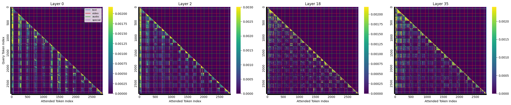

## Record

## TODO

- [ ] 补一个 token 数统计
- [ ] attn-llm 规律分析
- [ ] 看论文

### 2026-03-02

### 2026-03-03

给 attn-llm 热力图加了一个 token 边界以便区分

单个示例图如下：

规律特点统计：

+ 早期层中音频 token 占据了相当高的注意力，随着 llm 层数加深，注意力逐渐分给部分视觉 token

+ 在 llm 早期层中，后一时间块的 Vision token 和 前一时间块的 Audio token 相互注意

### 相关论文

优于 Omnizip 表现的一篇论文，不过好像不是 training-free 的

