## Record

### attn-llm 分析

给 attn-llm 热力图加了一个 token 边界以便区分

单个示例图如下：

规律特点统计：

+ 早期层中音频 token 占据了相当高的注意力，随着 llm 层数加深，注意力逐渐分给部分视觉 token

> 这里会不会是因为对于一个时间块内，因为音频 token 处于较后的位置，所有更容易获得更高的注意力？

+ 在 llm 早期层中，后一时间块的 Vision token 和 前一时间块的 Audio token 相互注意

### 论文

#### OmniSIFT:

优于 Omnizip 表现的一篇论文，不是 training-free, 25 %，暂时没开源

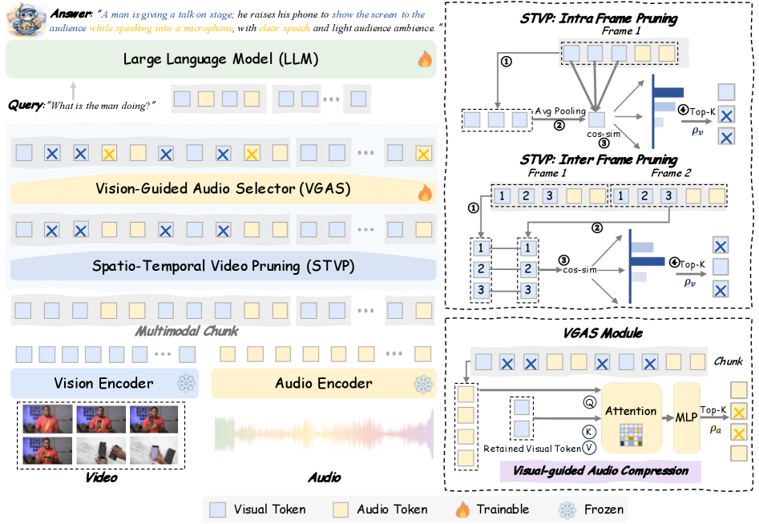

论文把 Omni-LLMs 的 token 压缩分为 3 类范式

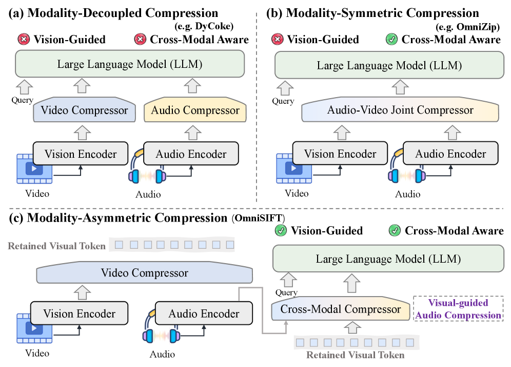

- 模态解耦压缩：独立 V / A token 压缩

- 模态对称压缩: 视为同等信息进行压缩

- 模态非对称压缩（？其实就是一者引导吧。。。）：本文先剪枝 V token，然后用 V 引导 A token 压缩

> 这篇论文提到了两篇我先前调研过的工作：Omnizip 和 EchoingPixels。Omnizip 没法用 Flash-attn，EchoingPixels 的话引入额外开销（多余 LLM 解码层来做双向注意力）

两个核心模块：

- STVP ( Spatio-Temporal Video Pruning ): 时间 + 空间冗余

    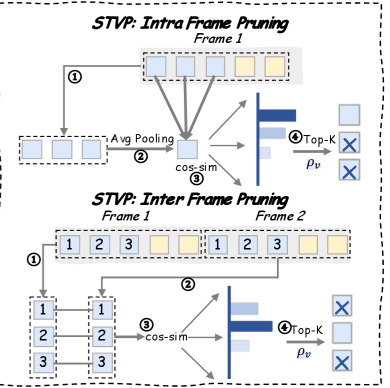

- VGAS ( Vision-Guided Audio Selector ): 用 V token 引导 A token 压缩

    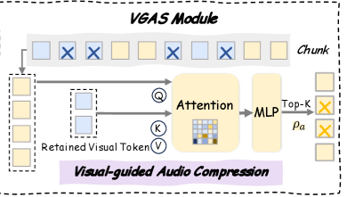

**STVP：两阶段剪枝**

两帧一组

空间冗余：

> 可能得看消融实验，感觉做法有点奇怪，直接平均池化作为基准的话如果相邻块差距本身较大。。。

    只在组内第一帧进行，帧内 token 平均池化作为全局平均向量，定义 token 的空间显著性为该 token 与全局平均向量的余弦距离

时间冗余：

    帧间对应 token 计算余弦距离

空间冗余和时间冗余分别 top K，相同的 K；

> 这里存疑的地方在于时间冗余的处理是选用了帧内所有 token 进行计算，还是对于空间冗余 top K 后的得到的 k 个 token 再进行计算更好。后者的话总体保留率就不一样了，在先前的一个工作中有提到这种方法，不过按照论文的说法应该是前者。

**VGAS：一个轻量化的交叉注意力，Q 是 A token， K,V 是剪枝后的视觉 token**

对于每个多模态块 $C_t$，VGAS 接收两个输入：

- 完整的音频令牌序列 $Z^(t)_a$：** 原始的、未压缩的音频令牌，维度为 $R^(n_a × D)$。

- 剪枝后的视频令牌序列 $Ẑ^(t)_v$：** 这是由 STVP 模块生成的、已经过压缩的视觉表示，维度为 $R^(ˆn_v × D)$。

$$H^(t)_a = Softmax((Q_a K^⊤_v) / √d) V_v$$

利用一个轻量级的跨注意力机制，其中音频令牌充当查询 $Q_a$，而剪枝后的视频令牌构成键 $K_v$ 和值 $V_v$。

计算交叉注意力得到带视觉信息的音频表示 $H_a$, 然后通过一个 MLP（2）接一个 Sigmoid 激活函数（分数在0-1），得到显著性分数，同样 TopK 选 token，因为 TopK 不可微，用 STE 训练

#### Token Pruning in Multimodal Large Language Models: Are We Solving the Right Problem?

2025.11

一些结论：

+ **基于注意力的 token 选择方法存在位置偏差问题，即后期位置上的视觉 token 更可能被保留。减少这些方法中的位置偏差可以提升其性能。**

+ 只有当给定任务与语言信息高度相关时，语言信息才有助于 token 剪枝。

+ token 的重要性及其独特性（低相似度）对 token 剪枝的性能有显著影响，且这种影响因任务而异。

**位置偏差**：

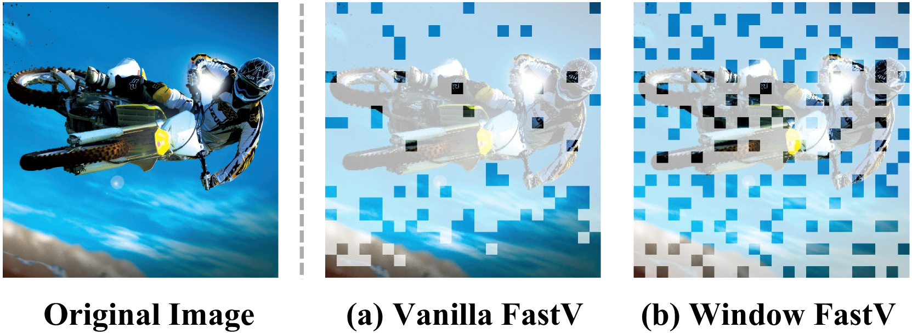

FastV：用最后一个 token 分配给视觉 token 的注意力分数来评估每个视觉 token 的重要性；

|frequency|attn|
|:--:|:--:|
|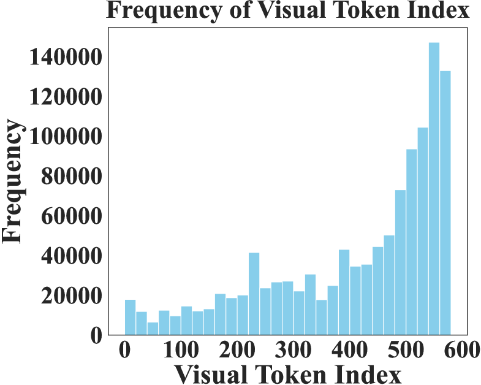|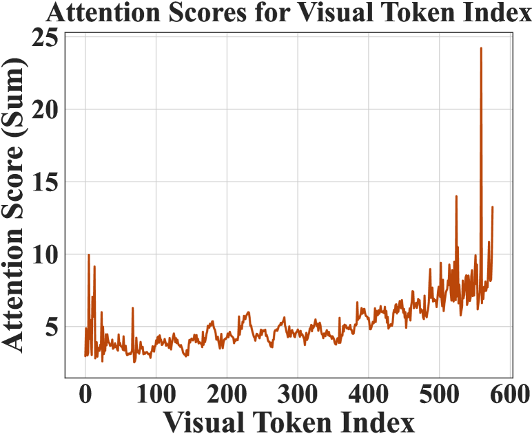|

这是一个统计，位于视觉 token 序列末尾的 token 被分配了显著更高的注意力分数, 且比其他位置的 token 保留频率高得多。

给出的解决方法是在注意力剪枝中融入空间均匀性，把视觉 token 序列中视为二维窗格，划分为多个小窗口，在每个区域内单进行注意力剪枝，最后合并结果。

#### Balanced Token Pruning: Accelerating Vision Language Models Beyond Local Optimization

2025.10

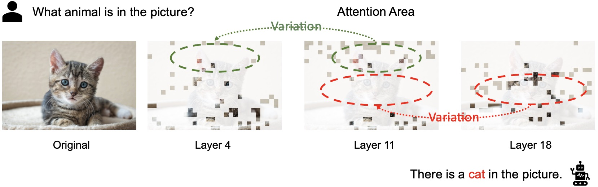

文本标记所注意的图像标记在不同层之间存在差异

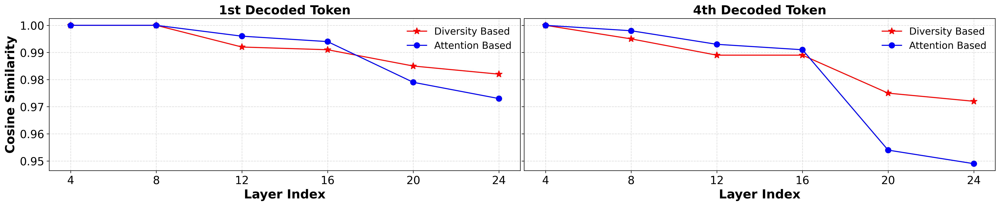

> 这里纵坐标的余弦相似度是和原始不剪枝的输出进行对比的，也就是比较在特定的解码位置的输出 token，剪枝模型与原始模型的差别。

可以看到基于注意力的方法在早期剪枝层能够很好地保持输出相似性，但在深层会累积误差。

提出基于多样性的剪枝，在初始层不保持输出相似性，但在后期剪枝阶段实现了更好的稳定性。

> 这里存在一个前提是原始模型的效果一定是好的？不然和原始模型保持相似性好像也没有意义

结合这两个的优缺点，提出 Balanced Token Pruning，BTP 剪枝方法，先使用校准集来确定剪枝层。在早期层，使用基于多样性的剪枝以保留后续层的输出。在深层，采用基于注意力的剪枝以维持剪枝层的输出。

$$L_{local-global} = - \sum^{|l|}_{i=1} \left(\lambda_i \sum_{j \in P_i} Atten^{(i)}(X^{(j)}_I, X_T) + (1 - \lambda_i)F_{dis}(P_i)\right)$$

$\lambda_i$ 随着剪枝阶段的深入而逐渐增加，这意味着在早期剪枝阶段（保留更多令牌时）更侧重多样性，而在后期剪枝阶段（保留更少令牌时）更侧重注意力。

**剪枝层选择**：剪枝应发生在图像标记含义发生显著变化的层之前或之后，因为在这些层中难以识别真正重要的标记

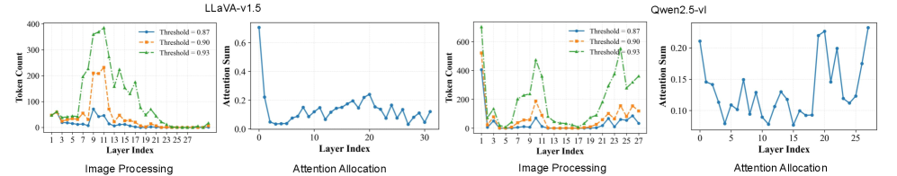

计算 V token 在每层前后的余弦相似度，对于每一层低于阀值的 token 数目进行统计，同时记录每层分配给 V token 注意力总和，绘制图像如上：

在 V token 发生显著变化的层后分配更多注意力给图像 token，这里的显著就是看 count 最高的数值所在，以 Qwen2.5VL 为例，除去第一层外，在 10 层和 24 层 V token 发生显著变化，在其前后相对变化低的位置就是 5 (9) (13) 17 (21) 25;

具体实现中，从 LLaVA-655k 数据集中随机采样 64 个实例，来确定在所有模型和基准测试中使用的剪枝层集合。

**多样性剪枝**：图像中空间距离较大的图像块往往具有更大的语义差异，将原始 token 序列（N）视为二维网格（ $\sqrt{N} \times \sqrt{N}$ 的二维网格），定义图像 token 之间的距离为它们在网格中的曼哈顿距离（实验证明了欧式距离更有效）

根据对应层的 $\lambda_i$ ，确定应该保留多少 token，然后让这些 token 之间的距离最大以保证多样性。

**注意力剪枝**：top k 注意力得分（V-T，这里只用输入的最后一个 token 作为 $X_t$）最高的 V token

$$S^{(l)}_{img} = \frac{1}{m} \sum^{m}_{i=1} Atten^{(l)}(X_I, X^{(i)}_T)$$

*   **$S^{(l)}_{img}$**: 在模型的第 $l$ 层，图像token的总体重要性分数。
*   **$\frac{1}{m} \sum^{m}_{i=1}$**: $m$ 代表文本token的数量, 对所有 $m$ 个文本token的注意力分数进行求和并取平均。
*   **$Atten^{(l)}(X_I, X^{(i)}_T)$**: 在模型的第 $l$ 层，图像token $X_I$ 对第 $i$ 个文本token $X^{(i)}_T$ 的注意力分数。衡量当模型处理第 $i$ 个文本token时，图像中的哪些部分（由图像token $X_I$ 表示）对理解该文本token最为关键。

为了确定在第 $l$ 层一个图像token有多重要，我们计算它对所有文本token的平均注意力分数。如果一个图像token对许多文本token都表现出很高的注意力（即在理解这些文本token时它很重要），那么它的 $S^{(l)}_{img}$ 值就会很高，从而被认为是更重要的图像token，在剪枝时更应该被保留。

实际实现中使用最后一个 token 作为文本 token, 对应的消融实验结果如下：

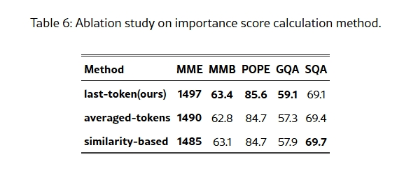

averaged-tokens 就是原始公式计算所有文本 token 注意力分数然后平均，similarity-based 是先计算 V-T 相似度，然后选择最相似的文本 token 来算注意力分数

最后一个 token 有效地对重要性分数进行建模，因为它在解码阶段通常被解码为第一个输出 token。这使得它能够有效地捕捉模型的关注点。

此外，由于注意力剪枝存在末尾 token 容易获得更高的分数的问题（上一篇论文中提到），有一个重平衡操作： Top K —> Top K', K'>K, 先选择比实际更多的 token，然后优先选择位置在序列前半部分的 token，然后再从后半部分选择 token 补足 K。

> 这篇论文中剪枝层选择的部分可以借鉴一下用来分析在哪些层剪枝更合适

### TODO

- [ ] 剪枝层选择的分析实验
- [ ] 

