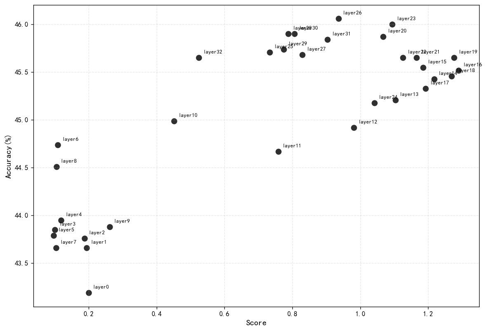
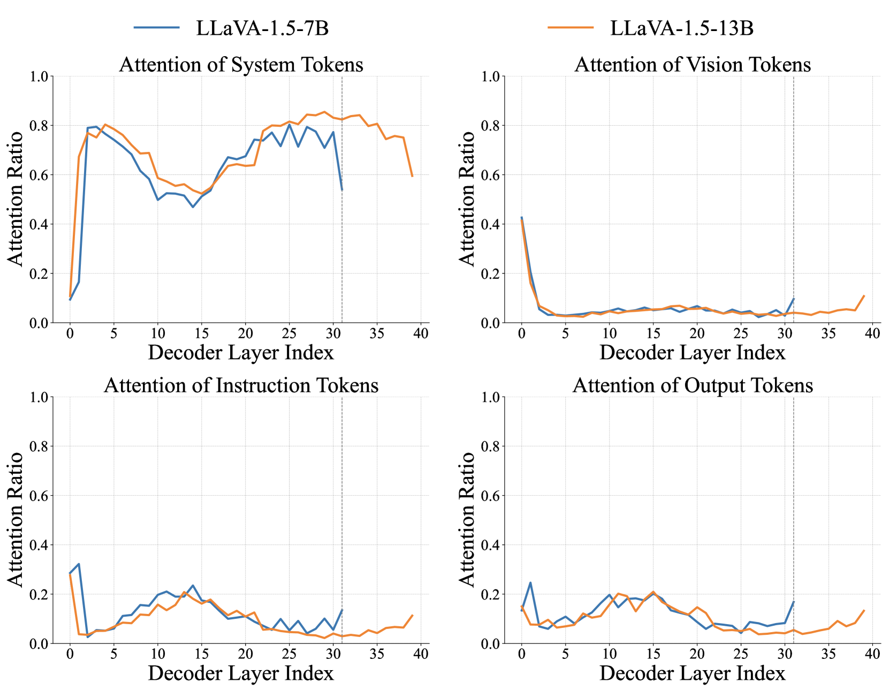
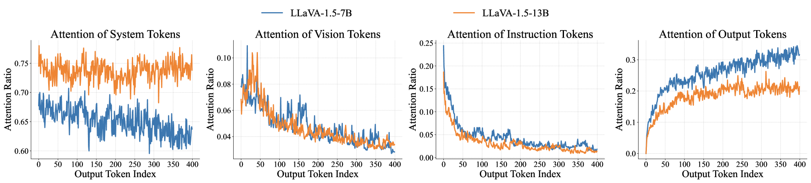
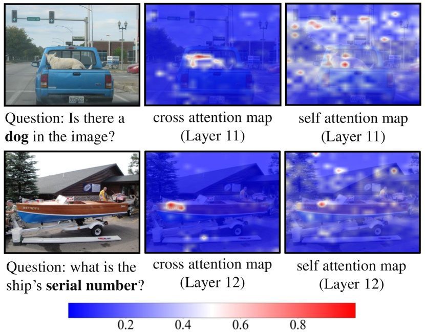
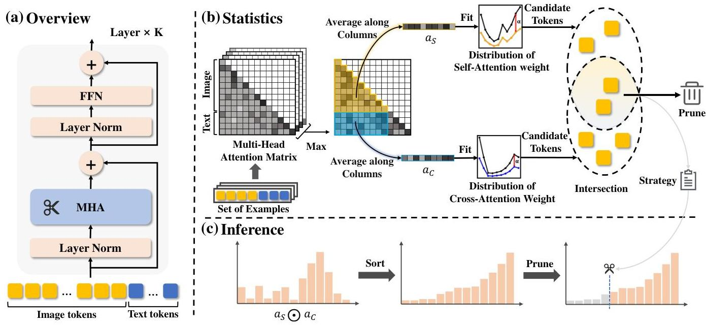
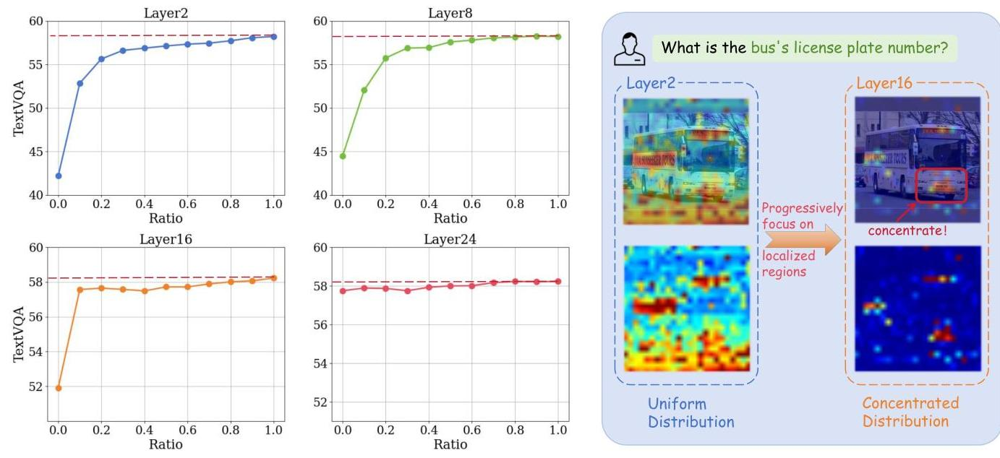
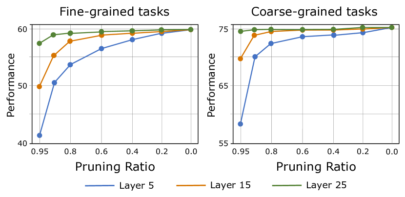

## 本周工作

### 实验

分数-层数


分数-性能



```py
Pearson r = 0.801938083380053
```

### 剪枝层选择类论文

+ [Boosting Multimodal Large Language Models with Visual Tokens Withdrawal for Rapid Inference](https://arxiv.org/abs/2405.05803)

在深层 MLLM 中不需要Vision代币





Token 处理策略：该方法通过前 K-1 层正常处理 token，允许完整的视觉信息处理和跨模态信息传输。从第 K 层开始，只有文本 token（系统、指令和输出 token）通过剩余层继续。

$K^* = \arg\min_K \{KL(P_{standard}||P_{VTW}^{(K)}) < \eta\}$

设置 $\eta = 0.003$

尝试了性能下降明显，

| 模型 | 总体准确率 |
| :---: | :---: |
| 完整模型 | 46.00 |
| Me-1 |  29.28 |
| Me-2 | 39.77 |

+ [Fit and Prune: Fast and Training-free Visual Token Pruning for Multi-modal Large Language Models](https://arxiv.org/abs/2409.10197)

LLaVA 中交叉注意力图和自注意力图的可视化，展示了不同层如何关注不同的视觉区域。注意力模式揭示了哪些视觉标记对模型的理解最重要



+ 自注意力分布（$D_S$）：这捕捉了视觉标记(Q)如何关注其他视觉标记，代表内部视觉处理和特征关系。
+ 交叉注意力分布（$D_C$）：这衡量了文本标记(Q)如何关注视觉标记，表明哪些视觉信息与语言生成最相关。



$\arg\min_P [d(D_S, D'_S) + d(D_C, D'_C)] \quad \text{subject to} \quad \Phi(G, P) \leq \delta$

在移除标记时最小化这些注意力模式的变化; $\Phi(G, P)$ 表示计算开销，$\delta$ 是预算约束

+ [PyramidDrop: Accelerating Your Large Vision-Language Models via Pyramid Visual Redundancy Reduction](https://arxiv.org/abs/2410.17247)



视觉标记的重要性在不同层之间差异巨大

分阶段剪枝, 固定剪枝率，所有图像token与最后一个指令token之间

+ [ATP-LLaVA: Adaptive Token Pruning for Large Vision Language Models](https://arxiv.org/abs/2412.00447)



带训练的剪枝层选择，给了一个权重 loss 随着剩余代币数量和层深度的增加而增加，先验性的


