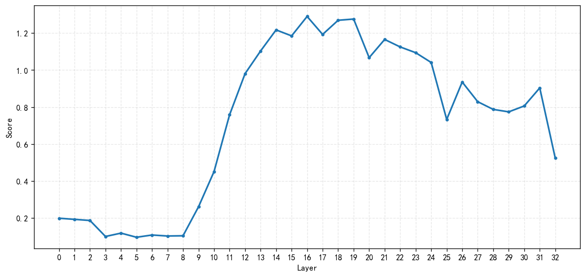
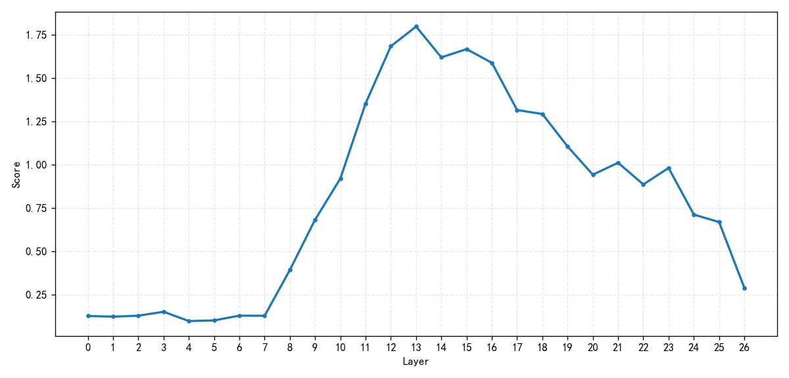
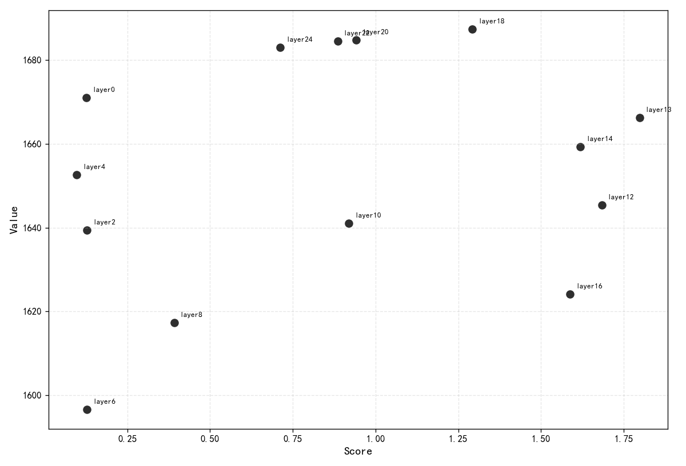
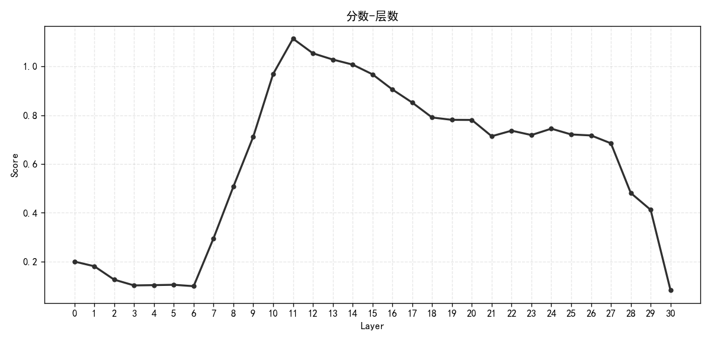

## 本周工作

### Qwen2.5-omni 3B

分数-层数

分数-性能

### Qwen2.5-vl 7B

补充了一部分实验

分数-层数

分数-性能

### llava-v1.5-7b

分数-层数

分数-性能

还在改动代码

在 11 层剪枝，保留率 0.5

|Tasks|Filter|n-shot|       Metric       |   |Value |   |Stderr|Stderr_CLT|
|-----|------|-----:|--------------------|---|-----:|---|------|---------:|
|mme  |none  |     0|mme_cognition_score |↑  |1.4286|±  |N/A   |    0.0054|
|mme  |none  |     0|mme_perception_score|↑  |0.0000|±  |N/A   |    0.0000|

迁移中间层剪枝到 llava 上，但是分数掉到一个很夸张的地步，应该是剪枝完后面位置编码之类的对不上之类的

### Boosting Multimodal Large Language Models with Visual Tokens Withdrawal for Rapid Inference 复现

| Methods | TFLOPs ↓ | MME ↑ |
|:--------|:-----|:------|
| LLaVA-1.5-7B | 8.48 | 1866.10 |
| VTW (K=16) | 4.68 (55.19%)  | 1872.43 |
| LLaVA-1.5-7B | - | 1509.97 |
| VTW (K=16) | - | 1442.67 |

因为这个 TFLOPs 我没找到他原始怎么算的就还没统计

