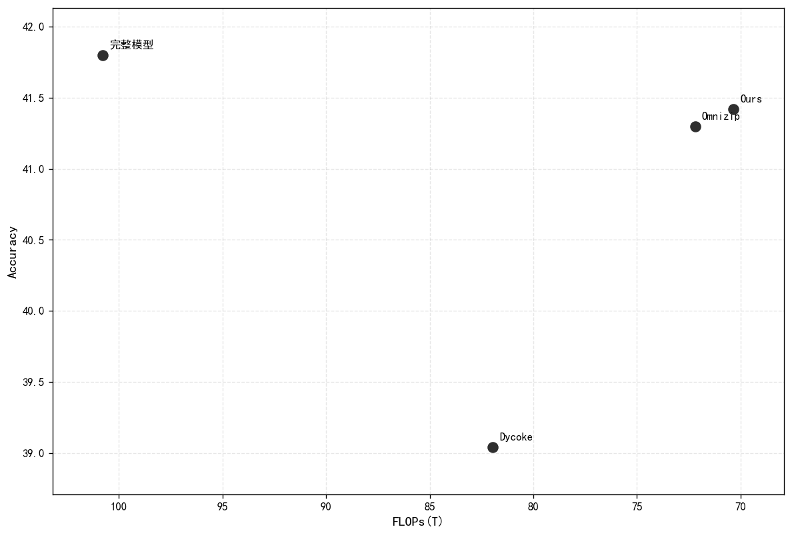
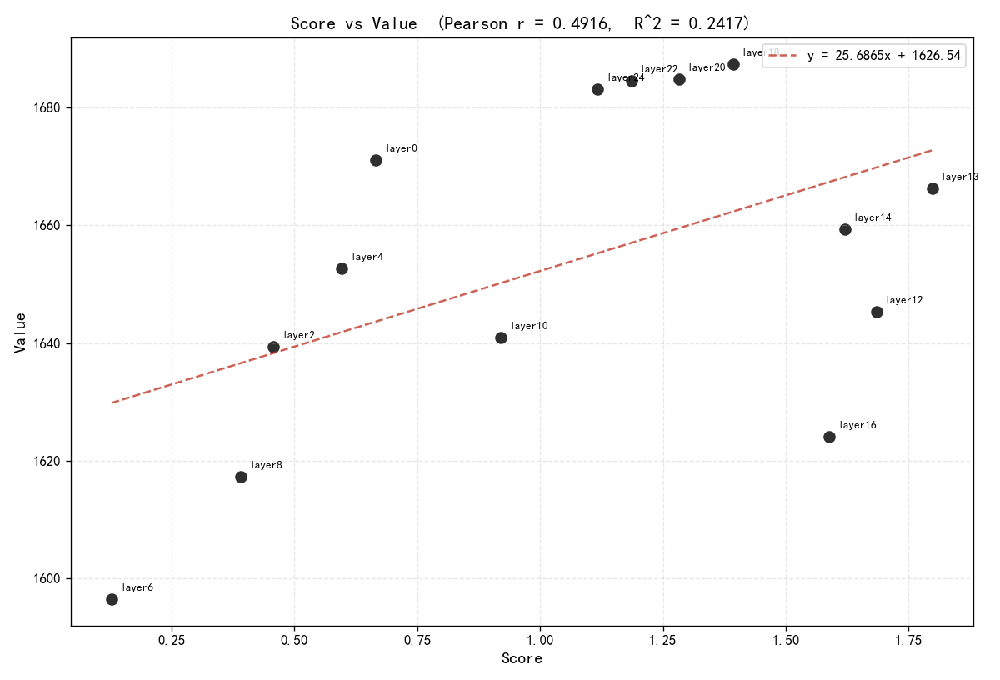

### Qwen2.5-omni 3B

分数-性能

Pearson r = 0.801938083380053

#### 与其他方法的对比

### Qwen2.5-vl 7B

分数-性能

Pearson  r   = 0.4916497765
Pearson  R^2 = 0.2417195027

### llava-v1.5-7b

分数-性能

Pearson  r   = 0.8752950645
Pearson  R^2 = 0.7661414499

#### 与其他模型的对比

llava-v1.5-7b

| Methods | TFLOPs ↓ | MME ↑ | MMMU acc ↑ |
|:--------|:-----|:------|:------|
| Full | 3.233 | 1509.97 |  36.43 |
| FastV(2024) | 1.869 | 1422.18 | 33.13 |
| VTW (K=16)(2024.5) | 1.782 | 1442.67 | 35.60 |
| DivPrune(2025.4) | 0.512 | 1328.3 | 35.89 |
| Ours(14) | 1.670 | 1498.33 | - |

