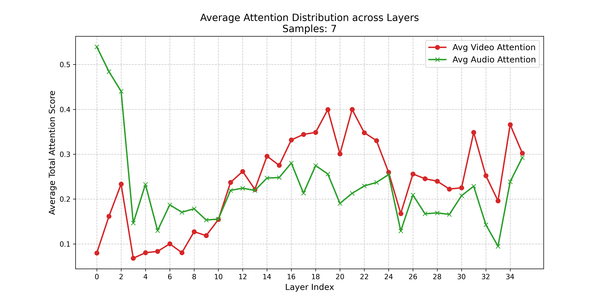
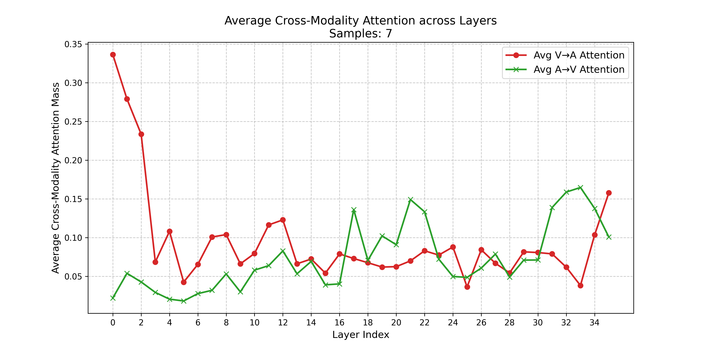
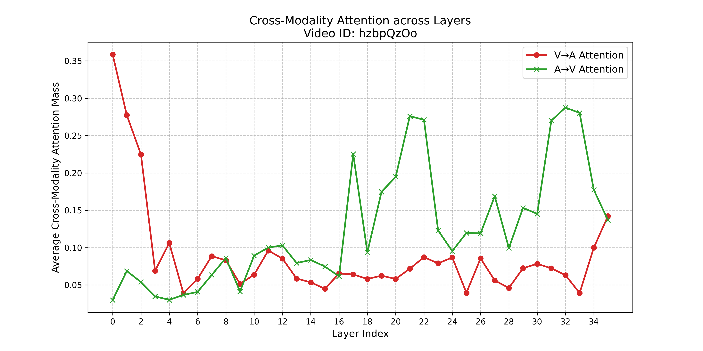

## Record

### 本周工作

- [x] 剪枝层选择的分析实验
- [x] V / A token 变化实验
- [x] baseline 实验

> 实验部分只做图示

### 剪枝层选择的分析实验

### V / A token 变化实验

### V / A token 彼此注意力变化实验

### baseline 实验

> V/A 括号内为冗余去除率 = 1 - 保留率

| Model | fps | overall_accuracy | Music | Culture & Politics | Tech & Science | Daily Life | Film & TV | Sports | Performance | Games |
| :---: | :---: | :---: | :---: | :---: | :---: | :---: | :---: | :---: | :---: | :---: |
| Qwen2.5-omni-3B(bf16，V(0.6)+A(0.3)) | 0.5 | 44.9 | 44.8 | 46.9 | 50.2 | 43.9 | 44.3 | 41.2 | 43.1 | 43.3 |
| Qwen2.5-omni-3B(bf16，V(0.5)+A(0.5)) | 0.5 | 44.7 | 43.3 | 46.3 | 49.8 | 44.1 | 43.8 | 42.1 | 42.7 | 44.6 |
| Qwen2.5-omni-3B(bf16，V(0.5)+A(0.3)) | 0.5 | 45.1 | 44.6 | 48.2 | 50.0 | 43.8 | 44.1 | 42.1 | 43.8 | 44.2 |

Audio 压缩方法：和 Omnizip 保持一致，在音频 encoder 最后一层自注意力里算出来的注意力矩阵，再聚合成一维重要性分数：

在音频 encoder 的 forward 里，对最后一层传 return_logits = True，多头平均后，对 query 维求和，得到每个 token 被关注总量的 1D 分数；这里有个需要注意的，因为音频 token 到 llm 前有下采样，所以这里这个分数需要按 2 做平均下采样；这样索引才对的上。

然后在 top k 来压缩 token，top k 未选中的 token 中按照索引均匀保留一定比例的 token。

VIDEO 压缩方法：时空压缩

四帧一组， 0，1，2，3

在 0，2 帧中，平均池化得到一个 token，和这个 token 计算余弦相似度作为多样性的评估指标，保留 top k。

1，3 帧和其前一帧 0，2 帧进行逐位置的 token 计算余弦相似度，保留相似度低的 token。

