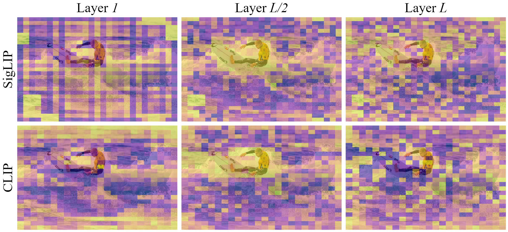
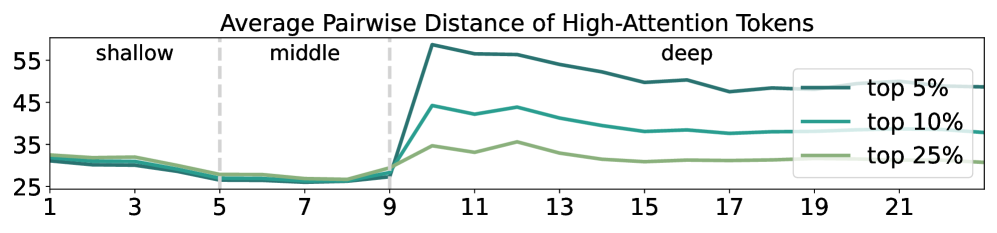

## Record

### 本周工作

- [x] baseline 实验 (原始模型在 wolrdsense 上的表现，token 数统计)
- [x] 关于分层剪枝的论文
- [x] TTT

### baseline 实验

| Model | fps | overall_accuracy | Music | Culture & Politics | Tech & Science | Daily Life | Film & TV | Sports | Performance | Games |
| :---: | :---: | :---: | :---: | :---: | :---: | :---: | :---: | :---: | :---: | :---: |
| Qwen2.5-omni-3B(bf16，Full tokens) | 2 | 46.4 | 46.1 | 50.8 | 51.5 | 45.0 | 45.4 | 44.2 | 43.8 | 42.5 |
| Qwen2.5-omni-3B(bf16，Full tokens) | 0.5 | 45.5 | 43.8 | 51.5 | 50.8 | 43.8 | 43.8 | 43.0 | 45.3 | 42.1 |
| Qwen2.5-omni-3B(bf16，V(0.6)+A(0.3)) | 0.5 | 44.9 | 44.8 | 46.9 | 50.2 | 43.9 | 44.3 | 41.2 | 43.1 | 43.3 |
| Qwen2.5-omni-3B(bf16，V(0.5)+A(0.5)) | 0.5 | 44.7 | 43.3 | 46.3 | 49.8 | 44.1 | 43.8 | 42.1 | 42.7 | 44.6 |
| Qwen2.5-omni-3B(bf16，V(0.5)+A(0.3)) | 0.5 | 45.1 | 44.6 | 48.2 | 50.0 | 43.8 | 44.1 | 42.1 | 43.8 | 44.2 |

#### token 统计

```bash
========== Token Statistics Summary ==========
                mean    max   min
TEXT       122.627049    702    94
VIDEO     8411.711223   9216  2160
AUDIO     3091.187264   7500   390
SPECIAL             9      9     9
TOTAL    11634.525536  17033  2665
```

### 一些论文

+ [Fit and Prune: Fast and Training-free Visual Token Pruning for Multi-modal Large Language Models](https://arxiv.org/abs/2409.10197)

    将 token 剪枝视为一个注意力分布拟合的统计问题，在预设的计算预算下，通过最小化剪枝前后自注意力与交叉注意力分布的散度来确定最优剪枝策略。利用二分搜索算法，根据少量推理数据的注意力统计，贪婪地识别并移除对注意力分布影响最小的视觉 token，从而快速生成一个在不同层级具有不同剪枝率的策略。

+ [TAMP: Token-Adaptive Layerwise Pruning in Multimodal Large Language Models](https://arxiv.org/abs/2504.09897)

    TAMP 的核心方法包含两部分：一是根据 MLLM 各层输出 token 的多样性动态调整每层的剪枝稀疏率，确保编码丰富多模态信息的关键层能保留更多参数

    模态内多样性：同一模态内输出 token 之间的余弦距离，而模态间多样性则量化不同模态输出 token 之间的余弦距离：

    二是自适应多模态输入激活，它利用当前层注意力机制计算出的 token 贡献度，智能地选择最具代表性的多模态输入 token 子集来计算参数重要性，从而更精确地指导当前层权重的剪枝；用注意力矩阵最后一行，保留高注意力分数的 token

+ [HiPrune: Training-Free Visual Token Pruning via Hierarchical Attention in Vision-Language Models](https://arxiv.org/abs/2508.00553v2)

    仅基于视觉编码器固有的层次化注意力模式

    

    SigLIP 和 CLIP 不同层的注意力图。分数较高的区域以黄色显示。中间层更以对象为中心。

    

    CLIP 中不同层高注意力标记的平均成对距离。根据分散趋势，将 CLIP 分为三个阶段。浅层保留噪声，中层关注语义对象，深层编码全局上下文。

    主要保留了三类 Token：

    + 锚点 Token:在视觉编码器的中间层中，具有最高注意力分数的 Token。这些 Token 对应于图像中的物体中心区域，包含丰富的细节信息。

    + 缓冲 Token:空间上邻近锚点 Token 的 Token。用于增强空间连续性，补充锚点 Token 周围的局部细节。在锚点 Token 确定后进行选择。 $I_B = \cup \{I_A - 1, I_A + 1, I_A - p, I_A + p\} \cap [0, p^2 - 1]$

    + 注册 Token: 在视觉编码器输出层中具有高注意力分数的 Token，捕获全局上下文特征，有助于模型对图像的整体理解。

### TTT

### 正在做的

把之前的实验扩展到全数据集上进行统计可视化

目前考虑：

在 9-17 层保留更多的 V-A token，变化大

第二阶段是在 18-26 层来做 v-a token 的主要剪枝，根据 A 注意力剪枝音频 token，根据得到的结论，这些层音频对视频 token 的关注高，视频 token 的剪枝结合这点进行

此外，和老师你发的那片论文类似的，仅基于视觉编码器/音频编码器的注意力在进入 llm 前剪枝，可以做个实验试试效果


