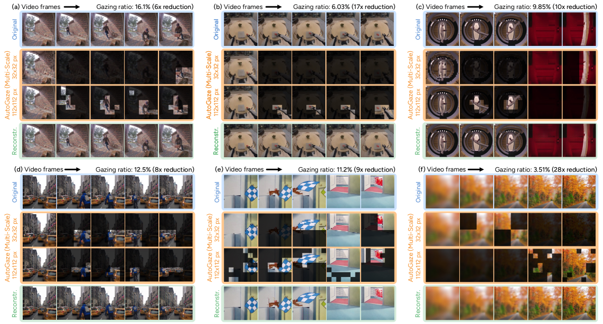
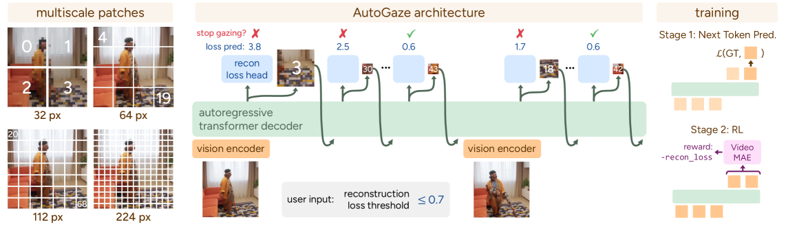

## Record

### 本周工作

- [x] new baseline 2fps 完全体
- [x] 15-26 层进行剪枝，baseline 基础上
- [x] Attend Before Attention 论文和一些思考

### new baseline 2fps 完全体和 new-llm

之前的 baseline 是在 omnizip 的基础上进行修改的，

| Model | fps | overall_accuracy | Music | Culture & Politics | Tech & Science | Daily Life | Film & TV | Sports | Performance | Games |
| :---: | :---: | :---: | :---: | :---: | :---: | :---: | :---: | :---: | :---: | :---: |
| Qwen2.5-omni-3B(bf16，Full tokens) | 2 | 46.4 | 46.1 | 50.8 | 51.5 | 45.0 | 45.4 | 44.2 | 43.8 | 42.5 |
| Qwen2.5-omni-3B(bf16，Full tokens) | 0.5 | 45.5 | 43.8 | 51.5 | 50.8 | 43.8 | 43.8 | 43.0 | 45.3 | 42.1 |
| Qwen2.5-omni-3B(bf16，V(0.5)+A(0.3), new) | 2 | 41.9 | 41.1 | 47.9 | 47.3 | 40.7 | 42.0 | 39.1 | 37.1 | 38.2 |
| Qwen2.5-omni-3B(bf16，V(0.5)+A(0.2), new) | 2 | - | - | - | - | - | - | - | - | - |
| Qwen2.5-omni-3B(bf16，V(0.2)+A(0.2), new) | 2 | 44.7 | 44.5 | 49.2 | 47.8 | 43.1 | 44.6 | 41.0 | 40.1 | 41.4 |
| Qwen2.5-omni-3B(bf16，V(0.5)+A(0.3), new+llm) | 2 | 25.1 | 36.5 | 26.9 | 29.6 | 20.8 | 26.6 | 18.4 | 21.7 | 19.3 |
| Qwen2.5-omni-3B(bf16，V(0.2)+A(0.2), new+llm) | 2 | - | - | - | - | - | - | - | - | - |
| Qwen2.5-omni-3B(bf16，V(0.6)+A(0.3), omnizip改) | 0.5 | 44.9 | 44.8 | 46.9 | 50.2 | 43.9 | 44.3 | 41.2 | 43.1 | 43.3 |
| Qwen2.5-omni-3B(bf16，V(0.5)+A(0.5), omnizip改) | 0.5 | 44.7 | 43.3 | 46.3 | 49.8 | 44.1 | 43.8 | 42.1 | 42.7 | 44.6 |
| Qwen2.5-omni-3B(bf16，V(0.5)+A(0.3), omnizip改) | 0.5 | 45.1 | 44.6 | 48.2 | 50.0 | 43.8 | 44.1 | 42.1 | 43.8 | 44.2 |

new baseline 2fps 的推理时间大概在 2 h 5 min 左右

new baseline 效果差的原因可能是因为音频 token 的剪枝过于激进了，相较于 omnizip 改的那版来说去除了非重要 token 合并的部分，在相同剪枝率的情况下保留了更少的音频 token。

同时由于视觉 token 剪枝 new 中以两帧一组进行余弦相似度计算，去除相似度（50%）以上的视觉 token，但是 2fps 下一组其实相当于 2s（内部卷积合并了一次），对于偏静态的视频，可能在 2s 内无明显变化，或者在 2s 内存在大量变化，但是目前设置的 50% 阈值可能减去了重要的变化信息。

new + llm 2fps 的推理时间在 3 h 左右，

- Audio token：用 18–25 层 self-attn 的 incoming attention（被关注度） 做平均，然后在 26 层开始对 audio token 做 top‑k 保留（其余在 causal_mask 里被 mask 成不可被 attend）。

- Video token：用 18–25 层里 audio query → video key 的注意力做平均，然后在 26 层开始对 video token 做 top‑k 保留（其余 key 位置被 mask）。

效果很差，也可能是因为压缩的太狠了，忘了调整 new 的 token 保留率，内部的保留率也是 A 70% V 50%。应该在 new 提供更高的保留率。


### Attend Before Attention

> [论文链接](https://arxiv.org/abs/2603.12254v1)



```
Video
↓
AutoGaze（pre-ViT）
↓
Sparse patches
↓
ViT / MLLM
```

自回归决策：

$$P(p1, p2, p3) = P(p1) P(p2|p1) P(p3|p1,p2)$$



AutoGaze 训练分为两个阶段：对收集的凝视 patch 序列进行下一标记预测预训练，以及带有重建奖励的强化学习后训练。

用最少 patch，重构当前帧

输入：历史已选 patch + 当前帧
输出：选择 patch subset
目标：reconstruction error ≤ threshold

两阶段训练：

- 第一阶段：预训练

    已选的 patch → 预测下一个patch

    数据来源：构造一组能良好重建视频的 patch 序列，作为 GT

- 第二阶段：RL 训练

    已选的 patch + 当前帧 → 选择 patch subset

