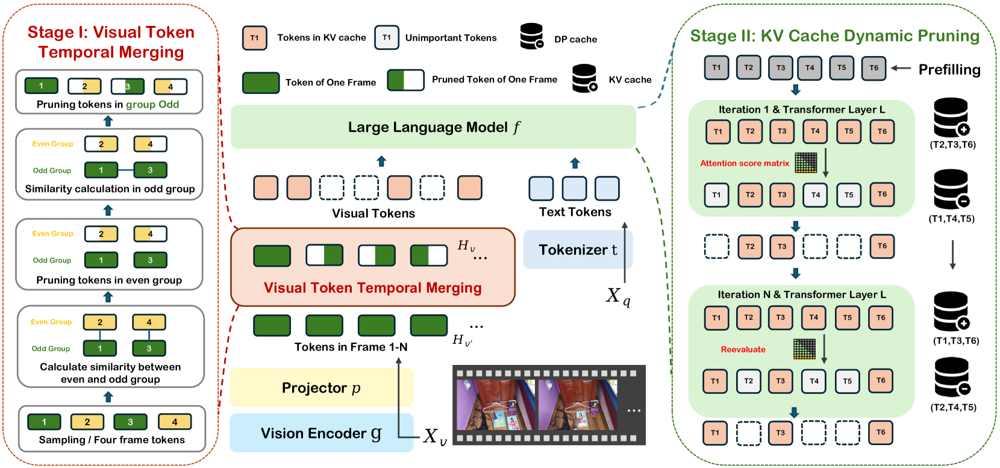
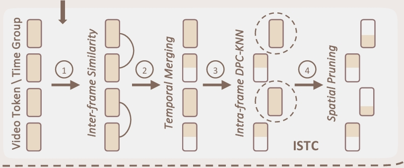
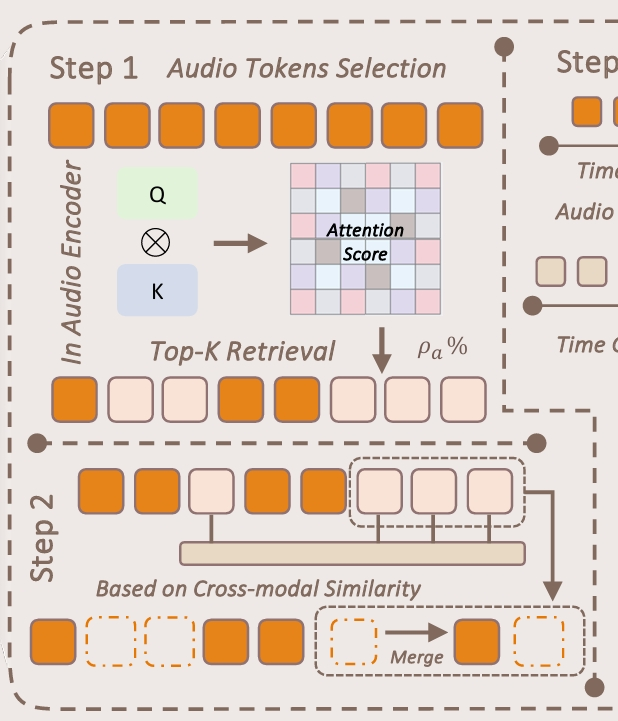

## Record

### 本周工作

> 模型 Qwen2.5-omni-3B，bf16, 1 fps，单个视频 token 数约为音频的 3 倍 ('VIDEO', 144),('AUDIO', 50), 但是遵循 omnizip 中在 WorldSense 数据集上测试的配置参数，设置最大帧数为 128 帧, 因此对于总数据集来说，视频 token 总数约为音频的 2 倍

| Model | RetainedRatio(RR) | V-RR | A-RR | fps | overall_accuracy | V-Method | A-Method |
| :---: | :---: | :---: | :---: | :---: | :---: | :---: | :---: |
| Full tokens | 100% | 100% | 100% | 1 | 41.8 | - | - |
| DyCoke(V&A) | 50% | 50% | 50% | 1 | 39.6 | TTM | TTM |
| DyCoke(V&A) | 50% | 40% | 70% | 1 | 39.7 | TTM | TTM |
| Version 1 | 50% | 40% | 70% | 1 | 40.2 | DPCKNN | TTM |
| Version 2 | 50% | 40% | 70% | 1 | 39.6 | TTM | Dominant |
| Version 3 | 50% | 40% | 70% | 1 | 40.5 | TTM | Dominant+Anchor1 |
| Version 4 | 50% | 40% | 70% | 1 | 40.9 | DPCKNN | Dominant+Anchor1 |
| Version 5 | 50% | 40% | 70% | 1 | 40.3 | DPCKNN | Dominant+Anchor2 |
| Version 6 | 50% | 40% | 70% | 1 | ---- | TTM | Dominant+Anchor2 |
| omnizip | 50% | 40% | 70% | 1 | 41.3 | omnizip | omnizip |

### 子数据集

原始数据集 3,172 个 QA 对，1,662 个视频， 8 个主要领域

子数据集在 8 个领域上等比例随机采样，并通过读取之前做的实验 log，确保保留了在多次实验中结果发生变化的 QA 对。

1500 个 QA 对，1043 个视频

目前一组测试的时间在 50min~60min 之间

### baseline（DyCoke）

DyCoke，但是只使用其 TTM 模块，同时用在 V/A 上



长度为 4 帧的滑动窗口进行均匀采样，分为 O 组（1，3）和 E 组（2，4）（Odd 和 Even），计算相邻组之间对应位置相似度（比如 1 和 2，3 和 4），这一步进行时空冗余的去除，因此剪去高度相似（余弦相似度）的 token（E 组的），topk 保留余弦相似度更低的 token，也就是更有变化的 token

> 每一组是一帧的 token

第二步，对于未被剪枝的 O 组，组内进行剪枝，和上面一样逐位置比较，窗口内第一帧的 token 不剪，剪后面的

实际实现上：

奇数帧全保留；偶数帧按与前一帧逐位置余弦相似度，保留最不相似的 k 个 token。

对每 4 帧中的第 3 帧（索引 i+2 ），再按与第 1 帧（索引 i ）逐位置余弦相似度，保留最不相似的 k 个 token。

| Model | RetainedRatio | fps | overall_accuracy |
| :---: | :---: | :---: | :---: |
| DyCoke(V&A) | 50% | 1 | 39.7 |


### Version 1

> 感觉每个 Version 还需要做消融之类的，因为现在的 50 % 保留率实际上是音频和视频共同作用的，而不是单独的。

baseline，音频上的处理不变，视频的处理改变：



类似的，4 帧一组，相邻帧逐位置计算余弦相似度，偶数帧保留最不相似的 k 个 token。

> 参考一些其他的实现，比如有篇讲空间均匀比单纯注意力更好，这里不使用注意力的话就选“中心 + 分散”的 token，中心 ：一个 token 周围有很多相似 token，"簇的中心"; 分散 ：不同簇

第二步，对于奇数组，1，3，归一化 embedding，`normed = normalize(tokens, dim=1)`

相关性 rho：
- `dist = 1 - normed @ normed.T`
    - dist[i,j] 越小表示 token i 与 token j 越相似
    - dist.fill_diagonal_(inf) ：把自己到自己的距离设为无穷大，避免 kNN 时选到自己
- 取每个点最近的 k 个邻居距离（kNN）
    - knn_dist[i] 是 token i 的 k 个最近邻距离
- 把“邻居越近 → 密度越高”变成 rho
    - `rho = exp(- knn_dist.mean(dim=1))`
    - 如果 token i 周围邻居很近，mean 很小，exp(-small) 接近 1 ⇒ rho 大（高密度、代表性强）
    - 如果周围邻居远，mean 大，exp(-large) 接近 0 ⇒ rho 小

delta：
- 对每个点 i，找所有rho 比它大的点 j，取 min dist[i,j]
- 构造“更高密度”掩码
    - higher_mask = rho.unsqueeze(0) > rho.unsqueeze(1)
- 只保留指向更高密度点的距离，其余置 inf
    - delta_dist = dist.clone()
    - delta_dist[~higher_mask] = inf
    - 这样每一行 i 里，只有那些 “更高密度点 j” 的距离是有限的
- delta 就是这一行最小值
    - delta = delta_dist.min(dim=1).values
- 最高密度点的特殊处理
    - 最高密度点没有任何更高密度点，所以它那一行会全是 inf，导致 delta[i] == inf
    - 因此其 delta 设成它到任何其他点的最大距离（保证它也能当中心）

```py
score = delta * rho
selected = topk(score, num_keep).indices
```

rho 大说明代表性强，delta 大：说明它离更密的中心远

| Model | RetainedRatio | fps | overall_accuracy |
| :---: | :---: | :---: | :---: |
| Version 1 | 50% | 1 | 40.2 |

### Version 2

baseline，视频上的处理不变，音频的处理改变：



音频采用“重要 token 保留，用音频编码器返回的 `attn_logits` 做 top-k，`dominant_num = round((1 - rho_audio) * N)`，直接置 `keep=True`。

| Model | RetainedRatio | fps | overall_accuracy |
| :---: | :---: | :---: | :---: |
| Version 2 | 50% | 1 | 39.6 |

### Version 3

Version 2，音频的处理增加了一部分：加了锚点合并的部分

音频采用“重要 token 保留 + 上下文 anchor + 合并”的结构

- Dominant 保留：用音频编码器返回的 `attn_logits` 做 top-k，`dominant_num = round((1 - rho_audio) * N)`，直接置 `keep=True`。
- Contextual anchors：在剩余 token 上按时间顺序分成 `contextual_num = round(contextual_ratio * N)` 个桶；每个桶内用桶内平均相似度最大，选一个代表 token 作为 anchor，并置 `keep=True`，保证时间覆盖且避免再次偏向全局 topk。

    桶内平均相似度最大指的是：选出一个最能代表这一桶整体分布的 token 当 anchor，用余弦相似度衡量“代表性”。

    - 设这个桶里有 $m$ 个 token，归一化后的向量是 $\tilde{x}_1,\dots,\tilde{x}_m$（单位长度）。
    - 对桶内每个 token $i$，计算它与桶内其它 token 的平均余弦相似度：
    $$
    \text{rep}(i)=\frac{1}{m-1}\sum_{j\neq i}\cos(\tilde{x}_i,\tilde{x}_j)
    $$
    - 选择 $\text{rep}(i)$ 最大的那个 token 作为 anchor：
    $$
    i^*=\arg\max_i \text{rep}(i)
    $$


- 合并（aa-only）：每个 Contextual anchor 选 top-`g` 个与该 Contextualanchor 最相似的 token 做 merge；合并权重 `w = softmax(cos(token, anchor))`，将被合并 token 的信息注入 anchor embedding，被合并 token 本身不保留。


| Model | RetainedRatio | fps | overall_accuracy |
| :---: | :---: | :---: | :---: |
| Version 3 | 50% | 1 | 40.5 |


### Version 4

Version 3，但是视觉和 Version 1 一样

| Model | RetainedRatio | fps | overall_accuracy |
| :---: | :---: | :---: | :---: |
| Version 4 | 50% | 1 | 40.9 |

### Version 5

Version 4, 但是音频非关键锚点选择变化大的作为 anchor

| Model | RetainedRatio | fps | overall_accuracy |
| :---: | :---: | :---: | :---: |
| Version 5 | 50% | 1 | 40.3 |

### omnizip

| Model | RetainedRatio | fps | overall_accuracy |
| :---: | :---: | :---: | :---: |
| omnizip | 50% | 1 | 41.3 |

### Version 6

Version 5，但是视觉和 baseline(DyCoke) 一样

| Model | RetainedRatio | fps | overall_accuracy |
| :---: | :---: | :---: | :---: |
| Version 6 | 50% | 1 |  |

### with LLM

> 基于 Version 4；1000，fps 0.5， ?

| Model | RetainedRatio(RR) | V-RR | A-RR | LLM | fps | overall_accuracy | V-Method | A-Method |
| :---: | :---: | :---: | :---: | :---: | :---: | :---: | :---: | :---: |
| with LLM | 47% | 60% | 80% | 70% | 1 | 43.1 | - | - |


### Flops 统计

```
2026-04-10 16:52:32,418 - INFO - Prefill dvOkwKAs.mp4: tflops=44.279911081268, tflops_per_s=5.084250306195264, time_ms=8709.23
2026-04-10 16:52:43,007 - INFO - Generate dvOkwKAs.mp4: tflops=44.292256054998, tflops_per_s=4.182740906901576, time_ms=10589.29
2026-04-10 16:52:43,008 - INFO - Decode dvOkwKAs.mp4: tflops=0.01234497373, tflops_per_s=0.006566270138528775, time_ms=1880.058765411377
```

所以后面统计只看 prefill

| Model | RetainedRatio(RR) | FLOPs(T) | V-RR | A-RR | overall_accuracy | V-Method | A-Method |
| :---: | :---: | :---: | :---: | :---: | :---: | :---: | :---: |
| Full tokens | 100% | 85.7 | 100% | 100% | 41.8 | - | - |
| Version 4 | 50% | 61.1 | 40% | 70% | 40.9 | DPCKNN | Dominant+Anchor1 |
| omnizip | 50% | 61.4 | 40% | 70% | 41.3 | omnizip | omnizip |

### TODO

with LLM； fps 1 下实验，debug


