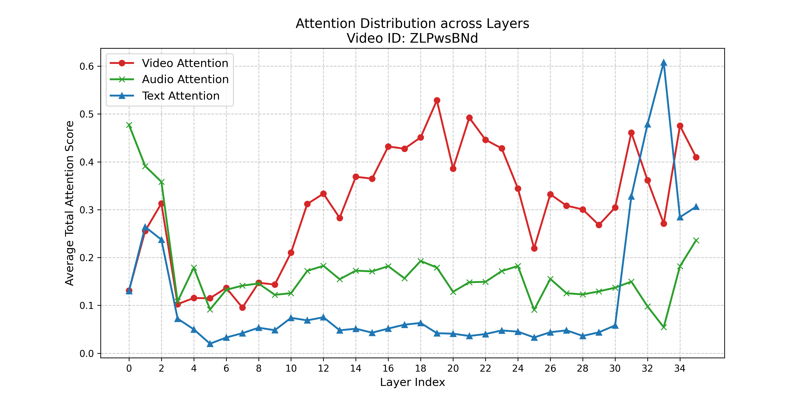
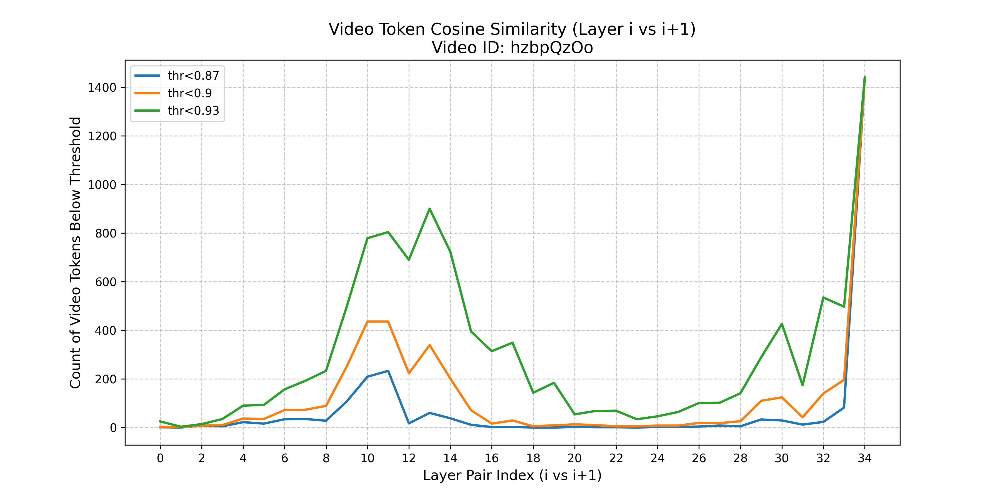
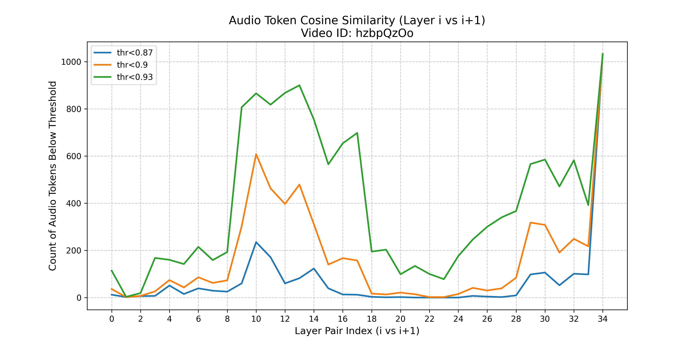
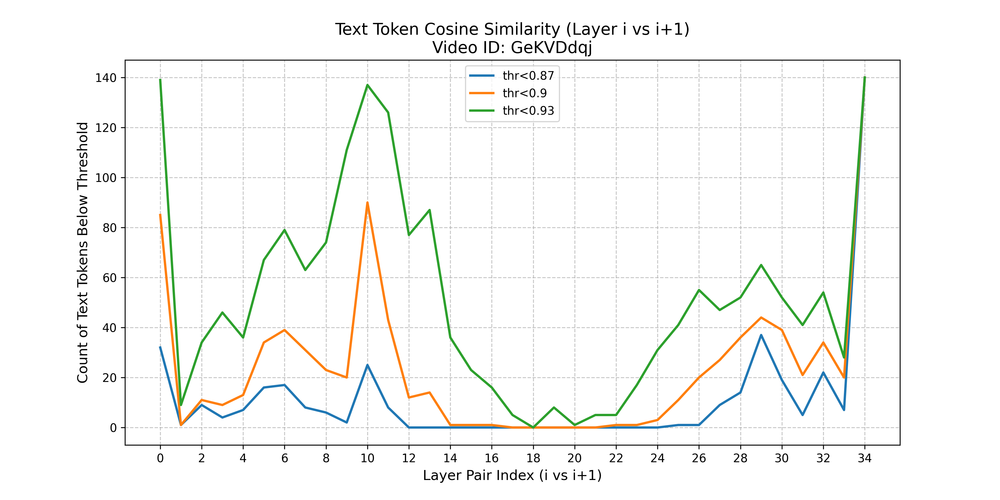
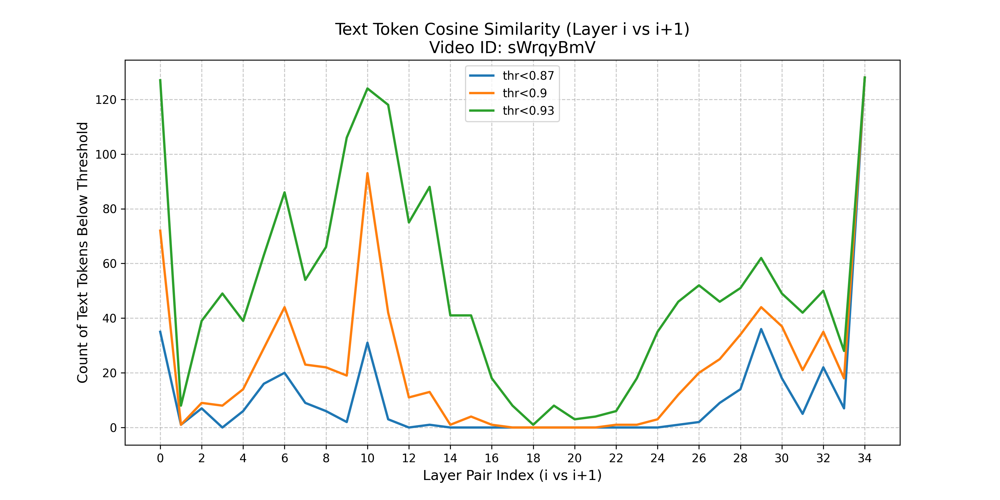
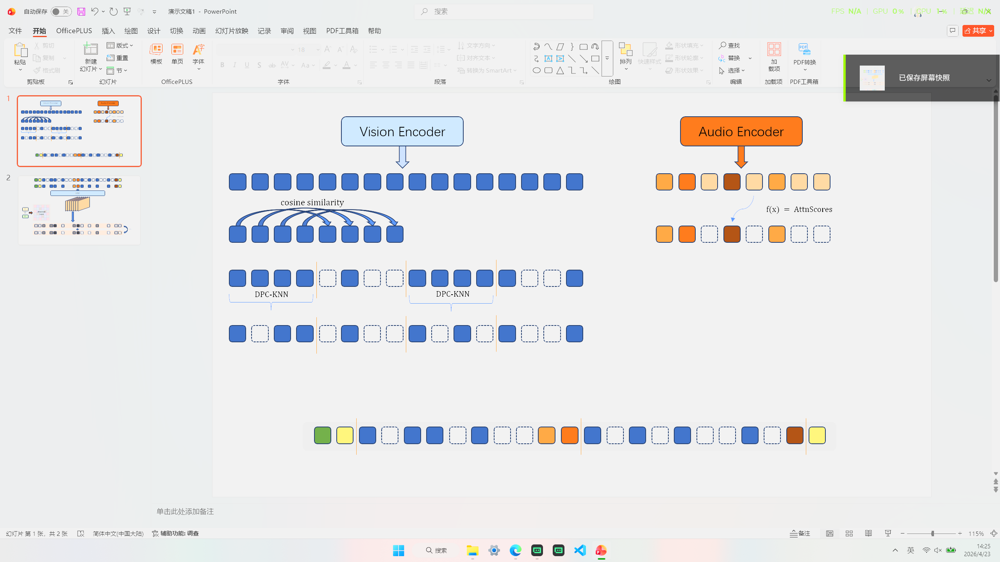
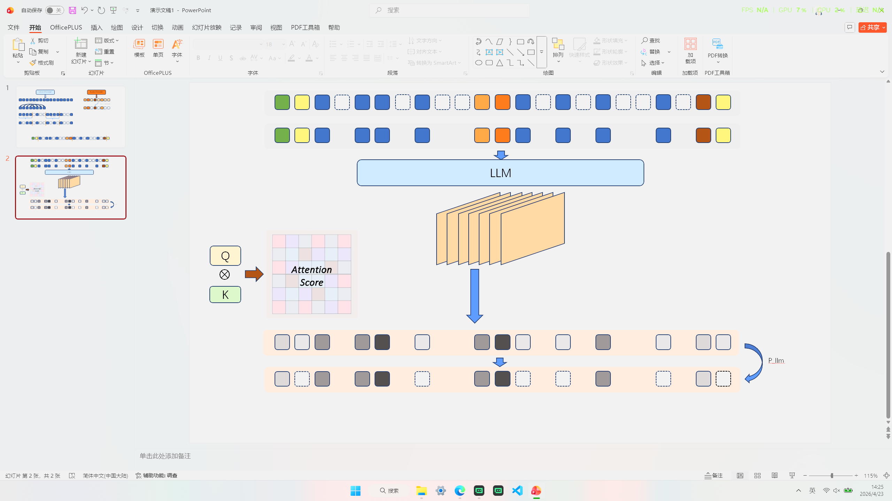

## Record

### 本周工作

### Flops 统计

和 omnizip 作者邮件联系了，他们说是只把 audio/video token 作为 Query（Q） 时产生的计算量记进 FLOPs, 也不考虑前面音频编码器和视觉编码器的 FLOPs；所以在 token 减半的时候对应 FLOPs 也会减半(自注意力平方项还会少更多)。

我这个的话是整个 prefill 阶段的，就多一点，作为评判指标感觉没问题。想着后面可能会进入多模态编码器之前有一些剪枝之类的就保留整个 prefill 做统计

> The FLOPs calculation considers the multimodal token originating from audio and video inputs

> 500 个样本的统计

| Model | FLOPs(T) | overall_accuracy |
| :---: | :---: | :---: |
| Full tokens | 85.7 | 41.8 |
| Version 4 | 61.1 | 40.9 |
| omnizip | 61.4 | 41.3 |
| with LLM | 59.82 | 41.42 |

> 完整数据集

剪枝后统计一组 flops 跑一个要 6~7h，full token 9h 左右

不带 flops 统计剪枝后 2h 左右

| Model | FLOPs(T) | overall_accuracy |
| :---: | :---: | :---: |
| Full tokens | 100.77  | 41.8 |
| Version 4 | 71.84  | 40.9 |
| omnizip | 72.20 | 41.3 |
| with LLM | 70.34 | 41.42 |

可以看到 with LLM 的方法在 FLOPs 上是最低的，且在 overall_accuracy 上是最高的。（不过需要多跑跑实验看看是不是只是超参数的问题）

### llm 给定不同的压缩率

> llm 17 层进行剪枝

前置视觉保留率 60% ，音频保留率 80%，进入 llm 前总体保留率为 67%

| llm 保留率 | overall_accuracy | 剪枝层总体保留率 |
|:---:|:---:|:---:|
| 70% | 41.27 | 46.9% |
| 50% | 41.42 | 33.5% |
| 30% | 41.17 | 20.1% |

### 在 llm 不同层进行剪枝的消融实验

根据之前实验的图；

|attention|Video_cosine|Audio_cosine|
|-|-|-|
||||

第一张是对于音视频全部 token 的注意力在不同层的占比，第二张和第三张分别是视频/音频 token 逐层余弦相似度的可视化，纵轴越高说明上一层到当前层 token 变化越大

由此我们知道在 17-24 层音频视频 token 获得较高注意力的同时，变化较小，感觉可以看作重要的 token 已经选出来了? 补了一个 text token 的那个余弦相似度变化的图，和视频/音频 token 的变化趋势几乎一致。

两个示例：

之前的图有点问题，注意力在不同层的占比的那个，之前在实验室的卡上用的 0.5fps 统计的，换成 1fps 后重新绘制了

顺便统计了文本 token 的注意力在不同层的占比，有个现象在 3-9 层文本、音频、视频 token 三者注意力离 1 也很远，也就是这里注意力主要落在 special token 上了

| layers | overall_accuracy |
| :---: | :---: |
| 9 | 39.75 |
| 17 | 41.42 |
| 19 | 41.36 |

### 新的方法的尝试

在进入 llm 前的视频侧，之前是 keep_ratio 固定的，现在改成 chunk 内总的 keep_ratio 固定, 对于单帧的预算分配按照信息量自适应分配

> 这个自适应分配如果有效果，下个实验可以联合音频来做

对每帧计算信息量分数

- 空间复杂度 `spatial_t`：帧内 token 离散程度（画面丰富度）
    - `mu = mean(tok)`
    - `spatial = mean( ||tok - mu||^2 )`

- 时间变化复杂度 `temporal_t`：与上一帧的平均变化（运动/事件变化）
    - `sim = (normalize(curr) * normalize(prev)).sum(dim=1)`（逐 token 对齐的余弦相似度）
    - `temporal = mean(1 - sim)`
    - 没有上一帧则 `temporal_t` = 0

- 信息量分数 `score_t = lambda * spatial_t + (1 - lambda) * temporal_t`

lambda 越大越偏向帧内复杂度，越小越偏向帧间变化

归一化分数后作为权重分配预算即可

效果：

| Model | overall_accuracy |
| :---: | :---: |
| omnizip | 41.3 |
| with LLM | 41.42 |
| Version 7 | 41.42 |

没产生效果，可能是因为 1 fps 下 chunk 内相当于只有两帧吧

### 现有方法的图示解释

