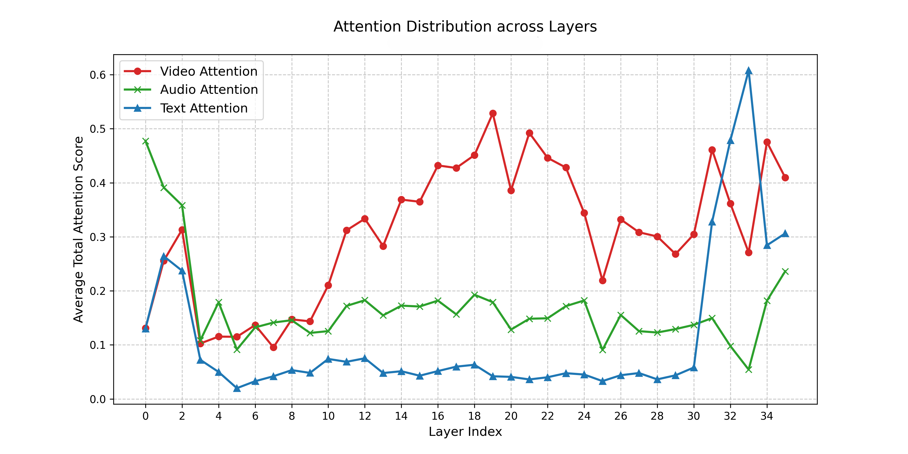
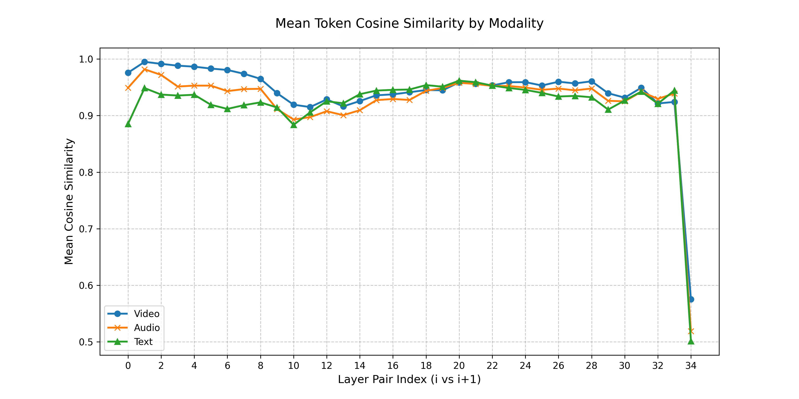
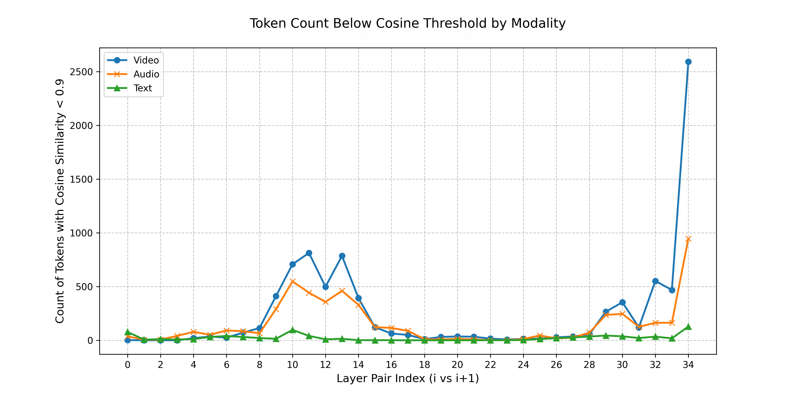

## Record

### 本周工作

+ 超参数实验
+ 注意力图重绘制
+ 通用方法

### 超参数实验

### llm 给定不同的压缩率

> llm 17 层进行剪枝

前置视觉保留率 60% ，音频保留率 80%，进入 llm 前相较于初始 token 数目，总体保留率为 67%

> llm 保留率：llm 内部剪枝保留比例
> 总体保留率：llm 剪枝层后 token 数 / 初始 token 数目


| llm 保留率 | FLOPs(T) | overall_accuracy | 剪枝层总体保留率 |
|:---:|:---:|:---:|:---:|
| 100% | 81.70 | 41.80 | 67% |
| 70% | 74.92 | 41.27 | 46.9% |
| 50% | 70.34 | 41.42 | 33.5% |
| 30% | 65.76 | 41.17 | 20.1% |

Full tokens：
+ FLOPs(T): 100.77
+ overall_accuracy：41.80

> LLM 保留率 100%, 也就是只进行前面的处理，视觉保留率 60% ，音频保留率 80%，此时和 full token 效果相同，不过只是总的准确率相同。

```
full token 效果：
INFO - Overall Accuracy: 0.4180 (1326/3172)
INFO -
Accuracy by Domain:
INFO -   Music: 0.3941 (160/406)
INFO -   Culture & Politics: 0.4887 (151/309)
INFO -   Tech & Science: 0.4694 (230/490)
INFO -   Daily Life: 0.4179 (275/658)
INFO -   Film & TV: 0.4090 (155/379)
INFO -   Sports: 0.3721 (160/430)
INFO -   Performance: 0.3858 (103/267)
INFO -   Games: 0.3948 (92/233)

LLM 保留率 100%:
INFO - Overall Accuracy: 0.4180 (1326/3172)
INFO -
Accuracy by Domain:
INFO -   Music: 0.4163 (169/406)
INFO -   Culture & Politics: 0.4887 (151/309)
INFO -   Tech & Science: 0.4694 (230/490)
INFO -   Daily Life: 0.4058 (267/658)
INFO -   Film & TV: 0.4090 (155/379)
INFO -   Sports: 0.3721 (160/430)
INFO -   Performance: 0.3783 (101/267)
INFO -   Games: 0.3991 (93/233)
```

### 注意力图重绘制

+ 不同层注意力对各模态的关注程度



K 是 video / audio / text 三类 token

Q 是所有 token

该层中，平均一个 query，会把多少注意力分给某类 key token

+ 各模态 token 不同层变化剧烈程度



纵轴：同一类 token 在两层之间隐藏状态的平均余弦相似度

值越接近 1 说明这类 token 经过这一层后变化越小；值越低说明这一层对这类 token 的变换更明显，表征更新更强

前面大多数层的相似度都很高，基本在 0.9~0.99，说明模型相邻层之间总体是“渐进式更新”，不是每层都大改。
Video 线整体最高、最平稳，视频 token 的表征在大多数层间变化相对更小。

Audio 和 Text 在前中段有几次更明显下探，尤其大约在 9~13 附近，说明这些层对音频/文本信息做了更强的重整或融合。

中后段三条线又回到 0.94~0.96 左右并较平稳，模型在这些层的表示更新幅度又变小了，趋于稳定。



各模态 token 的余弦相似度 < 0.9 的数目，数目越大说明这一层这类 token 的变换越大。

+ 各层中音视频 token 之间注意力的变化


- v2a_scores ： Video token 作为 Q 时，对 Audio token 作为 K 分配了多少注意力
- a2v_scores ： Audio token 作为 Q 时，对 Video token 作为 K 分配了多少注意力

- V→A Attention ：视频 token 在更新自己时，看了多少音频 token
- A→V Attention ：音频 token 在更新自己时，看了多少视频 token


### 确定 llm 内部剪枝层：通用方法

我们用少量样本统计相邻层音视频 token hidden state 的平均余弦相似度，将 $1-\cos$ 作为表征更新强度 $C_\ell$。选取第一次显著峰值 $\ell_{peak}$ 作为‘融合/重整发生’的拐点，并在其后寻找 $C_\ell$ 连续多层维持低值的稳定平台 $\mathcal{P}$。在平台内，选择音视频 token 作为 Key 接收注意力达到高分位阈值的最早层作为 LLM 内部剪枝层，对应“信息已融合且表征已稳定”的剪枝时机。

####  表征变化强度（用余弦定义“峰值”和“回到平静”）**  
对第 $\ell$ 层到 $\ell+1$ 层，相邻层表征变化定义为

$$
C_\ell
= 1 - \frac{1}{N}\sum_{i=1}^{N}\frac{1}{|Tok_{AV}|}\sum_{t\in Tok_{AV}}
\cos\!\big(h^{(i)}_{\ell,t},\, h^{(i)}_{\ell+1,t}\big)
$$

- $Tok_{AV}$ 表示音频+视频 token 的集合
- $C_\ell$ 越大，说明这一步“更新更剧烈”。图里“余弦更低/低于阈值更多”的层就对应 $C_\ell$ 的峰。

用 $C_\ell$ 配合阈值来确定寻找发生显著变化的层，定义为波动区间

再定义平静期：峰值之后，$C_\ell$ 连续 $K$ (=3)层都低于一个稳定阈值 $\tau$：

$
\ell \in \mathcal{P}
\iff
\ell > \ell_{peak}
\ \land\
\max_{0\le j \le K-1} C_{\ell+j} \le \tau
$


#### 音视频 token 收到的注意力较高

音视频 token 作为 K 被看得多

$$
A_\ell
=\frac{1}{N}\sum_{i=1}^{N}\frac{1}{|Q|}\sum_{q\in Q}\sum_{k\in Tok_{AV}} \bar a^{(i)}_{\ell}(q,k)
$$

- $Q$ 是所有 query token
- $\bar a$ 是对 head 平均后的 attention。

#### 最终选层

先得到平静集合 $\mathcal{P}$，选平静里最早满足“注意力够高”的层

$$
\ell^* = \min\left\{\ell\in \mathcal{P} \mid A_\ell \ge \operatorname{Quantile}_{0.7}\left(\{A_j\}\right)\right\}
$$


### 一些尝试

在进入 llm 前的视频侧，之前是 keep_ratio 固定的，现在改成 chunk 内总的 keep_ratio 固定, 对于单帧的预算分配按照信息量自适应分配

> 这个自适应分配如果有效果，下个实验可以联合音频来做

对每帧计算信息量分数

- 空间复杂度 `spatial_t`：帧内 token 离散程度（画面丰富度）
    - `mu = mean(tok)`
    - `spatial = mean( ||tok - mu||^2 )`

- 时间变化复杂度 `temporal_t`：与上一帧的平均变化（运动/事件变化）
    - `sim = (normalize(curr) * normalize(prev)).sum(dim=1)`（逐 token 对齐的余弦相似度）
    - `temporal = mean(1 - sim)`
    - 没有上一帧则 `temporal_t` = 0

- 信息量分数 `score_t = lambda * spatial_t + (1 - lambda) * temporal_t`

lambda 越大越偏向帧内复杂度，越小越偏向帧间变化

归一化分数后作为权重分配预算即可

效果：

lambda = 0.5， 2 fps

| Model | overall_accuracy |
| :---: | :---: |
| with LLM | 41.96 |
| with LLM + new | 41.55 |

简单尝试，效果反而变差了，可能是 lambda 设置的不合理，感觉时间冗余应该比空间冗余分配更少的预算，因为视频大部分是高度时间冗余的，而空间冗余相对较小，应该给时空冗余更激进的压缩，和更少的 token 预算。


