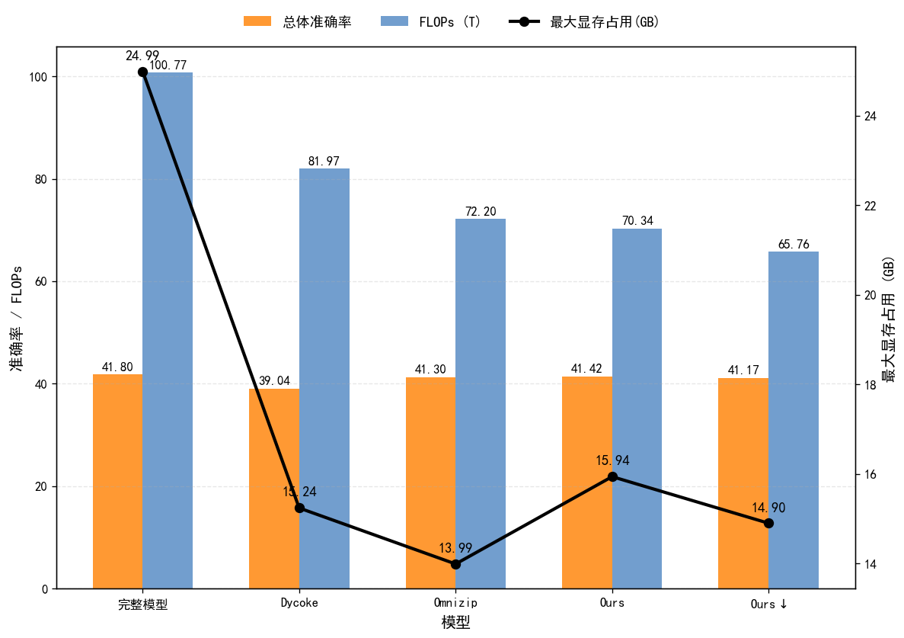
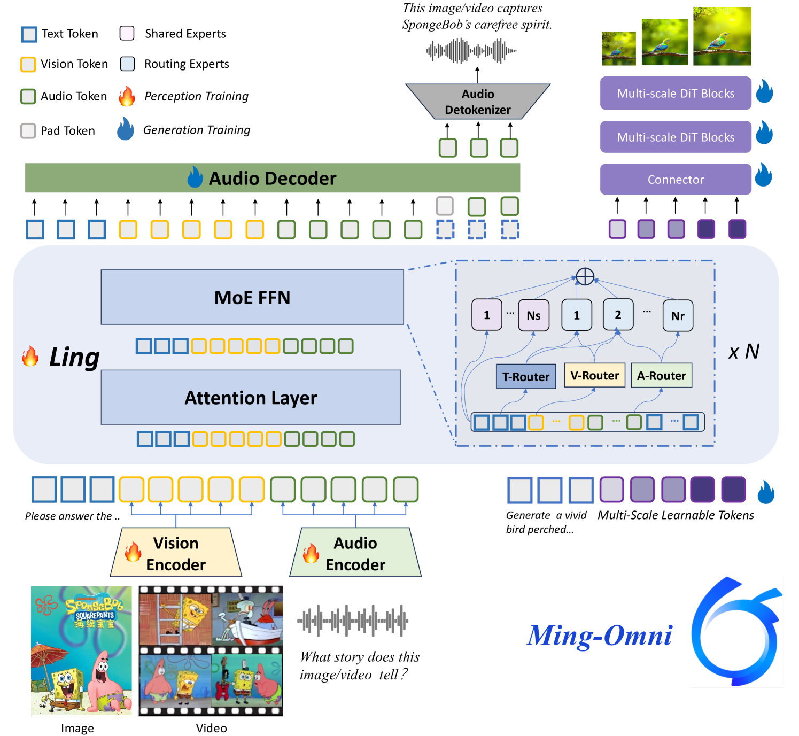
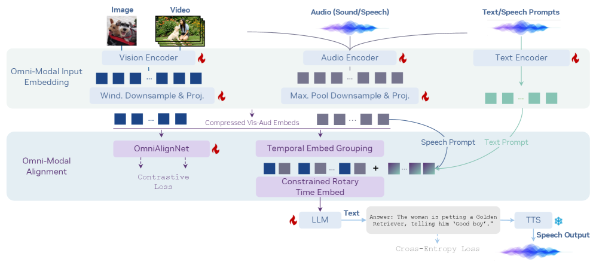
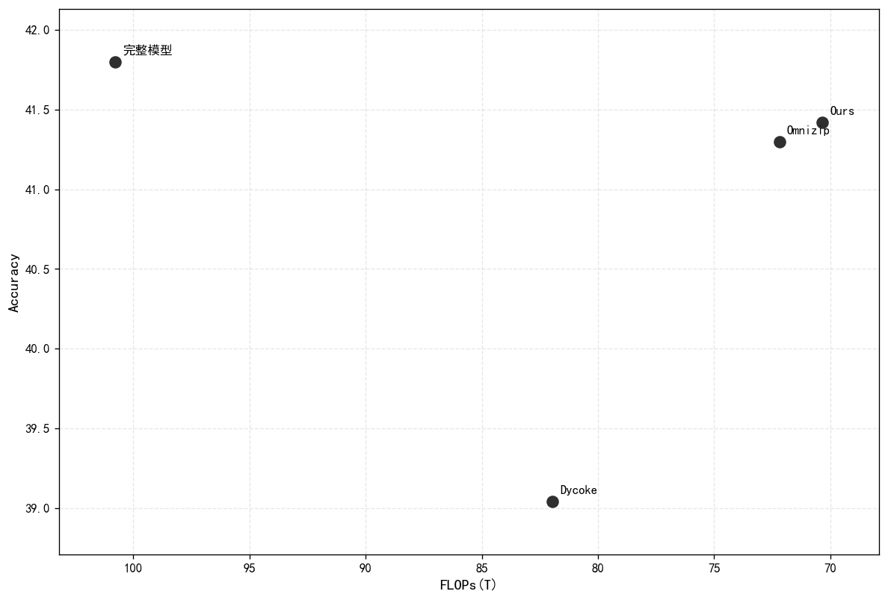
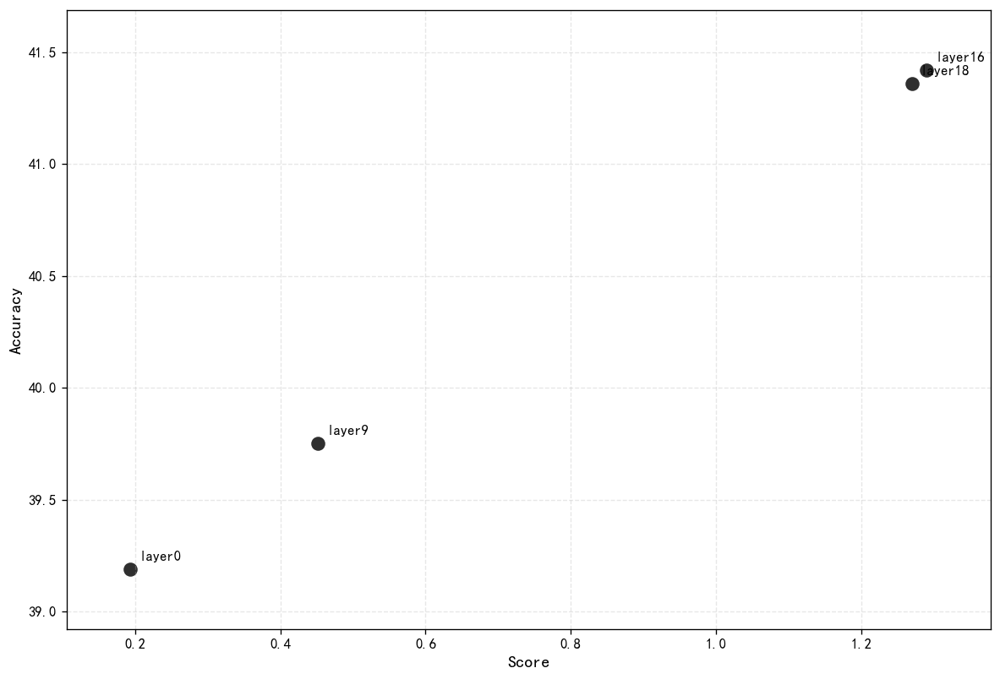

## 本周工作

### 实验补充

| 模型 | 最大显存占用(GB) | FLOPs(T) | 总体准确率 |
| :---: | :---: | :---: | :---: |
| 完整模型 | 24.99 | 100.77 | 41.80 |
| Dycoke | 15.24 | 81.97 | 39.04 |
| Omnizip | 13.99 | 72.20 | 41.30 |
| Ours | 15.94 | 70.34 | 41.42 |
| Ours⬇ | 14.90 | 65.76 | 41.17 |

### 自适应选择 LLM 内部剪枝层

用少量样本统计相邻层音视频 token hidden state 的平均余弦相似度，将 $1-\cos$ 作为变化强度 $C_\ell$。通过阈值找到第一个波动区间，并在其后寻找 $C_\ell$ 连续多层维持低值的平静区间 $\mathcal{P}$。在平静区间内，选择音视频 token 作为 Key 接收注意力达到一定阈值的最早层作为 LLM 内部剪枝层。

#### 变化强度

对第 $\ell$ 层到 $\ell+1$ 层，相邻层变化强度定义为

$$
C_\ell
= 1 - \frac{1}{N}\sum_{i=1}^{N}\frac{1}{|Tok_{AV}|}\sum_{t\in Tok_{AV}}
\cos\!\big(h^{(i)}_{\ell,t},\, h^{(i)}_{\ell+1,t}\big)
$$

- $Tok_{AV}$ 表示音频+视频 token 的集合
- $C_\ell$ 越大，说明这一层变化更剧烈。图里“余弦更低/低于阈值更多”的层就对应 $C_\ell$ 的峰。

用 $C_\ell$ 配合阈值来确定寻找发生显著变化的层，定义为波动区间

平静区间：波动区间之后，$C_\ell$ 连续 $K$ (=3)层都低于一个稳定阈值 $\tau$：

$
\ell \in \mathcal{P}
\iff
\ell > \ell_{peak}
\ \land\
\max_{0\le j \le K-1} C_{\ell+j} \le \tau
$

#### 音视频 token 收到的注意力较高

音视频 token 作为 K 被看得多

$$
A_\ell
=\frac{1}{N}\sum_{i=1}^{N}\frac{1}{|Q|}\sum_{q\in Q}\sum_{k\in Tok_{AV}} \bar a^{(i)}_{\ell}(q,k)
$$

- $Q$ 是所有 query token
- $\bar a$ 是对 head 平均后的 attention。

#### 最终选层

先得到平静区间 $\mathcal{P}$，选平静区间内最早满足注意力阈值的最早层

$$
\ell^* = \min\left\{\ell\in \mathcal{P} \mid A_\ell \ge \operatorname{Quantile}_{0.7}\left(\{A_j\}\right)\right\}
$$

### 在其他多模态模型上

在其他多模态模型上试验自适应的选层方法，目前找了两个模型；测试了其完整模型的 worldsense 上的准确率

[Ming-Omni](https://arxiv.org/abs/2506.09344v1)

| Model | Worldsense |
| :---: | :---: |
| Qwen2.5-omni7B(Omnizip) | 46.80 |
| Ming-Omni | 未报告 |
| 复现 | 46.44 |

[OmniVinci](https://arxiv.org/abs/2510.15870v2)

9B

| Model | Worldsense |
| :---: | :---: |
| Qwen2.5-omni7B(Omnizip) | 46.80 |
| Qwen2.5-Omni7B(OmniVinci) | 45.40 |
| OmniVinci | 48.23 |
| 复现 | 47.56 |

复现是用的 OmniVinci 模型然后套用的 Omnizip 在 worldsense 上的评估的代码

这个还没提 issue 问，打算要一下评估代码

### 后续计划

- 在这些模型上做类似分析（注意力，token 变化）

- 在进入 llm 之前交叉注意力？

### 补充

| layers | FLOPs(T) | overall_accuracy |
| :---: | :---: | :---: |
| 0 | 62.37 | 39.19 |
| 9 | 66.85 | 39.75 |
| 16 | 70.34 | 41.42 |
| 18 | 71.33 | 41.36 |

+ 稳定度

    对每一层 $(\ell,\ell+1)$，分别在视频 token 与音频 token 上计算相邻层 hidden state 的平均余弦相似度：

    $$
    \cos^{(v)}_\ell = \mathbb{E}_{t\in\mathcal{T}_v}\Big[\cos(\mathbf{h}^{(v)}_{\ell,t},\mathbf{h}^{(v)}_{\ell+1,t})\Big],\quad
    \cos^{(a)}_\ell = \mathbb{E}_{t\in\mathcal{T}_a}\Big[\cos(\mathbf{h}^{(a)}_{\ell,t},\mathbf{h}^{(a)}_{\ell+1,t})\Big],
    $$
    其中 $\mathcal{T}_v,\mathcal{T}_a$ 分别为当前样本中的视频/音频 token 索引集合。定义融合变化强度：
    $$
    C_\ell = 1 - \frac{1}{2}\big(\cos^{(v)}_\ell+\cos^{(a)}_\ell\big),\qquad \ell=0,\dots,L-2.
    $$

    设置窗口大小为 $w$，对每层定义局部变化均值：
    $$
    \overline{C}_\ell = \frac{1}{|\Omega_\ell|}\sum_{k\in\Omega_\ell} C_k,\quad
    \Omega_\ell=\{\ell,\ell+1,\dots,\min(\ell+w-1,L-2)\}.
    $$
    那稳定度就是:
    $$
    \mathrm{Stab}_\ell = 1-\overline{C}_\ell.
    $$
    对 $\mathrm{Stab}_\ell$ 做 min-max 归一化得到 $\widehat{\mathrm{Stab}}_\ell\in[0,1]$。

+ 注意力强度

    第 $\ell$ 层注意力权重：统计音频/视频 token 作为 Key 被分配的注意力质量，并按 token 数归一化，将两者相加并做 min-max 归一化得到：
    $$
    \widehat{\mathrm{Attn}}_\ell = \mathrm{Norm}\big(A^{(v)}_\ell + A^{(a)}_\ell\big).
    $$

给定权重系数 $\alpha,\beta$，基础分数定义为：

> $\alpha,\beta$ 都是 1，没调整过

$$
B_\ell=\alpha\cdot \widehat{\mathrm{Attn}}_\ell+\beta\cdot \widehat{\mathrm{Stab}}_\ell.
$$

+ 其他

    设阈值为 $thr$，$thr$ 取 $\{C_\ell\}$ 的分位数（$p$ 取的 0.75）

    $$
    thr = \mathrm{Quantile}\big(\{C_\ell\}, p\big).
    $$

    变化起点为第一个满足 $C_\ell\ge thr$ 的层：

    $$
    \ell_0 = \min\{\ell\mid C_\ell \ge thr\}.
    $$

    抑制信息融合之前层的得分，并鼓励在融合后的稳定区域选层，引入分段权重

    > 线性的，r 是步长（想要表示变化区间长度），这里实现还不是很完善，我这里是固定的一个步长大小，如果检测到稳定区间开始来设置动态步长应该更好点；或者最大值不给到 1，而是给到 0.5 这种，确保变化的时候不容易被选中

    $$
    w_\ell=
    \begin{cases}
    w_{\text{pre}}, & \ell<\ell_0,\\
    w_{\text{pre}}+(1-w_{\text{pre}})\cdot \min\Big(1,\frac{\ell-\ell_0+1}{r}\Big), & \ell\ge \ell_0,
    \end{cases}
    $$

    考虑到融合后越早剪枝越省 FLOPs，在开始融合后引入指数衰减的早期加成，倾向于选中更早的层：

    $$
    e_\ell=
    \begin{cases}
    1, & \ell<\ell_0,\\
    \exp\big(-\gamma(\ell-\ell_0)\big), & \ell\ge \ell_0,
    \end{cases}
    $$

最终分数为：
$$
S_\ell = B_\ell\cdot w_\ell\cdot e_\ell,\qquad \ell=0,\dots,L-2.
$$
选择得分最高的层作为内部剪枝层：
$$
\ell^\ = \arg\max_\ell S_\ell.
$$
