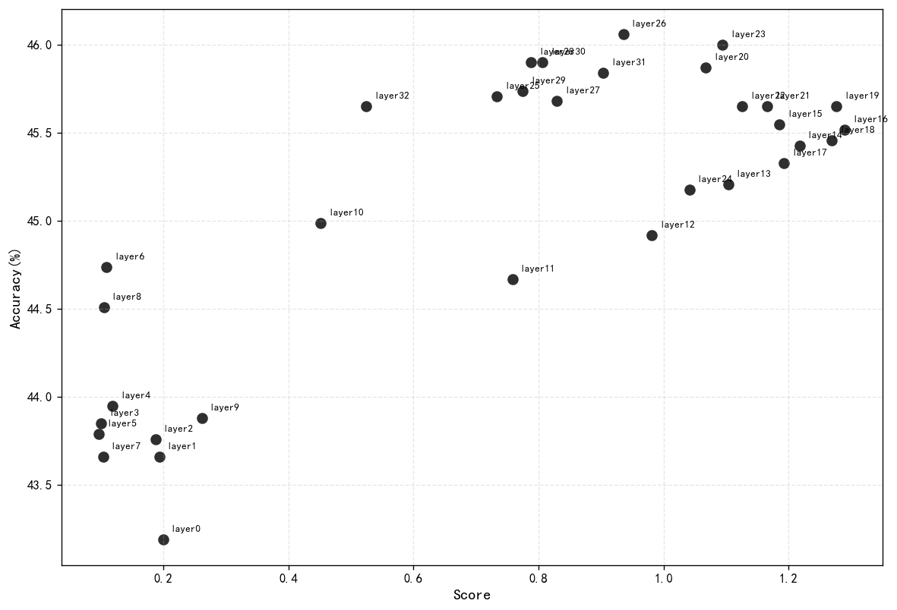
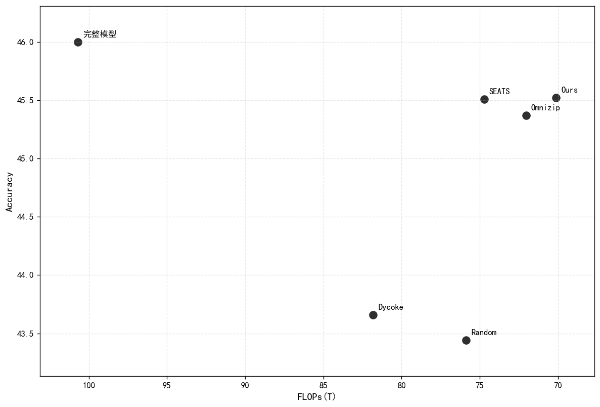
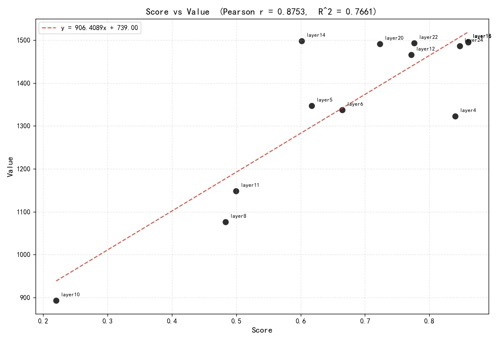
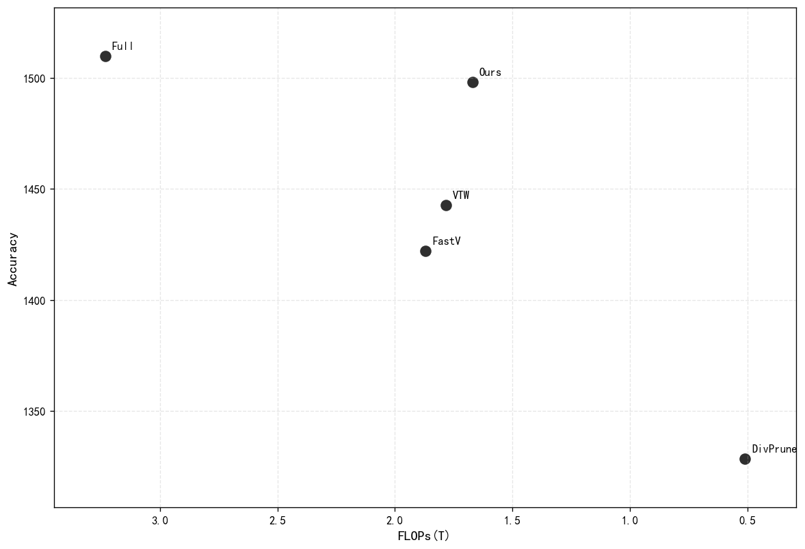

## Record

### 本周工作

### Qwen2.5-omni 3B

分数-性能

Pearson r = 0.801938083380053

#### 与其他方法的对比

| Methods | TFLOPs ↓ | Token 预算 | Acc |
|:--------|:-----|:------|:------|
| Full | 100.69 | 100% |  46.00 |
| Random | 75.86 | 35% | 43.44 |
| Dycoke(2024.11) | 81.81 | 50% | 43.66  |
| OmniZip(2025.11) | 72.04 | 45% | 45.37 |
| OmniSIFT(2026.2,未测试) | - | 35% | 45.7(论文中完整模型分数为45.80) |
| SEATS(2026.5) | 74.72 | 35% | 45.51 |
| OmniSelect(2026.5,未测试) | - | 45% | 45.08(论文中完整模型分数为45.62)|
| OmniFocus(2026.7) | -(统计中) | 35% | 45.29 |
| Ours | 70.11 | 33.5% | 45.52 |

### Qwen2.5-vl 7B

×

### llava-v1.5-7b

分数-性能

Pearson  r   = 0.8752950645
Pearson  R^2 = 0.7661414499

#### 与其他模型的对比

llava-v1.5-7b

| Methods | TFLOPs ↓ | MME ↑ | MMMU acc ↑ |
|:--------|:-----|:------|:------|
| Full | 3.233 | 1509.97 |  36.43 |
| FastV(2024) | 1.869 | 1422.18 | 33.13 |
| VTW (K=16)(2024.5) | 1.782 | 1442.67 | 35.60 |
| DivPrune(2025.4) | 0.512 | 1328.3 | 35.89 |
| Ours(14) | 1.670 | 1498.33 | 36.17 |

