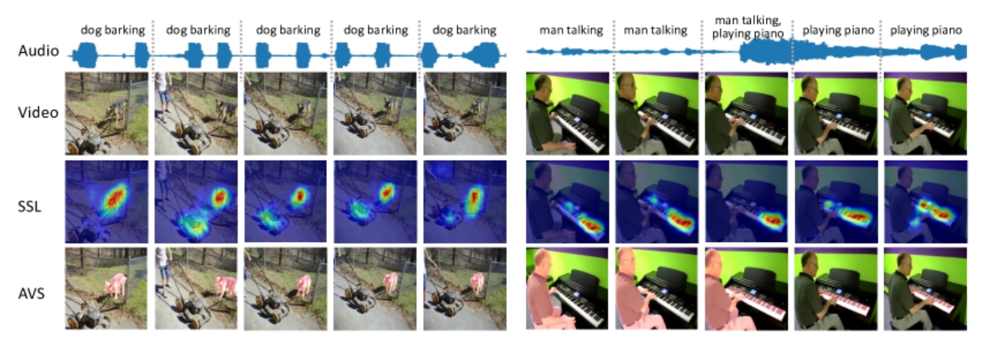
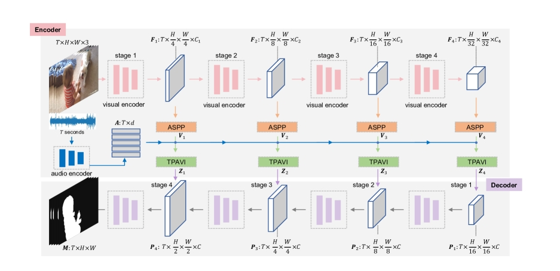
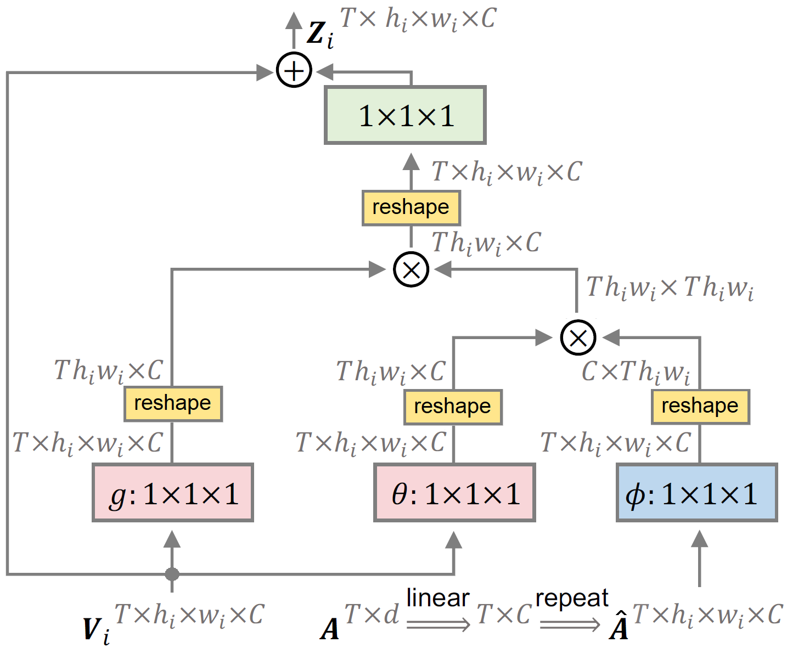

# Audio−Visual Segmentation 与 AVSS 论文研读

音频-视觉分割/ 基于语义的视听分割

> 视听分割问题的提出论文

[项目源码](https://github.com/OpenNLPLab/AVSBench)

## 总体概述

| 对比维度 | AVS | AVSS|
| ------ | ------ | ----- |
| 任务定义 | 首次提出 **音视频分割（AVS）**，输出声音来源的像素级二值掩码 | 在 AVS 基础上扩展为 **带语义的音视频分割（AVSS）**，输出包含类别信息的语义掩码|
| 数据集  | AVSBench（含单声源、复声源两子集） | 扩展为 **AVSBench-object + AVSBench-semantic**（新增语义标签，类目从 23 扩至 70） |
| 任务设置 | 1️⃣ S4：单声源半监督  2️⃣ MS3：多声源全监督 | 增加 3️⃣ AVSS：语义音视频分割，全监督 |
| 方法框架 | Encoder-Decoder + TPAVI 模块（Temporal Pixel-wise Audio-Visual Interaction） + L_AVM 正则 | 同样结构，但输出语义图（K 通道 softmax）；加入更大规模实验与消融研究 |
| 贡献亮点 | 首次提出 AVS 任务与数据集，构建 AVSBench 基准，验证多模态像素级分割可行性 | 引入语义标签与更丰富的数据集，支持 AVSS 任务与在线 Benchmark，扩展 TPAVI 模型适配语义输出 |

## Benchmark

视听分割基准 ( AVSBench ) :

| 任务 | 数据集 | 标签类型 | 学习方式 |
| ---- | ---- | ---- | ---- |
| S4 | 单声源子集 | 二值掩码（仅首帧标注）| 半监督 |
| MS3 | 多声源子集 | 二值掩码（每帧标注）| 全监督 |
| AVSS | 语义子集 | 语义掩码（每帧标注）| 全监督 |

## 背景

现有的音视频研究任务没有关注到声音对应到图像的像素级分割问题

早期的研究包括

| 任务 | 含义 | 局限 |
| ---- | ---- | ---- |
| AVC (Audio-Visual Correspondence) | 判断音频与图像是否来自同一场景 | 仅分类，不关心位置|
| AVEL / AVVP                       | 定位事件发生的时间段 | 时间层面|
| SSL (Sound Source Localization)   | 帧内与声音相对应的视觉区域 | 只能粗定位，无法分割具体形状 |

## 音频-视觉分割定义

其目标是在图像帧的时间点输出产生声音的物体的像素级分割掩码

> 和声源定位(SSL)的区别  
>   
> SSL: 帧内与声音相对应的视觉区域, 不考虑发声对象的实际形状，块级别  
> AVS: 帧内所有发声物体的像素级分割掩码

## Baseline Method

核心是通过一个时序级的、Encoder–Decoder 架构的音视频交互网络，实现声音和图像的对齐

同时在视觉语义分割结构的基础上引入了音频分支和一个关键的融合模块——TPAVI (Temporal Pixel-wise Audio-Visual Interaction)。

| 模块 | 作用 |
| ---- | ---- |
| ASPP    | 视觉特征多尺度感受野，捕获不同大小物体 |
| TPAVI   | 时序像素级音视频交互，建立声音与像素的映射 |
| Decoder | 空间重建，生成分割掩码 |

### 编码器（Encoder）

编码器有两部分：**视觉编码器** 与 **音频编码器**，二者独立提取模态特征，之后在中间层进行融合。

#### Audio Encoder

- 输入：视频的音频片段 $S^a$
- 先通过**短时傅里叶变换 STFT**生成频谱图；然后送入 **VGGish 网络**（在 AudioSet 上预训练的权重）来提取音频特征 $A \in \mathbb{R}^{T\times d}, \quad d=128$

#### Video Encoder

- 输入：视频帧序列 $S^v$
- 使用基于卷积或基于视觉变换器的流行骨干网络（ResNet-50 或 PVT-v2）提取视觉特征 $F_i \in \mathbb{R}^{T \times h_i \times w_i \times C_i}, \quad i = 1, 2, 3, 4, .., n$
    
    其中 $(h_i,w_i)=(H,W)/2^{i+1}$

- 输出多尺度特征图，其中每层空间尺寸依次缩小（1/4, 1/8, 1/16, 1/32; n=4）

### ASPP 模块（Atrous Spatial Pyramid Pooling）

在视觉特征 $F_i$ 上加入（空洞空间金字塔池化）ASPP 结构，利用多尺度空洞卷积捕获不同感受野，有助于识别大小不同的发声物体（如小提琴 vs 飞机），输出 $V_i$。

$$
F_i \xrightarrow[]{ASPP} V_i \in \mathbb{R}^{T\times h_i \times w_i \times C}, \quad C=256
$$

### TPAVI （Temporal Pixel-wise Audio-Visual Interaction）模块

TPAVI是这两篇论文的灵魂模块,它在视觉特征与音频特征之间建立时序+像素级的相互注意关系，从而实现模态融合。

#### (1) 模块输入

- 视觉特征： $V_i \in \mathbb{R}^{T\times h_i \times w_i \times C}$
- 音频特征： $A \in \mathbb{R}^{T\times d}$

通过一个线性层将音频特征投影到与视觉通道一致的维度：
$$
\hat{A} = W_a A \in \mathbb{R}^{T\times C}
$$
然后复制并 reshape 到与视觉特征相同的空间维度：
$$
\hat{A} \rightarrow \mathbb{R}^{T\times h_i \times w_i \times C}
$$

每个视觉像素通过 TPAVI 模块与当前帧对应的全部音频特征交互

#### (2) 模块结构

TPAVI 内部是一个非局部注意力结构（类似 Transformer 的 self-attention），核心计算为：

$$
Z_i = V_i + \mu(\alpha_i g(V_i))
$$
其中：
$$
\alpha_i = \frac{\theta(V_i)\phi(\hat{A})^T}{N}, \quad N = T \times h_i \times w_i
$$

解释如下：

| 符号 | 含义 | 运算  | 形状 |
| ------ | ----- | ------ | ---- |
| $ \theta(\cdot), \phi(\cdot), g(\cdot), \mu(\cdot) $ | 1×1×1 卷积层（可理解为线性变换） | —  | —  |
| $ V_i $ | 视觉特征  | `[T, H, W, C]`  | —    |
| $ \hat{A} $  | 广播后的音频特征  | `[T, H, W, C]`  | —  |
| $ \theta(V_i)\phi(\hat{A})^T $  | 计算像素与音频的相似度 | `[T, N, N]`（N = H×W） | attention map |
| $ \alpha_i $  | softmax 归一化相似度  | `[T, N, N]`  | 音频-视觉相似度 |
| $ g(V_i) $   | 值特征（Value） | `[T, H, W, C]` | — |
| $ \alpha_i g(V_i) $ | 加权求和 | `[T, H, W, C]` | 融合后的音视频特征 |
| $ \mu(\cdot) $  | 输出变换 | `[T, H, W, C]`  | — |
| $ Z_i = V_i + \mu(\alpha_i g(V_i)) $  | 残差连接输出 | `[T, H, W, C]`| 最终融合特征  |

#### (3) 模块直观解释

音频引导的注意力层, 对于每个像素判断在当前音频特征和自己的相关性，然后用这个注意力权重来重新加权视觉特征

举个例子，如果音频包含的是“钢琴声”，那么钢琴键盘附近的像素注意力权重就会更高；相反，和声音无关的背景像素权重就会被抑制。最后，模块根据这些注意力权重重新加权视觉特征

### 解码器（Decoder）

在 TPAVI 模块后，视觉特征经过融合，得到四层输出：Z4，Z3，Z2，Z1

| 层级 | 分辨率 | 通道数 | 说明      |
| -- | -- | -- | -- |
| Z₄ | 最深层，1/32 | 512 | 语义强但空间小 |
| Z₃ | 1/16     | 256 | 中层语义    |
| Z₂ | 1/8      | 128 | 较细节     |
| Z₁ | 1/4      | 64  | 空间细节最丰富 |

作者采用 **Panoptic-FPN 风格的解码器**：

- 逐层融合上采样（Z4 → Z3 → Z2 → Z1） -- 解码后的特征随后被上采样到下一阶段
- 结合跳跃连接恢复空间细节（简而言之，在第 j 阶段（j = 2, 3, 4），编码器第 $Z_{5-j}$ 阶段的输出和最后阶段 $Z_{6-j}$ 的输出都用于解码过程。

> 高层特征知道是什么（语义），低层特征知道形状（空间细节）

- 最终输出预测掩码 $M$

$$
M \in
\begin{cases}
\mathbb{R}^{T\times H\times W}, & \text{AVS (二值)} \\
\mathbb{R}^{T\times H\times W\times K}, & \text{AVSS (语义)}
\end{cases}
$$

在 AVS 中，激活函数为 Sigmoid；
在 AVSS 中，改为 Softmax（输出类别概率图，具有最高概率的索引代表探测对象的类别）。

### 损失函数设计

总损失由两部分组成：

$$
L = L_{BCE}(M, Y) + \lambda L_{AVM}(M, Z, A)
$$

### (1) 二值交叉熵损失 (BCE)

用于像素级监督，保证预测掩码与标注一致。

### (2) 音视频映射正则项 (L_AVM)

基于 KL 散度：
$$
L_{AVM} = \sum_i KL(\text{avg}(M_i \odot Z_i), A_i)
$$
作用：
让模型学到“相似声音 → 相似视觉特征”的分布一致性，
促进跨模态对齐。

> 注：在单声源半监督任务（S4）中，作者发现该项帮助有限，因此 λ=0。

---

### 方法在扩展论文（AVSS）中的改进

TPAMI 版本的方法在框架上基本一致，但针对**语义任务**做了以下扩展：

| 改进点              | 说明                  |
| ---------------- | ------------------- |
| 输出多通道语义掩码 (K=70) | 使用 Softmax 激活进行类别预测 |
| 多类别 KL 正则        | 对不同类别的音频特征建立对应关系    |
| 更长时序输入（10秒）      | 模型需处理跨时段音视频对齐       |
| 更大规模数据（12k 视频）   | 提升泛化能力与鲁棒性          |

