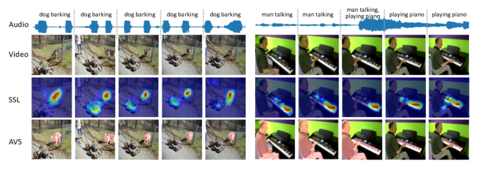

## Audio−Visual Segmentation

音频-视觉分割

> 视听分割问题的提出论文

[项目源码](https://github.com/OpenNLPLab/AVSBench)

### Benchmark

视听分割基准 ( AVSBench ) :

- 单声源半监督视听分割 (semi-supervised audio-visual segmentation with a single sound source) ———— 半监督单声源分割（S4）
- 多声源全监督视听分割 (fully-supervised audio-visual segmentation with multiple sound sources) ———— 全监督多声源分割（MS3）

### 音频-视觉分割定义

其目标是在图像帧的时间点输出产生声音的物体的像素级分割掩码。

> 和声源定位(SSL)的区别  
>   
> SSL: 帧内与声音相对应的视觉区域, 不考虑发声对象的实际形状，块级别  
> AVS: 帧内所有发声物体的像素级分割掩码

### SSL 存在的问题

- 现有的 SSL 方法无法清晰界定发声物体的形状
- 依赖于无监督学习

