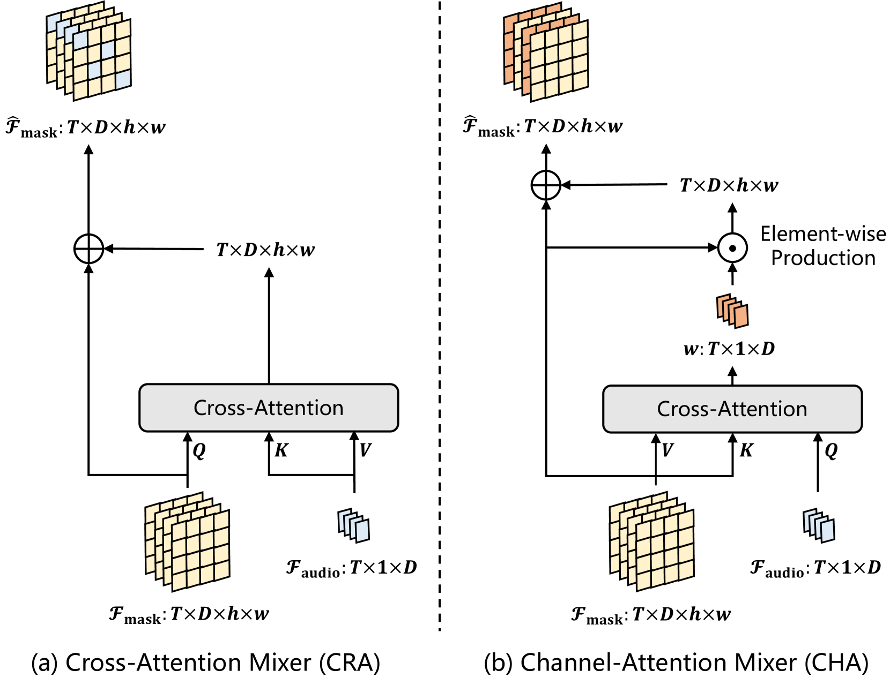
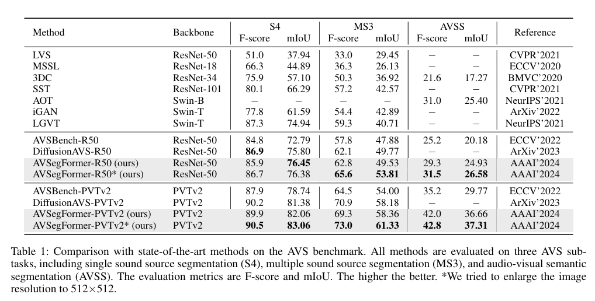

# AVSegFormer: Audio-Visual Segmentation with Transformer

基于 Transformer 的视听分割

[项目源码](https://github.com/vvvb-github/AVSegFormer)

## Benchmark datasets

[AVSBench 数据集的三个子集](https://github.com/OpenNLPLab/AVSBench)

语义标签子集（AVSS）、多源子集（MS3）、单源子集（S4）

```bash
|--AVS_dataset
    |--AVSBench_semantic/
    |--AVSBench_object/Multi-sources/
    |--AVSBench_object/Single-source/
```

## 研究背景与问题动机

### 研究背景

任务定义： 音视频分割（Audio-Visual Segmentation, AVS）旨在在视频中根据音频信号定位并分割出发声物体的像素区域。

### 现有问题

以往方法如 AVSBench (Zhou et al., ECCV 2022) 采用了简单的模态融合（fusion module）+ Semantic FPN, 但：

- 无法捕捉音视频间的细粒度关联；
- 在多声源场景下表现差；

## 核心方法

提出 AVSegFormer —— 一个基于 Transformer 的音视频分割框架, 核心思想是通过 稠密与稀疏的双路径跨模态融合, 实现更强的音视频对应建模。

### 模型整体结构


AVSegFormer 包含四个关键模块：

- Query Generator（查询生成器）

- Transformer Encoder（编码器）
    - 输入多尺度视觉特征；
    - 输出初始的 mask feature（掩码特征） 和 多尺度特征 token 序列（ Flatten + 拼接成序列作为 Encoder 的输入）

- Audio-Visual Mixer（音视频混合器）
    - 动态调整视觉特征通道权重；
    - 使用 Channel-Attention 机制（比Cross-Attention效果更好）；
    - 输出 vision-conditioned mask feature；
    - 同时引入辅助混合损失 L_mix 来引导学习正确的跨模态特征对应。

- Transformer Decoder（解码器）
    - 输入：
        - $Q_{mixed} \in \mathbb{R}^{T \times N_q \times D}$
        - 多尺度视觉特征 token 序列
    - 输出：$Q_{output} \in \mathbb{R}^{T \times N_q \times D}$

### Query Generator（查询生成器）

- 初始：$Q_{init} \in \mathbb{R}^{T \times N_q \times D}$
- 输入: $F_{audio} \in \mathbb{R}^{T \times D}$, 作为键与值

$$
Q_{audio} = \mathrm{Attn}(Q_{init}, F_{audio}, F_{audio}) \\
Q_{mixed} = Q_{audio} + Q_{learn}
$$

- 输出: $Q_{mixed} \in \mathbb{R}^{T \times N_q \times D}$


### Transformer Encoder（编码器）

Transformer Encoder 的输入来自视觉主干（ResNet 或 PVTv2）：
$$
F_i \in \mathbb{R}^{T \times D_i \times h_i \times w_i}, \quad i = {1/8, 1/16, 1/32}
$$

- (T)：时间帧数；
- (D_i)：对应层的通道数；
- (h_i, w_i)：空间尺寸（分别为 (H/8, H/16, H/32) 等）；
- 取三层特征
  - 1/8：局部细节；
  - 1/16：中层语义；
  - 1/32：全局语义。

因为不同层的通道维度不同（ResNet 分别为 256 / 512 / 1024 / 2048）, 在送入 Transformer 前, 需要统一到同一维度 (D=256)：

$$
F_i' = \text{Conv}_{1×1}(F_i) \quad \Rightarrow \quad F_i' \in \mathbb{R}^{T×256×h_i×w_i}
$$

Transformer 处理序列, 因此需要将空间特征展平为 token 序列：

$$
F_i' \in \mathbb{R}^{T×D×h_i×w_i}
\quad \Rightarrow \quad
F_i^{flat} = \text{Flatten}(F_i') \in \mathbb{R}^{T×(h_iw_i)×D}
$$

拼接三个尺度的 token：

$$
F_{concat} = [F_{1/8}^{flat}, F_{1/16}^{flat}, F_{1/32}^{flat}]
\in \mathbb{R}^{T×N×D}
$$

其中：
$$
N = h_{1/8}w_{1/8} + h_{1/16}w_{1/16} + h_{1/32}w_{1/32}
$$

为了生成统一的 mask feature, 对 1/8 尺度特征进行 2x 上采样到并与 1/4 尺度特征相加：

$$
F_{mask} = \text{Upsample}(F_{merge}^{1/8}) + F_{backbone,1/4}
$$

最终：
$$
F_{mask} \in \mathbb{R}^{T×256×H/4×W/4}
$$


#### Audio-Visual Mixer (视听混合器)

- 输入：
    - 音频特征： $ F_{audio} \in \mathbb{R}^{T \times D} $
    - 视觉掩码特征：$ F_{mask} \in \mathbb{R}^{T \times D \times h \times w} $, 其中 $ h=H/4, w=W/4 $

论文尝试过两种设计：



- **Cross-Attention Mixer（CRA）**：效果不佳；
- **Channel-Attention Mixer（CHA）**：最终采用的方案。

通道注意力机制（Channel-Attention）：

* 对每个时间帧, 计算音频特征与视觉通道的跨模态注意力权重：
  $$
  \omega = \mathrm{softmax}\left(
  \frac{F_{audio} F_{mask}^T}{\sqrt{D/n_{head}}}
  \right) F_{mask}
  $$
* 然后对视觉掩码特征进行加权增强：
  $$
  \hat{F}_{mask} = F_{mask} + F_{mask} \odot \omega
  $$
  其中 ⊙ 表示通道间逐元素乘。

输出：

$$
\hat{F}_{mask} \in \mathbb{R}^{T \times D \times h \times w}
$$


##### Auxiliary mixing loss （辅助混合损失）

- 引入 **Mixing Loss $L_{mix}$**, 通过线性层整合所有掩码特征的通道 $F_{mask}$, 并预测一个二值掩码,同时将真实标签中的所有前景标签提取出来作为一个新的二值标签, 计算它们之间的 Dice 损失

- 提升复杂场景下鲁棒性

#### Transformer Decoder （解码器）

输入：

* Queries：$ Q_{mixed} \in \mathbb{R}^{T \times N_q \times D} $
* 多尺度视觉特征：${F_i} \in \mathbb{R}^{T \times D_i \times h_i \times w_i}, \quad i = {1/8, 1/16, 1/32}$
* 混合视觉掩码特征：$ \hat{F}_{mask} \in \mathbb{R}^{T \times D \times h \times w} $, 其中 $ h=H/4, w=W/4 $

处理流程：

1. **Cross-Attention 聚合：**

   - 每个 query 与视觉特征交互, 提取与之相关的区域；
   - 得到更新后的 query 输出：
    $$
    Q_{output} = \mathrm{TransformerDecoder}(Q_{mixed}, F_{visual})
    $$
2. **掩码生成：**

   - 将输出的 queries 与混合后的掩码特征相乘：
     $$
     F_{mask}^{'} = \hat{F}_{mask} \cdot Q_{output}
     $$
   - 通过 MLP + 全连接层预测最终掩码：
     $$
     M = \mathrm{FC}( \hat{F}_{mask} + \mathrm{MLP}(F_{mask}^{'}) )
     $$
3. **输出维度：**
   $$
   M \in \mathbb{R}^{T \times N_{class} \times h \times w}
   $$
   每帧输出多通道语义分割结果, 维度 $N_{class}$ 表示语义类别的数量。


### Loss Function

$
L = L_{IoU} + \lambda L_{mix}, \quad \lambda = 0.1
$

- **$L_{IoU}$（Dice Loss）**：用于最终掩码监督, 比较最终分割掩码与真实值；
- **$L_{mix}$**：辅助监督, 让 Mixer 的特征更聚焦于声音目标；

- 选择 Dice Loss 的原因：AVS 中前景占比小, Dice 对小目标敏感。


### 结果分析

#### 整体结果



AVSegFormer 在所有子任务上都优于 AVSBench 基线

#### 消融实验

| 模块 | 效果 | 说明  |
| --- | -- | ------ |
| Queries 数量=300| 最优 | 过少限制表达能力 |
| Learnable Queries  | +2% mIoU | 提升多声源识别能力|
| Audio-Visual Mixer | +2~3% mIoU | Channel-Attention 优于 Cross-Attention |
| Mixing Loss | +1.5% mIoU | 稳定跨模态特征  |


- 查询数量 (Number of Queries)
    实验比较了解码器输入查询数为 1、100、200、300 时的性能。结果显示查询数量与性能正相关, 最多 300 个查询时表现最佳。这说明更多查询能覆盖更丰富的语义区域, 对多声源场景尤为重要。
- 可学习查询 (Learnable Queries)
    在 Query Generator 生成动态查询的基础上增加可学习参数后, 单声源任务提升较小, 但在多声源任务中显著提升性能。说明可学习查询能提供类别先验, 对复杂场景中的多目标建模更有帮助。
- 视听混合器（Audio-Visual Mixer）
    对比了两种设计：交叉注意力混合器（CRA）与通道注意力混合器（CHA）。结果表明 CHA 明显优于 CRA, 能够更稳定、更有效地利用音频语义调制视觉通道, 实现对发声物体的增强与背景的抑制。
- 辅助混合损失（Auxiliary Mixing Loss）
    在训练中加入混合损失后, 模型在两个任务上均有明显提升。该损失有助于在特征空间中加强音视频对齐, 使融合特征更具辨别力和一致性。

### 贡献

1. 提出 **AVSegFormer** —— 基于 Transformer 的新型音视频分割框架；
2. 设计了：
   * 稠密 **Audio-Visual Mixer**；
   * 稀疏 **Cross-Modal Decoder**；
   * **双向条件特征融合机制**；
3. 实验在 AVSBench 三个子任务上全面超越当时 SOTA；
4. 模型对复杂音频语义、多目标场景具有更好鲁棒性。