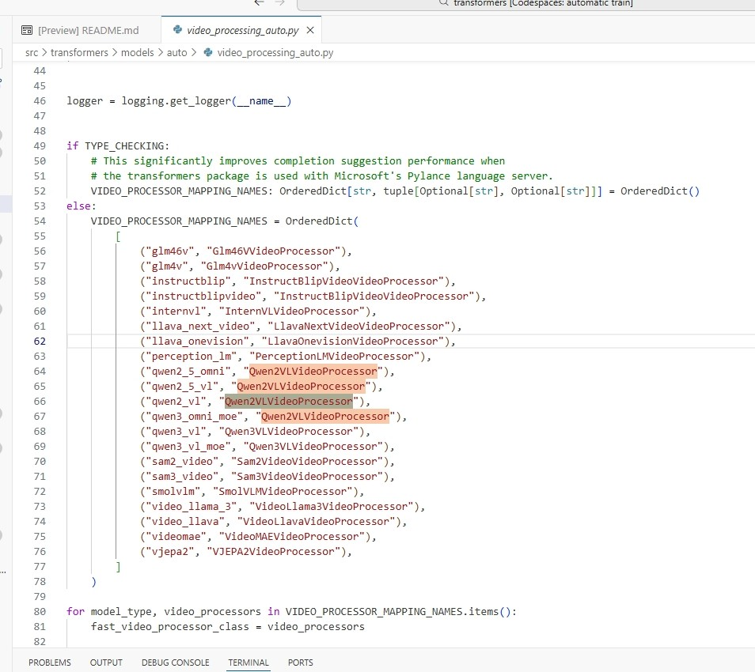
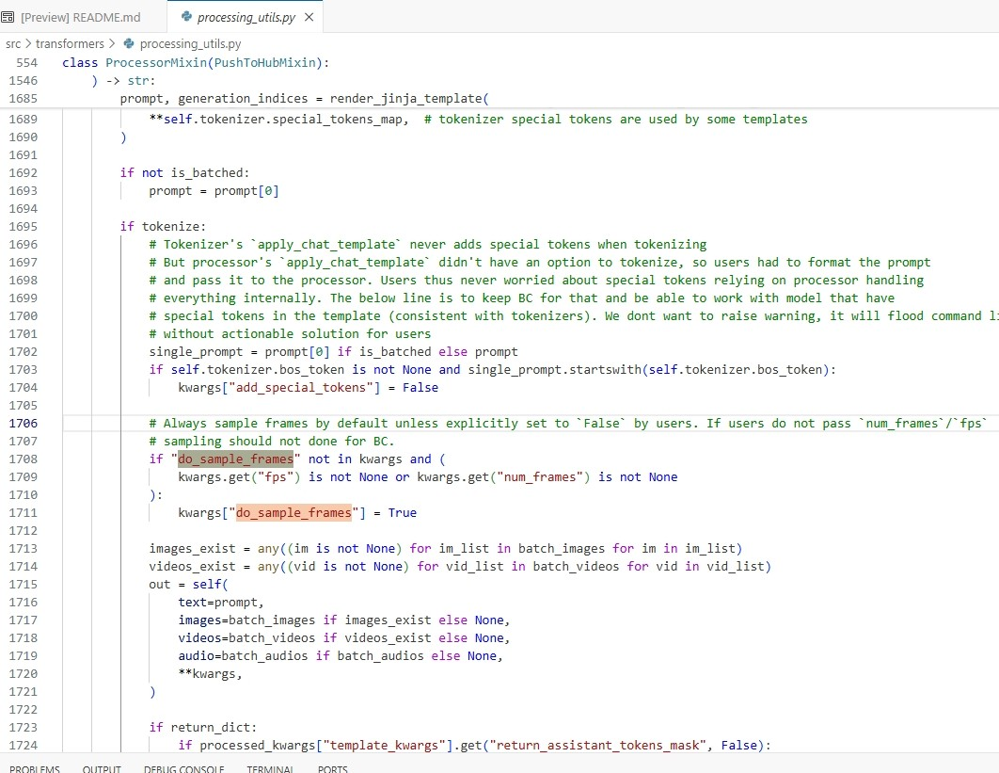

## Qwen2.5-omni VL部分详解

### 代码定位

https://github.com/huggingface/transformers/blob/main/src/transformers/models/qwen2_5_omni/processing_qwen2_5_omni.py

```py
    videos_inputs = self.video_processor(videos=videos, **output_kwargs["videos_kwargs"])

    fps = output_kwargs["videos_kwargs"].get("fps", 2.0)
    video_grid_thw = videos_inputs["video_grid_thw"]
    second_per_grid_ts = [self.video_processor.temporal_patch_size / fps] * len(video_grid_thw)
    videos_inputs["video_second_per_grid"] = second_per_grid_ts

    video_grid_thw = iter(video_grid_thw)
    video_second_per_grid = iter(second_per_grid_ts)
```

从这里看，Qwen2.5-Omni 默认认为视频帧经过采样后对应 fps = 2 Hz，temporal_patch_size = 2 每两帧合并成一个时间 token（T-grid）

如果采样后的帧率为 fps，采样后每一帧时间间隔是：1/fps 秒，每个 T-patch 包含 temporal_patch_size 帧，也就是每个 video-grid token 对应的时间长度是 1s

据此找 video_processor 的代码，根据类顶部注释，可以看到要去 Qwen2-VL 里面找 `Qwen2VLVideoProcessor` 类（最新的）

```py
    r"""
        ...
        video_processor ([`Qwen2VLVideoProcessor`], *optional*):
            The video processor.
        ...
    """
```

具体的映射是通过 auto 里面 video_processor 函数进行定位



也就是 https://github.com/huggingface/transformers/blob/main/src/transformers/models/qwen2_vl/video_processing_qwen2_vl.py

类中内置参数数值如下

```py
    resample = PILImageResampling.BICUBIC
    size = {"shortest_edge": 128 * 28 * 28, "longest_edge": 28 * 28 * 768}
    image_mean = OPENAI_CLIP_MEAN
    image_std = OPENAI_CLIP_STD
    do_resize = True
    do_rescale = True
    do_normalize = True
    do_convert_rgb = True
    min_pixels = 128 * 28 * 28
    max_pixels = 28 * 28 * 768
    patch_size = 14
    temporal_patch_size = 2
    merge_size = 2
    min_frames = 4
    max_frames = 768
    do_sample_frames = False  # Set to False for BC, recommended to set `True` in new models
    valid_kwargs = Qwen2VLVideoProcessorInitKwargs
    model_input_names = ["pixel_values_videos", "video_grid_thw"]
```

定位到 `sample_frames` 函数，

```py
    if num_frames is not None:
        num_frames = round(num_frames / temporal_patch_size) * temporal_patch_size
    elif fps is not None:
        if metadata is None or metadata.fps is None:
            raise ValueError(
                "Asked to sample `fps` frames per second but no video metadata was provided which is required when sampling with `fps`. "
                "Please pass in `VideoMetadata` object or use a fixed `num_frames` per input video"
            )
        max_frames = math.floor(min(max_frames, total_num_frames) / temporal_patch_size) * temporal_patch_size
        num_frames = total_num_frames / metadata.fps * fps
        num_frames = min(max(num_frames, min_frames), max_frames, total_num_frames)
        num_frames = math.floor(num_frames / temporal_patch_size) * temporal_patch_size

    if num_frames > total_num_frames:
        raise ValueError(
            f"Video can't be sampled. The inferred `num_frames={num_frames}` exceeds `total_num_frames={total_num_frames}`. "
            "Decrease `num_frames` or `fps` for sampling."
        )

    if num_frames is not None:
        indices = torch.arange(0, total_num_frames, total_num_frames / num_frames).int()
    else:
        indices = torch.arange(0, total_num_frames).int()

    return indices
```

zai这里实现了动态帧采样的帧逻辑：根据输入视频自身的原始 FPS 动态决定采样后的帧数

```py
num_frames = total_num_frames / metadata.fps * fps
```

换言之：

$$
\text{num\_frames}=\underbrace{\text{视频总帧数}/\text{原始 FPS}}_\text{视频总时长（秒）}\times\text{目标采样 FPS}
$$


比如说原视频：10s@25fps，有 `total_num_frames = 250`, `fps = 2`， 则 `num_frames = 20`

动态采样后的视频将具有 20 帧，每秒 2 帧。

```py
num_frames = min(max(num_frames, min_frames), max_frames, total_num_frames)
```

- 不少于最小帧数（默认 min_frames=4）
- 不超过最大帧数（默认 max_frames=768）
- 不超过真实帧数

必须保证采样的帧数是 temporal_patch_size 的整数倍：

```py
num_frames = math.floor(num_frames / temporal_patch_size) * temporal_patch_size
```

20 帧→ 保留 20 帧
21 帧→ `floor(21/2) = 10` → 10×2=20→ 修为 20 帧


```py
indices = torch.arange(0, total_num_frames, total_num_frames / num_frames).int()
```

均匀采样, 等间隔取 num_frames 个点, `250 / 20 = 12.5`; 采样索引：$0, 12, 25, 37, 50, ... , 237$

这里面 `do_sample_frames` 默认是 False，照理说是默认不启用的，根据 `class Qwen2_5_VLProcessor(ProcessorMixin):` 找 `ProcessorMixin` 里面和 `do_sample_frames` 相关的逻辑



可以看到这是一个自动启用帧采样的条件判断：`"do_sample_frames" not in kwargs` 也就是用户没有明确设置 `do_sample_frames` 参数时

如果满足：

`kwargs.get("fps") is not None` or `kwargs.get("num_frames") is not None`

自动设置 `kwargs["do_sample_frames"]` = True


