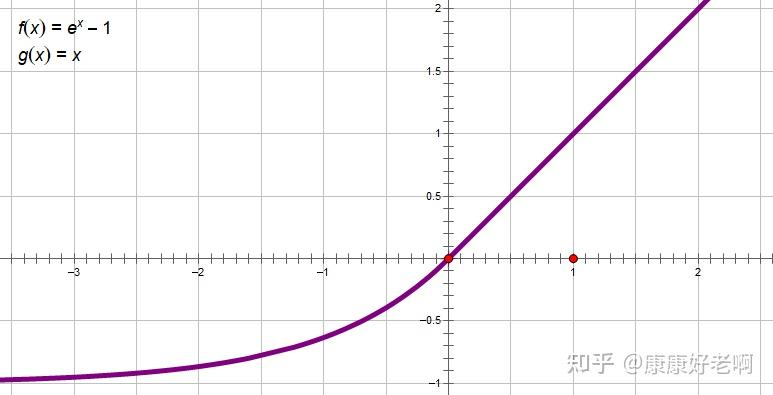

## 从标准 attn 到 TTT

### 标准 attn (Scaled-Dot Attention)

目前最流行的 Attention 机制当属《Attention is All You Need》中提出的 Scaled-Dot Attention，也就是缩放点积 Attention。

这里主要讨论自注意力，故统一设 $Q, K, V \in \mathbb{R}^{n \times d}$，一般情况下来说 $n > d ( 或 n >> d)$

$$ Attention(Q,K,V) = softmax(\frac{QK^T}{\sqrt{d}})V $$

其中，$d_h$ 为头的大小，也即维度，$n$ 为序列长度。

我们用 $x_t \in \mathbb{R}^{n \times d_h}$ 表示序列中的第 t 个元素，$W_q, W_k, W_v \in \mathbb{R}^{d_h \times d}$ 分别表示查询、键、值矩阵。

则有：

$$ Q = x_t W_q, K = x_t W_k, V = x_t W_v$$

那么对于序列中的第 t 个元素 $x_t$ ，其输出 $o_t$ 为：

$$ o_t = softmax(\frac{q_t^TK_t^T}{\sqrt{d}})V_t$$

其中，$ \mathbb{K}_t, \mathbb{V}_t \in \mathbb{R}^{t \times d}$ 被称为 KV Cache，它由迄今为止所见的所有键和值的连接组成：

$$
\mathbb{K}_t=\begin{bmatrix} K_1 \\ K_2  \\ \vdots \\ K_t \end{bmatrix},
\mathbb{V}_t=\begin{bmatrix} V_1 \\ V_2  \\ \vdots \\ V_t \end{bmatrix} \in \mathbb{R}^{t \times d}
$$

为简化起见，我们省略 $\sqrt{d}$ 因为它可以吸收到查询或键矩阵， 对于序列中的第 t 个元素 $x_t$ ，将其输出 $o_t$ 写为

$$ y_t = softmax(q_t^TK_t^T)V_t$$

我们把注意力也写成对应的格式：

$$ Attention(Q,K,V) = softmax(QK^T)V $$

#### 通用表示

对于输入序列

$$x_1, x_2, \dots, x_t$$

我们知道，一个通用序列建模层可以表示为一个根据更新规则转换的隐藏状态。那么标准注意力可以表示为下面的形式：

状态更新：
$$
\mathbb{K}_t.append(k_t) \\
\mathbb{V}_t.append(v_t)
$$

查询规则(输出)：
$$
y_t = softmax(q_t^TK_t^T)V_t
$$

状态大小：$2td$

#### Scaled-Dot Attention 存在的问题

我们可以把计算标准注意力分为三步：

1. 计算 $ QK^T $

    $(n,d)(d,n) = (n,n)$, 也就是 $O(n^2d)$

2. 对其进行 softmax 操作

    O($n^2$)

3. 与值矩阵 V 进行点积操作

    $(n,n)(n,d) = (n,d)$, 也是 $O(n^2d)$

综上，标准注意力的计算复杂度为 $O(n^2d)$, 其中 $n >> d$，复杂度为 $O(n^2)$.

由于需要计算出 $QK^T$ 这个 $(n,n)$ 的矩阵，其空间和时间复杂度都正比于 $n^2$。尽管 Flash Attention 的出现降低了空间需求，但平方的时间复杂度依然无法避免

随着输入序列长度的增加，实际计算的速度和内存占用也会增加，这在实际应用中是不可接受的。

### 线性注意力

如果我们不考虑计算优先级(softmax), 那么注意力的计算可以简单的写作 $QK^TV$ 的三个矩阵连乘，那么用矩阵乘法的结合律，我们简单的优化计算

先计算 $K^TV$，得到一个 $(d,d)$ 的矩阵，然后用 $Q$ 左乘这个矩阵，计算复杂度是 $O(nd^2)$，由于 $n >> d$，所以计算复杂度是 $O(n)$，也就是说去掉 $softmax$ 的 Attention 复杂度可以降到最理想的线性 $O(n)$。

但是去掉 $softmax$ 后还能算是 attention 吗，或者说，还能有标准 attention 的效果吗？

Softmax 操作: $ f(x_i) = \frac{e^{x_i}}{\sum_{j=1}^ne^{x_j}} $

现在把标准注意力写成等价的形式：

$$
Attention(Q,K,V)_i = \frac{\sum_{j=1}^ne^{q_i^Tk_jv_j}}{\sum_{j=1}^ne^{q_i^Tk_j}}
$$

这样来看，标准注意力其实就是用 $e^{q_ik_j^T}$ 来对 $v_j$ 进行加权平均，由此我们可以提出一个注意力的一般化形式定义：

$$
Attention(Q,K,V)_i = \frac{\sum_{j=1}^n sim(q_i,k_j)v_j}{\sum_{j=1}^n sim(q_i,k_j)}
$$

也就是定义一个相似度函数 $sim(q_i,k_j)$，计算查询 $q_i$ 和键 $k_j$ 之间的相似度。

为了保证和 attention 相似的分布特性，要求  $sim(q_i,k_j) >= 0$

如果直接去掉 softmax 那就是 $sim(q_i,k_j) = q_i^T k_j$，但是内积无法保证非负性，一个自然的想法是让 $q_i,k_j$ 中的每一个元素都非负，这样内积必然也都是非负的。可以给 $q_i,k_j$ 分别加上一个激活函数 $\phi, \varphi$，也即：

$$
sim(q_i,k_j) = \phi(q_i)^T \varphi(k_j)
$$

其中 $\phi, \varphi$ 都是非负的激活函数，比如 $\phi(x) = \varphi(x) = elu(x) + 1$

$$
elu(x) = \begin{cases}
    x & x \geq 0 \\
    \alpha(e^x - 1) & x < 0
\end{cases}
$$

函数图像如下：

#### 通用表示

把 $sim(q_i,k_j) = \phi(q_i)^T \varphi(k_j)$ 带入一般形式，有

$$
Attention(Q,K,V)_i = \frac{\sum_{j=1}^n \phi(q_i)^T \varphi(k_j)v_j}{\sum_{j=1}^n \phi(q_i)^T \varphi(k_j)} = \frac{\phi(q_i)^T\sum_{j=1}^n \varphi(k_j)v_j^T}{\phi(q_i)^T \sum_{j=1}^n \varphi(k_j)}
$$

简化掉激活函数 $\phi, \varphi$，有

$$
y_t = q_t^TK_t^TV_t = q_t^T(K_t^TV_t) = q_t^T \sum_{j=1}^n {k_j}v_j^T
$$

> 这里的 $v_j$ 其实并不是变成 $v_j^T$，因为 $v_j$ 是一个列向量 $(d,1)$，本身和前面算出来的 $(1,1)$ 是无法直接相乘的，要把其转置一下，也就是本来就是需要转置的，只是之前由于前面算出来的 $(1,1)$ 其实也可以看作标量所以没有显示的写出转置的符号

类似的，将其表示为一个根据更新规则转换的隐藏状态

状态更新：

$$
S_t = S_{t-1} + k_t v_t^T
$$

查询规则(输出)：
$$
y_t = q_t^TS_t
$$

状态大小：$d^2$, 其实也就是 $\sum_{j=1}^n k_jv_j^T$

#### Linear Attention 存在的问题

由于状态实际上是固定大小的 $(d,d)$ 矩阵，更新其实就是个 cumsum，将所有历史信息等权叠加，那么当输入的 token 足够多的时候，每个 token 的信息占比就会变小，这会导致信息丢失。

一些简单的做法比如 RetNet，给线性 attention 引入遗忘效应：$S_t = \alpha S_{t-1} + k_t v_t^T$

但是固定大小的状态矩阵能压缩存储的信息还是受限的，尤其在其优点相较于标准注意力还是处理长序列时，长序列导致的信息丢失和其线性复杂度之间需要做出一定的权衡。

### TTT

更上层的一种指导序列模型设计的原则。具体来说，TTT 将序列模型的构筑视为一个 online-learning 的问题，并提出用优化器来构建 RNN 的做法。

也即通过输入的获取的 $K,V$ 视为语料库$(k_i,v_i)$在模型内部训练一个小的模型 $f(W_t,k)$，最后输出为 $y_t = f(W_t,q_t)$，其中$W_t$ 为模型参数。训练目标是从 $k$ 重建 $v$.

从 RNN 的角度看，输入变成了 $(k_t,v_t)$, 要更新的状态变成了模型的参数 $W_t$，由优化器进行参数更新，输出变成了 $q_t$ 通过网络 $f(W_t,q_t)$ 得到的 $y_t$。

### 通用表示

由此我们可以写出 TTT 的通用表示：

状态更新：

$$
W_t = W_{t-1} - \eta \nabla_{W_{t-1}} L(W_{t-1},k_t,v_t)
$$

查询规则(输出)：
$$
y_t = f(W_t,q_t)
$$

状态大小：任意（因为可以是任意神经网络）

现可以绘制一个标准注意力-线性注意力-TTT的通用表示表格如下：

| 模型 | 状态更新 | 查询规则 | 状态大小 |
| --- | --- | --- | --- |
| 标准注意力 | $\mathbb{K}_t.append(k_t) \\ \mathbb{V}_t.append(v_t)$ | $y_t = softmax(q_tK_t^T)V_t$ | $2td$ |
| 线性注意力 | $S_t = S_{t-1} + k_t v_t^T$ | $y_t = q_t^TS_t$ | $d^2$ |
| TTT | $W_t = W_{t-1} - \eta \nabla_{W_{t-1}} L(W_{t-1},k_t,v_t)$ | $y_t = f(W_t,q_t)$ | 任意 |

### 如何理解

$W$ 存放所有的 $k-v$ 关系($K^TV$)，最后 $q$ 通过 $W$ 和所有的 $k-v$ 关系进行计算，类似于去做加权求和。

我们以线性模型为例，线性注意力可以看作是 TTT 的一种特殊情况，

线性模型 $f(W_t,k_t) = k_tW_t$，其中 $k_t$ 是自变量，快速权重 $W$ 可以当作线性模型的系数

按照初始的损失设计，我们采用负点积作为损失( k-v 相似度)，也即：

$$
L(W_{t-1},k_t,v_t) = - (k_tW_{t-1})v_t^T
$$

梯度：

$$
\nabla_{W_{t-1}} L(W_{t-1},k_t,v_t) = k_tv_t^T
$$

代回状态更新：

$$
W_t = W_{t-1} + \eta k_tv_t^T
$$

对比线性注意力：

$$
S_t = S_{t-1} + k_t v_t^T
$$

可以注意到其更新规则和线性注意力机制相同，只是多了一个 $\eta$ 学习率来控制。

$W_t = \eta \sum_{j=1}^n k_jv_j^T$

$y_t = k_tW_t = k_t(\eta \sum_{j=1}^n k_jv_j^T) = \eta q_t \sum_{j=1}^n k_jv_j^T$

如果改进损失函数为均方误差损失 (MSE)

也即
$$
L(W_{t-1},k_t,v_t) = \frac{1}{2}\|k_tW_{t-1} - v_t\|^2
$$

梯度：
$$
\nabla_{W_{t-1}} L(W_{t-1},k_t,v_t) = k_t(k_t^TW_{t-1} - v_t^T)
$$

代回状态更新：
$$
W_t = W_{t-1} - \eta k_T(k_t^TW_{t-1} - v_t^T) = W_{t-1} + \eta k_tv_t^T - \eta k_tk_t^TW_{t-1}
$$

其中，$ \eta k_tv_t^T$ 是更新的内容，$\eta k_tk_t^TW_{t-1}$ 则是负责遗忘之前的状态。

> $k_t^Tk_t$ 向量的子点积 >= 0, 也就是固定比例衰减更新前权重 $W_{t-1}$ 的作用

这就是带遗忘的线性注意力机制 DeltaNet。

$W$ 存放所有的 $k$-$v$ 关系（对应标准注意力里的 $K^\top V$），最后用 $q^T$ 与 $W$ 相乘得到输出。之所以说**这一步等价于注意力里的加权求和**，可以从矩阵运算的物理意义直接理解：

在线性设定下，经过多步更新后，快速权重 $W$ 本质上是所有历史键值对的累加和：
$$
W_t \approx \sum_{s=1}^t k_s v_s^T
$$
此时用当前查询 $q_t^T$ 去乘 $W_t$，展开后就是：
$$
q_t^TW_t
= q_t^T \sum_{s=1}^t k_s v_s^T
= \sum_{s=1}^t \underbrace{(q_t k_s)}_{\text{相似度权重}} v_s^T
$$
可以清晰看到：
- $q_t^Tk_s$ 就是标准注意力里 $q_t$ 与每个历史键 $k_s$ 的**相似度分数**；
- 再乘以对应的 $v_s$ 并累加，就是对所有历史值做**加权求和**。

也就是说，$W$ 把“所有 $k$-$v$ 关联”预先压缩成一个矩阵，
而 $qW$ 这一步，**一次性完成了注意力里“相似度计算 + 加权 + 求和”的全部流程**。
因此从功能上看，二者完全等价，只是 TTT 用动态学习的方式隐式实现了加权求和，而非显式构造注意力矩阵。

我们以线性模型为例，线性注意力可以看作是 TTT 的一种特殊情况，

