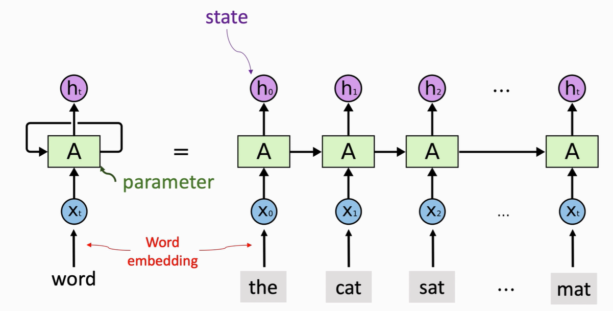
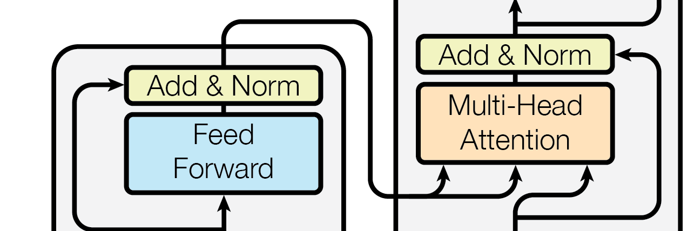
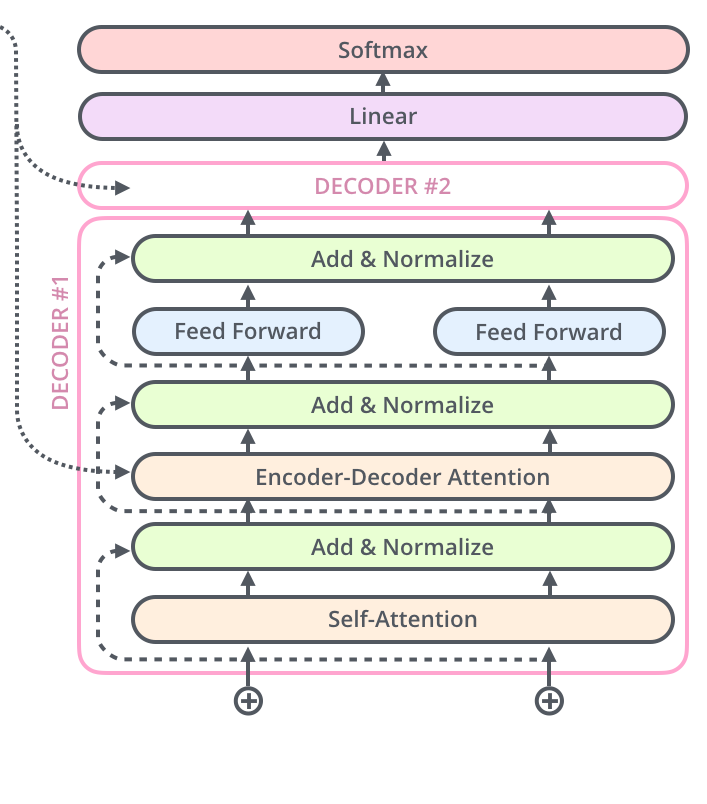
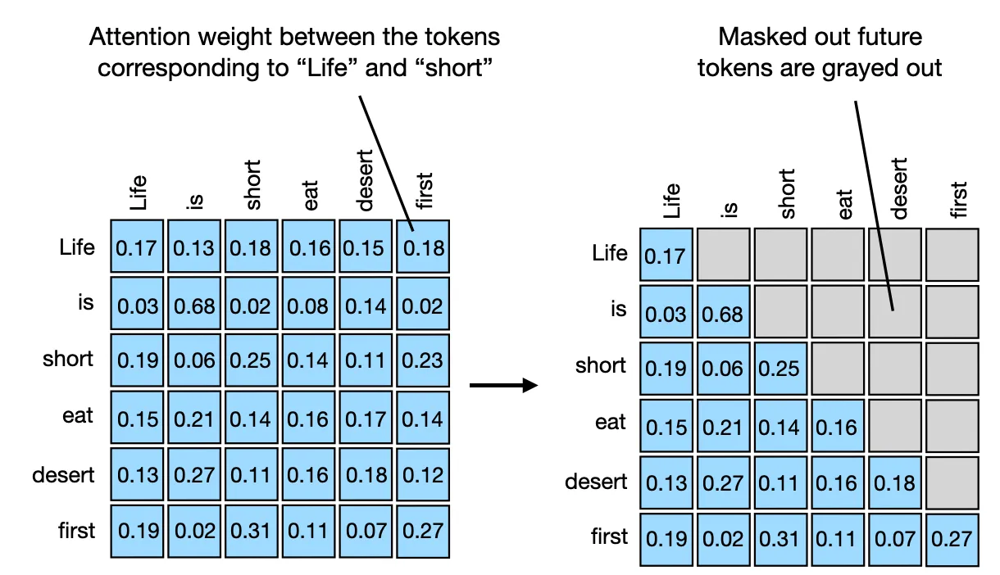

# Attention Is All You Need

[项目代码（PyTorch）](https://github.com/jadore801120/attention-is-all-you-need-pytorch)

import { Tabs, TabItem } from 'astro-pure/user'
import { CardList } from 'astro-pure/user'
import { Spoiler } from 'astro-pure/user'

<Tabs>
  <TabItem label="摘要">
    <CardList list={
      [
        { title: '主流的序列转导模型普遍基于复杂的循环或卷积神经网络，并采用编码器-解码器配置。其中，性能最佳的模型还会通过注意力机制连接编码器和解码器。我们提出了一种全新的简单网络架构——Transformer，它完全基于注意力机制，彻底摒弃了循环和卷积结构。 在两个机器翻译任务上的实验表明，Transformer 模型在质量上表现更优，同时具备更好的并行化能力，且训练所需时间显著减少。在WMT 2014英语-德语翻译任务中，我们的模型取得了28.4的BLEU分数，比现有最佳结果（包括集成模型）提升了超过2个BLEU点。在WMT 2014英语-法语翻译任务中，我们的模型在8个GPU上训练3.5天后，达到了41.8的BLEU分数，创造了新的单模型最先进水平，这仅为文献中最佳模型训练成本的一小部分。通过将其成功应用于英语成分句法分析（无论是在大量还是有限的训练数据下），我们进一步证明了Transformer在其他任务上具有良好的泛化能力。' },
      ]
    } />
  </TabItem>

  <TabItem label="问题">
    <CardList list={
      [
        { title: '现有序列转换模型（RNN/LSTM）由于固有的顺序计算而导致训练缓慢，限制了并行化' },
        { title: '由于信息流的路径长度增加，RNN和CNN在学习序列中的长距离依赖方面面临挑战' },
        { title: '在机器翻译等任务中，达到最先进水平的计算成本和训练时间很高，通常需要复杂的集成模型' },
      ]
    } />
  </TabItem>

  <TabItem label="结果">
    <CardList list={
      [
        { title: 'Transformer（大）在WMT 2014英德翻译任务上取得了28.4的BLEU新SOTA分数，比之前的SOTA集成模型提高了2.0+点' },
        { title: '它显著降低了训练成本，在英法翻译任务上以不到之前最佳模型1/4的训练成本达到了SOTA' },
        { title: '该模型通过最少的任务特定调优，在英语成分句法分析（仅限WSJ）上取得了91.3的F1分数，表现出强大的泛化能力，优于多个判别式句法分析模型' },
      ]
    } />
  </TabItem>

  <TabItem label="方法">
    <CardList list={
      [
        { title: '引入了Transformer，一个完全抛弃了循环和卷积，仅依赖自注意力机制的编码器-解码器架构' },
        { title: '采用多头注意力机制，将查询、键和值投影到多个子空间，使模型能够同时关注输入的不同方面' },
        { title: '引入了位置编码以注入关于词元相对或绝对位置的信息，因为注意力机制本身缺乏序列感知能力' },
      ]
    } />
  </TabItem>

  <TabItem label="要点">
    <CardList list={
      [
        { title: '用自注意力机制取代循环和卷积，实现了前所未有的并行化，大幅缩短了序列模型的训练时间' },
        { title: '多头注意力允许模型同时关注来自不同表示子空间的信息，从而捕捉多样化的关系模式' },
        { title: '通过自注意力机制在任意两个位置之间建立直接连接，与RNN或CNN相比，本质上改进了长距离依赖的处理能力' },
      ]
    } />
  </TabItem>
</Tabs>

<Spoiler>Blog 框架的一个 BUG：link 英文的话得小写</Spoiler>

<CardList title='目录' list={
  [
    { title: 'Background', link: '#Background' },
    { title: '概览', link: '#概览' },
    { title: '模型架构', link: '#模型架构',
      children: [
        { title: 'Encoder', link: '#encoder'},
        { title: 'Decoder', link: '#decoder'},
        { title: '自注意力', link: '#自注意力'},
        { title: '多头注意力', link: '#多头注意力'},
        { title: '位置编码', link: '#位置编码'},
        { title: '前馈神经网络', link: '#前馈神经网络'},
      ]
    },
    { title: '实验结果', link: '#实验结果' }
  ]
} />

## Background

循环神经网络(RNN)，特别是长短期记忆网络(LSTM)和门控循环网络(GRU)，当时序列建模和转导问题（如语言建模和机器翻译）的最先进方法

存在的问题

- RNN 中每一步都需要前一步的隐藏状态，无法并行，计算效率低下，特别是对于较长的序列。

- 梯度消失/梯度爆炸



## 概览

编码组件是一叠编码器, 解码组件是由相同数量的解码器叠成的堆。


编码器在结构上完全相同（但不共享权重）。每个编码器被分解为两个子层 ( 多头自注意力层和 FFN )，自注意力层的输出被输入到前馈神经网络。完全相同的前馈网络被独立地应用于每个位置。

解码器包含这两个层，在它们之间还有一个 Encoder-Decoder 多头注意力层(从输入的角度这么讲)，帮助解码器关注输入句子的相关部分




## 模型架构


### Encoder

由若干个相同的层堆叠而成，第一个子层是一个多头自注意力机制，第二个子层是一个 Position-wise Feed-Forward Networks。在每个子层周围使用残差连接，然后进行层归一化

子层的输出 $LayerNorm(x+Sublayer(x))$， 其中 $Sublayer(x)$ 是子层自身实现的函数(多头自注意力最后得到的一个输出)


### Decoder

解码器在Encoder的基础上，新增了一个子层，对编码器堆的输出执行多头注意力，此外，修改了底部的多头自注意力层，添加了一个 Mask 来阻断解码器关注后续位置的内容。



### 自注意力

#### 以使用向量计算子注意力为例

1. 计算自注意力的第一步是基于编码器的每个输入向量创建三个向量 Q，K，V。这些向量是通过将嵌入乘以在训练过程中训练好三个权重矩阵来创建的。


2. 计算自注意力的第二步是计算 Score（向量相似度，直观上理解就是向量夹角的大小 $A⋅B=∣A∣∣B∣cosθ$，即 Q 与 K 的点积。分数决定了在编码某个位置的词时，应该将多少注意力放在输入句子的其他部分

  $$ Score = QK^T, s_1 = q_1k_1^T, s_2 = q_2k_2^T, \dots, s_n = q_nk_n^T $$

3. 第三步是将计算得到的 Score 进行缩放后输入到 softmax 函数中，得到注意力权重。

  $$\text{Attention}(Q,K,V) = \text{softmax}\left(\frac{QK^T}{\sqrt{d_k}}\right)V$$

  - 缩放：防止点积结果过大，从而避免 Softmax 函数进入梯度饱和

    $$softmax(x) = e^x / sum(e^x)$$

    对于非常大或非常小的输入，其梯度会变得接近于 0。这意味着在反向传播时，模型很难学习到有效的权重更新，导致收敛缓慢。

4. 第四步是将每个值向量乘以 softmax 分数, 并将这些结果相加。保持想要关注的单词的值不变，通过乘以很小的数（例如 0.001）来忽略无关的单词。


换成矩阵的话就是这样

| | |
|:--:|:--:|
|||

### 多头注意力

扩展模型关注不同位置的能力（主要关注点）

每个注意力头使用不同的 Q、K、V 生成权重矩阵，每个头的输出拼接起来，然后和一个额外的权重矩阵 $W_O$ 相乘得到最终的输出。


$$\text{MultiHead}(Q,K,V) = \text{Concat}(\text{head}_1, ..., \text{head}_h)W^O$$

在 decoder 中，这个的最终实现有所不同, 在第三步中加一个 Mask 对缩放后的分数进行了屏蔽，防止解码器关注后续位置的内容。


一个示例的掩码：

```python
tensor([[0., -inf, -inf, -inf, -inf],
        [0.,  0., -inf, -inf, -inf],
        [0.,  0.,  0., -inf, -inf],
        [0.,  0.,  0.,  0., -inf],
        [0.,  0.,  0.,  0.,  0.]])
```



#### Encoder-Decoder 多头注意力

顶层编码器的输出转换为一组注意力向量 K 和 V, 作为 Encoder-Decoder 多头注意力层的 K, V 输入，Q 是来自于前面那个带掩码的自注意力层的输出（经过残差连接和层归一化之后）。


### 位置编码

由于 Transformer 缺乏循环或卷积，它没有内在的序列顺序理解能力, 模型引入了位置编码，并将其添加到输入嵌入中

$$PE_{(pos,2i)} = \sin(pos/10000^{2i/d_{model}})$$

$$PE_{(pos,2i+1)} = \cos(pos/10000^{2i/d_{model}})$$

其中 $pos$ 是位置，$i$ 是维度。这种方法为每个位置提供了独特的编码


### 位置感知前馈网络 ( Position-wise Feed-Forward Networks )

编码器和解码器中的每一层都包含位置感知前馈网络，它应用两个带有ReLU激活的线性变换：

$$\text{FFN}(x) = \max(0, xW_1 + b_1)W_2 + b_2$$

独立(方便并行化)且相同(参数相同)地应用于输入序列中的每一个位置, 为模型增加了非线性。

输入和输出的维度为 $d_model = 512$, 内层的维度为 $d_{ff} = 2048$

#### Key Problem

> Attention 的计算是全非线性的吗？

对 Q 和 K 的 softmax 的非线性运算。但是对于 V 来说，并没有任何的非线性变换，所以每一次 Attention 的计算相当于是对 V 进行了加权平均

> FFN 为什么升维 4d？

两层全连接网络

- 第一层（升维）：$W_1$ 让维度从 d 变为 4d；

  经过ReLU（或其他激活函数）大约一半的神经元会变为0，信息丢失1/2。

- 第二层（降维）：将 4d 维的结果降回 d 维。等效于有效信息又减少近1/2

### 最终线性层和 Softmax 层

解码器堆栈输出一个浮点数向量。线性层是一个简单的全连接神经网络，它将解码器堆栈产生的向量投影到一个更大的向量 logits 向量中，logits 向量和词汇表大小一致——每个单元格对应一个独特单词的分数。

Softmax 层随后将这些分数转换为概率，选择概率最高的单元，并将其关联的词作为该时间步的输出。


## 实验结果

### 训练设置与超参数

- 数据集：WMT 2014 英德（450万句对）、英法（3600万句对）
- 模型规模：
  - Base：6层，$d_{model}=512$，$d_{ff}=2048$，8头，$d_k=d_v=64$
  - Big：6层，$d_{model}=1024$，$d_{ff}=4096$，16头
- 训练细节：
  - 硬件：8块 P100 GPU
  - Base模型：12小时（100k步）
  - Big模型：3.5天（300k步）
  - 优化器：Adam + 自适应学习率调度
  - 正则化：Dropout (0.1~0.3)、Label Smoothing (0.1)

### 主要实验结果

| Model | EN-DE BLEU | EN-FR BLEU | 训练成本 (FLOPs) |
|:-:|:-:|:-:|:-:|
| GNMT + RL | 24.6 | 39.9 | $2.3 \times 10^{19}$ |
| ConvS2S | 25.2 | 40.5 | $9.6 \times 10^{18}$ |
| Transformer (Base) | 27.3 | 38.1 | $3.3 \times 10^{18}$ |
| Transformer (Big) | 28.4 | 41.8 | $2.3 \times 10^{19}$ |

结论：Transformer 在翻译任务上超越当时所有模型，且训练成本更低。

### 消融实验（表 3）

|变体/超参|BLEU 变化|说明|
|:-:|:-:|:-:|
|单头 attention| -0.9 | 多头更优，头数过多无益|
|前馈层宽度减小| - | 表现下降|
|去除位置编码| 大幅下降 | 位置编码不可或缺|
|去除残差/LayerNorm| 不收敛 | 训练极不稳定|
|Dropout 调整| - | 适当 dropout 防止过拟合|
|learned pos embed| ≈ | 与 sin/cos 编码效果相近|

### 长序列建模效率分析

|层类型|复杂度/层|顺序操作数|最大路径长度|
|:-:|:-:|:-:|:-:|
|Self-Attention|$O(n^2 d)$|$O(1)$|$O(1)$|
|RNN|$O(n d^2)$|$O(n)$|$O(n)$|
|CNN|$O(k n d^2)$|$O(1)$|$O(\log_k n)$|
|限制Self-Attn|$O(r n d)$|$O(1)$|$O(n/r)$|

Self-Attention 并行度高（$O(1)$ 顺序操作），路径最短（$O(1)$），适合长距离依赖建模，但复杂度随序列长度二次增长。


