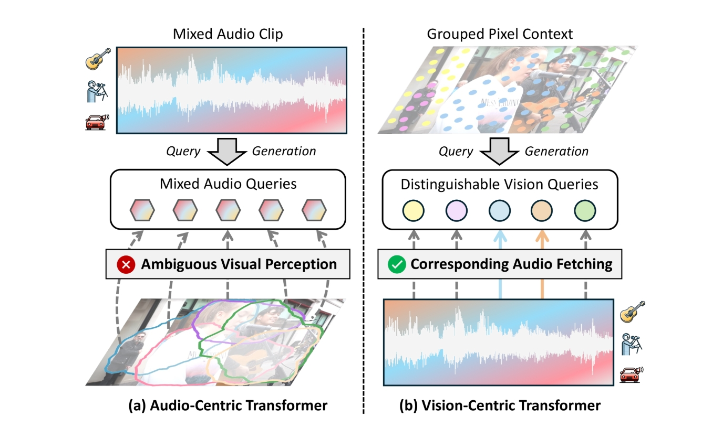
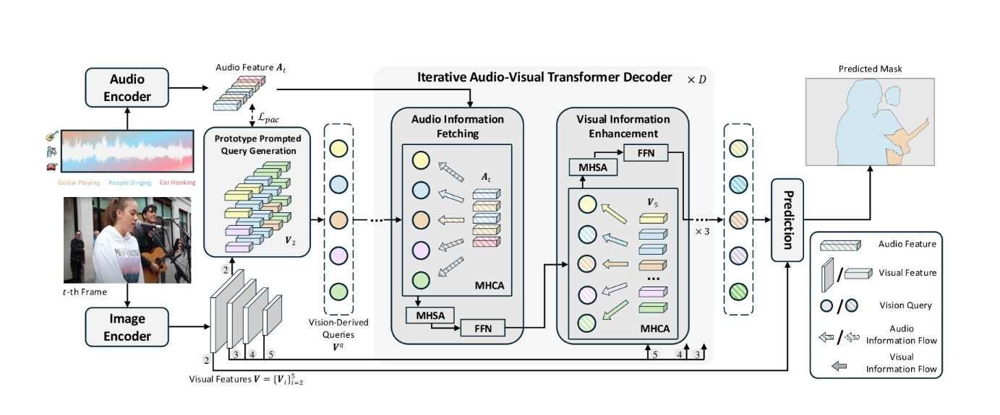

# Revisiting Audio-Visual Segmentation with Vision-Centric Transformer

基于视觉中心 Transformer 重新审视视听分割

[项目源码](https://github.com/spyflying/VCT_AVS)

> 在 windows 上复现存在问题, detectron2 pip install -e . 时, "OSError: [WinError 182] 操作系统无法运行 %1。 Error loading "D:\Cache\PythonLib\envs\vct_avs\lib\site-packages\torch\lib\shm.dll" or one of its dependencies."  
> 按照 COMBO-AVS 的复现说明看起来得在 mac 或者 linux 上进行复现, 或者 detectron2 里面代码需要调整？  
> 等国庆回来看看怎么个事...

> Most related work:
> - [Cooperation Does Matter: Exploring multi-order bilateral relations for audio visual segmentation](https://arxiv.org/abs/2312.06462)
> - [Audio-visual segmentation](https://arxiv.org/abs/2207.05042)
> - [Audio-visual segmentation with semantics](https://arxiv.org/abs/2301.13190)

## Benchmark datasets

[AVSBench 数据集的三个子集](https://github.com/OpenNLPLab/AVSBench), 用的是 related work 中第二篇论文的数据集。

数据文件组织如下：(384x384分辨率, 预处理)

语义标签子集（AVSS）、多源子集（MS3）、单源子集（S4）, 数据集内容大致为帧片段、标注mask、整个音频、整个视频等

```bash
|--AVS_dataset
    |--AVSBench_semantic/
    |--AVSBench_object/Multi-sources/
    |--AVSBench_object/Single-source/
```

| datasets | 数据类型 | class | T |
|:--:|:--:|:--:|:--:|
| S4 | 单声源 | 23 | 5s(5个视频帧) |
| MS3 | 多声源 | 23 | 5s |
| AVSS | 混合 | 70 | 10s |


## 研究背景与问题动机

### 研究背景

音视分割（Audio-Visual Segmentation, 简称 AVS）任务旨在：根据视频中的音频信号, 识别并在图像中分割出正在发声的物体区域。

需要模型在像素层面上理解声音来源, 并准确描绘发声物体的边界。

### 现有问题

目前主流方法大多采用以音频为中心的 Transformer（Audio-Centric Transformer） 架构, 物体查询主要由音频特征生成, 模型通过音频线索去引导视觉分割。

这种方式存在两个缺点：

| 缺点 | 说明 |
| -- | -- |
| 感知模糊性（Perception Ambiguity） | 音频信号往往是多声源混合的（如人声 + 吉他 + 汽车噪声）, 从音频特征生成的查询难以区分不同发声体, 导致识别混乱。 |
| 视觉细节缺失（Visual Detail Loss） | 音频查询起初不包含图像细节信息, 融合视觉特征较晚, 导致模型对物体边界和形状的刻画不精确。|


## 核心方法 VCT

为解决上述问题, 作者提出一种全新的 “视觉中心（Vision-Centric）” Transformer 框架：从视觉特征生成查询（Vision-Derived Queries）, 再通过多层音视交互逐步融合对应音频信息。



### 模型整体结构

VCT 的整体结构可分为三部分:

1. **特征提取**

    - Image Encoder: 使用 Swin Transformer 提取多尺度视觉特征；
    - Audio Encoder: 使用 VGGish 提取音频特征（Mel 频谱输入）。

2. **PPQG 模块（Prototype Prompted Query Generation）**

    - 从视觉特征(以最大的视觉特征为输入)中生成初始查询；
    - 通过“音频原型提示（Audio Prototype Prompting）”与“像素上下文分组（Pixel Context Grouping）”增强查询；
    - 生成兼具视觉细节与语义感知的 **Vision-Derived Queries**。

3. **迭代音视 Transformer 解码器（Iterative Audio-Visual Transformer Decoder）**

    - 查询与音频特征交叉注意（Cross Attention）, 提取对应声源信息；
    - 查询与多尺度视觉特征交互, 增强边界感知；
    - 多轮迭代后输出分割掩码与声音类别预测。(输入 PPQG 生成的查询)



### 音频特征提取

原始音频：$A \in \mathbb{R}^{T}$, 一维波形, 可以看成 $X[n]$, $n = 1, 2, ... 16000 \times T$

然后按照 VGGish 的那套做法, 16kHZ重采样, STFT（短时傅里叶变化）, 再加一个 Mel 滤波

- STFT: 把一维波形转为时频域表示, 也就是变成一个类似图片的二维表示, 横坐标为 t, 纵坐标为 f, 也就是不同时间帧上的频谱。

    > 滑动窗口分帧：0.96s 划分音频为 L 片, $0.96s / 10ms = 96$（每个音频片上的时间帧数）

    $X[n]--^{STFT}--|X(t,f)|, \text{ t = 96}$

- Mel 滤波：在上一步得到的时频域表示上, f 是一个连续表示, 将其映射到符合人耳的 Mel 频率空间

    $|X(t,f)|--^{Mel}--|X(t,m)|, \text{ m = 64}$

    在这步变换后我们取得梅尔谱 $A_s \in \mathbb{R}^{T \times 96 \times 64}, \text{ T 为帧数, 也即时间片数}$

    可以形象地把 $A_s$ 看作是$T$张$96 \times 64$ 的图片流, 就像是视频的帧表示, 然后很自然地类似图片中VGG, 输入到 VGGish 卷积 Net 里面

- VGGish：在这篇论文中对 VGGish 进行了一些修改, 去掉了里面最终压缩（池化）的操作

    VGGish的部分源码如下：

    ```python
    NUM_FRAMES = 96  # Frames in input mel-spectrogram patch.
    NUM_BANDS = 64  # Frequency bands in input mel-spectrogram patch.
    EMBEDDING_SIZE = 128  # Size of embedding layer.

    net = slim.conv2d(net, 64, scope='conv1')  # 输出形状为 (96, 64, 64)
    net = slim.max_pool2d(net, scope='pool1')  # 输出形状为 (48, 32, 64)
    net = slim.conv2d(net, 128, scope='conv2')  # 输出形状为 (48, 32, 128)
    net = slim.max_pool2d(net, scope='pool2')  # 输出形状为 (24, 16, 128)
    net = slim.repeat(net, 2, slim.conv2d, 256, scope='conv3')  # 输出形状为 (24, 16, 256)
    net = slim.max_pool2d(net, scope='pool3')  # 输出形状为 (12, 8, 256)
    net = slim.repeat(net, 2, slim.conv2d, 512, scope='conv4')  # 输出形状为 (12, 8, 512)
    net = slim.max_pool2d(net, scope='pool4')  # 输出形状为 (6, 4, 512)

    net = slim.flatten(net)
    net = slim.repeat(net, 2, slim.fully_connected, 4096, scope='fc1')

    net = slim.fully_connected(net, params.EMBEDDING_SIZE, scope='fc2',
                                activation_fn=None)
    ```

    对于上述的 $A_s \in \mathbb{R}^{T \times 96 \times 64}$ 的一个音频帧输入, （96, 64, 1）———> (6, 4, 512)

    得到最终的特征向量 $A \in \mathbb{R}^{T \times S \times C^a}$

    其中 $C^a$ 为 VGGish 卷积神经网络的输出通道数, 也即特征维度数, 这里为 512。

### 图像特征提取

原始视频： $I \in \mathbb{R}^{T \times H \times W \times 3}$
原始图像： $I_t \in \mathbb{R}^{H \times W \times 3}$

通过视觉编码器（如 Swin Transformer）, 提取多尺度图像特征: 

$V_i \in \mathbb{R}^{H_i \times W_i \times C^v_i}$

其中 $H_i, W_i$ 为不同尺度的图像高度和宽度, $C^v_i$ 为视觉编码器的输出通道数, 也即特征维度数。

$V=\{V_i\}^5_{i=2}, H_i=H/2^i, W_i=W/2^i$

其中 $V_2$ 用于后续输入 PPQG 模块进行视觉查询（最大的视觉特征 embeding ）

$V_3, V_4, V_5$ 用于后续输入迭代 Transformer 解码器进行多尺度视觉增强。

### PPQG 模块

PPQG 模块包含三个步骤:


| 步骤 | 功能 |
|:---:|:---:|
| 视觉嵌入聚合（Visual Embedding Aggregation）| 将图像高分辨率特征压缩为视觉嵌入向量, 保留空间语义|
| 音频原型提示（Audio Prototype Prompting） | 定义一组 Audio Prototype, 通过对比学习 $L_{pac}$ 训练音频原型, 使它们具备区分类别的能力。交叉注意力机制让视觉查询动态聚合对应的音频特征 |
| 像素上下文分组（Pixel Context Grouping） | 采用 Gumbel-Softmax 进行可微的硬分配, 将像素划分给不同查询, 使每个视觉查询聚焦于不同的图像区域 |

最终生成的 **Vision Queries** 既包含语义类别先验, 又保留丰富的视觉细节。

#### PPQG 模块详解

PPQG 模块的输入：

视觉特征嵌入：$V_2 \in \mathbb{R}^{H_2 \times W_2 \times C^v_2}$

音频特征： $A_t \in \mathbb{R}^{S \times C^a} (t=1, .., T; A \in \mathbb{R}^{T \times S \times C^a})$

##### 视觉嵌入聚合: 

**这一步主要是为了生成一个中间特征 $V^h$**, 说实话挺奇怪

定义一个中间特征 $V^h =  \text{Conv}_{1 \times 1} \left( \delta \left( \text{Conv}_{3 \times 3} \left( \delta \left( \text{Conv}_{1 \times 1} \left( \mathbf{V}_2 \right) \right) \right) \right) \right)$

此时,  $V^h \in \mathbb{R}^{H_2 \times W_2 \times C^h}$

$V^e = \text{Reshape}\left(\text{MLP}\left(\text{Reshape}\left(V^h\right)\right)\right)$

$V^h =[i,j,c] -- V^h=[c,{index}], {index}=(i-1)W_2+j$

$V^h \in \mathbb{R}^{C^h \times (H_2W_2)}$, $C^h$ 个（$H_2W_2$）的向量

> 相当于把整个图像分成了 N 块（不是空间概念上的, 是一个 query 和 图像特征的一个对应关系的划分 ）, 每个块上分别有其 $C^h$ 维的特征值。

此时再通过 MLP 将（$H_2W_2$）映射到 N（视觉查询的个数, 100, 对应视觉查询区域）, 然后进行一次转置, 得到 $V^e \in \mathbb{R}^{N \times C^h}$,  N 个$C^h$ 的向量

这块对应的就是论文图中


##### 音频原型提示: 

**这一步就是把音频信息通过和随机音频原型做一个对比学习, 训练出一个音频原型, 使它们具备区分类别的能力。然后过 Cross Attentio 让视觉查询动态聚合对应的音频特征。**

定义音频原型集合(可学习)：$P_a \in \mathbb{R}^{K \times C^h}$, 这里的 K 和数据集相关, 比如在 S4 数据集里面, 就是 23 (这样看似乎泛化性可能一般, 除非数据集特别强)

输入某一时间步的音频特征, 也就是 $A_t \equiv A[t] \in \mathbb{R}^{S \times C^a}.$

* 把 $A_t$ 映射到与 $P$ 相同的向量空间（即得到与 $C_h$ 对齐的向量）, 记作 $\hat A_t \in \mathbb{R}^{C^h}$。

- 然后对 $\hat A_t$ 进行全局平均池化（GAP）得到 $\hat A_t \in \mathbb{R}^{C^h}$


计算音频与原型的相似度

将 $\hat A_t \in \mathbb{R}^{C^h}$ 与原型 $P \in \mathbb{R}^{K \times C^h}$ 做点积得到匹配预测 $M_t \in \mathbb{R}^{K}$

$M$ 与真实标签 $M^*$ 计算平均二元交叉熵损失：

$\mathcal{L}_{\text{pac}}(\boldsymbol{M}, \boldsymbol{M}^*) = \frac{1}{K} \sum_{k=1}^{K} \mathcal{L}_{\text{bce}}(\boldsymbol{M}_k, \boldsymbol{M}_k^*)$

$P$ 通过 $\mathcal{L}_{\text{pac}}$ 更新,每个原型逐渐收敛为一个“声音类别中心”的语义向量

然后和视觉查询过一次 Cross Attention）, 得到融合音频信息的视觉查询 $V^e \in \mathbb{R}^{N \times C^h}$

这一块其实计算的过程中有一个 (N, K), 相当于类别 K 对应视觉查询 N 了, 感觉可以用来作为参考信息 

**Gumbel-Softmax**

假设我们有一张图片, 我们想让每个像素“决定”自己属于哪一个查询（Vision Query）。

* 如果直接用 `argmax`（选最大的那个类别）, 这是一个**离散操作**, 不可导, 模型无法反向传播学习。
* 如果用普通的 `softmax`, 虽然可导, 但每个像素都会“平均地”属于多个组（模糊分配）, 不够清晰。

所以需要一个方法, 既能让分配接近 one-hot（硬分配）, 又能保持可导（能反向传播）。这就是 Gumbel-Softmax。

它能让每个像素更明确地归属到某一个视觉查询, 而不是模糊地属于多个; 同时, 由于它是可微的, 模型可以通过反向传播学习到最优的分组方式。

> 让不同的视觉查询关注图像中的不同区域, 形成“语义多样化”的视觉查询。
> 也就是说, 查询之间不再重叠或竞争, 从而更好地区分不同发声物体。


## 迭代式音视 Transformer 解码器（Iterative Audio-Visual Transformer Decoder）

PPQG 模块已经生成了视觉导向查询（Vision-Derived Queries）, 但这些查询初始时只包含：局部视觉区域的信息以及通过音频原型提示得到的类别语义先验。

为了让这些查询进一步理解该区域是否在发声（音频关联）和发声物体的形状与边界（视觉细化）, 作者设计了一个迭代式（iterative）音视 Transformer 解码器来持续融合音频与视觉特征, 实现逐步精炼。

### 解码器结构


一个完整的解码单元包含：

> [音频信息提取块 + 三个视觉信息增强块]  
> 这种结构被重复 D 次（论文中 D=2）, 最后再接一个音频块进行最终融合。

#### 音频信息提取块（Audio Information Fetching Block）

每个视觉衍生查询通过 MHCA 与当前帧的音频特征交互, 以 $A_t$ 作为键和值, 获取其代表区域的相应声音信息, 从而确定该区域中的物体是否发声及其音频类别。

#### 视觉信息增强块（Visual Information Enhancement Block）

> 借鉴 Mask2Former 的做法, 将上一层预测的掩码作为注意力掩码, 限制查询只关注潜在的发声区域, 避免干扰。

视觉查询依次与多尺度视觉特征（V5, V4, V3）进行多头交叉注意力交互；每一次交互都能捕获更细粒度的视觉特征。

## 损失函数

模型总损失函数为：

$$
L = \lambda_{cls}L_{cls} + \lambda_{mask}L_{mask} + \lambda_{pac}L_{pac}
$$

其中：

> BCE Loss 相当于前景预测置信度, Dice Loss 相当于前景预测整体区域重叠程度（发声物体占比小）  
> BCE 关注每个像素对不对, Dice 关注整体区域重叠好不好。

* $L_{cls}$：分类损失（交叉熵）
* $L_{mask}$：掩码损失 = Dice 系数损失 + 二分类交叉熵损失（Dice + BCE）
* $L_{pac}$：作者提出的原型-音频对比损失


## 评估

- $M_j$: Jaccard 指数, 计算预测分割与真实标签之间的交并比（IoU）。在 AVSS 子集上, 是所有类别平均的 IoU

- $M_f$: F 分数, 结合分割结果的精确率和召回率


## 不足

* **计算复杂度较高**：论文在方法部分提到 VCT 包含多层迭代交互解码器, 每层又含多个多头交叉注意力（MHCA）与自注意力（MHSA）块。计算量大

* **数据依赖性强**：模型训练依赖数据集标注(语义类别标签)

> 3.2 The matching ground truth M* indicating which audio event categories are actually present in the current audio can be obtained from the dataset annotation）

