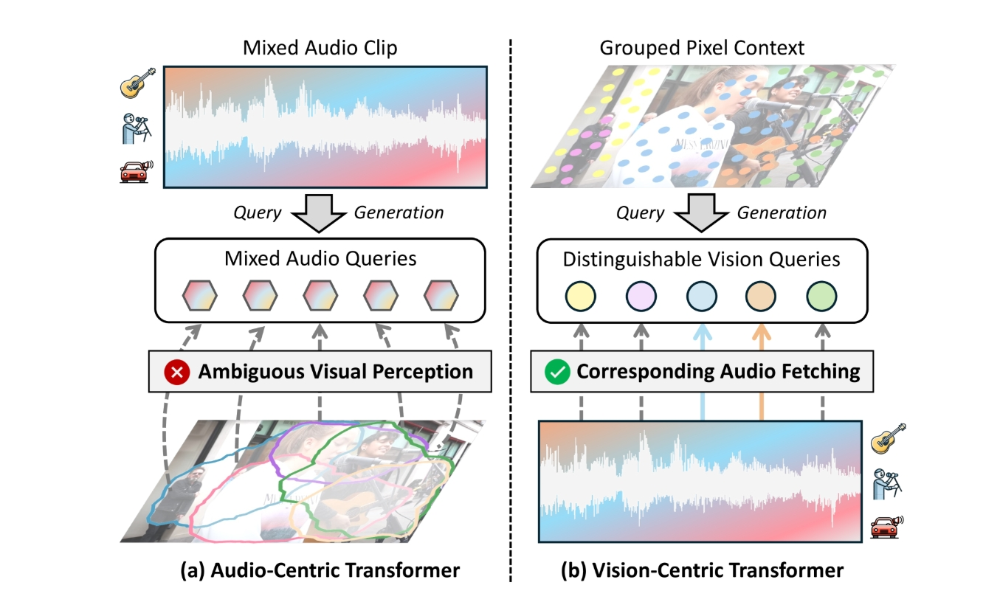

## Revisiting Audio-Visual Segmentation with Vision-Centric Transformer

基于视觉中心 Transformer 重新审视视听分割

> Most related work:
> - [Cooperation Does Matter: Exploring multi-order bilateral relations for audio visual segmentation](https://arxiv.org/abs/2312.06462)
> - [Audio-visual segmentation](https://arxiv.org/abs/2207.05042)
> - [Audio-visual segmentation with semantics](https://arxiv.org/abs/2301.13190)

### 摘要

> AVS: 视听分割，基于**相关音频信号**对视频帧中的发声物体进行分割



+ 现有方法：以**音频为中心**，Transformer 架构，物体查询由音频特征导出。

    - 缺点：
        - ：音频的混合特性->发声物体感知过程存在模糊性
        - ：视觉细节损失->密集预测能力减弱

+ 提出方法：以**视觉为中心**，Transformer 框架 (`VCT`)，用视觉导出的查询来迭代获取相应的音频 & 视觉信息

    - 原型提示查询生成 (`PPQG`) 模块
        - 输入：音频原型提示 + 像素上下文分组
        - 输出：语义感知且视觉丰富的视觉导出查询
    - 目的（或者说优点）：

        - 混合音频，区分不同发声物体
        - 精确勾勒出发声物体轮廓

    > how ?


#### Benchmark datasets

[AVSBench 数据集的三个子集](https://github.com/OpenNLPLab/AVSBench), 用的是 related work 中第二篇论文的数据集。

数据文件组织如下：(384x384分辨率, 预处理)

```
|--AVS_dataset
    |--AVSBench_semantic/
    |--AVSBench_object/Multi-sources/
    |--AVSBench_object/Single-source/
```

