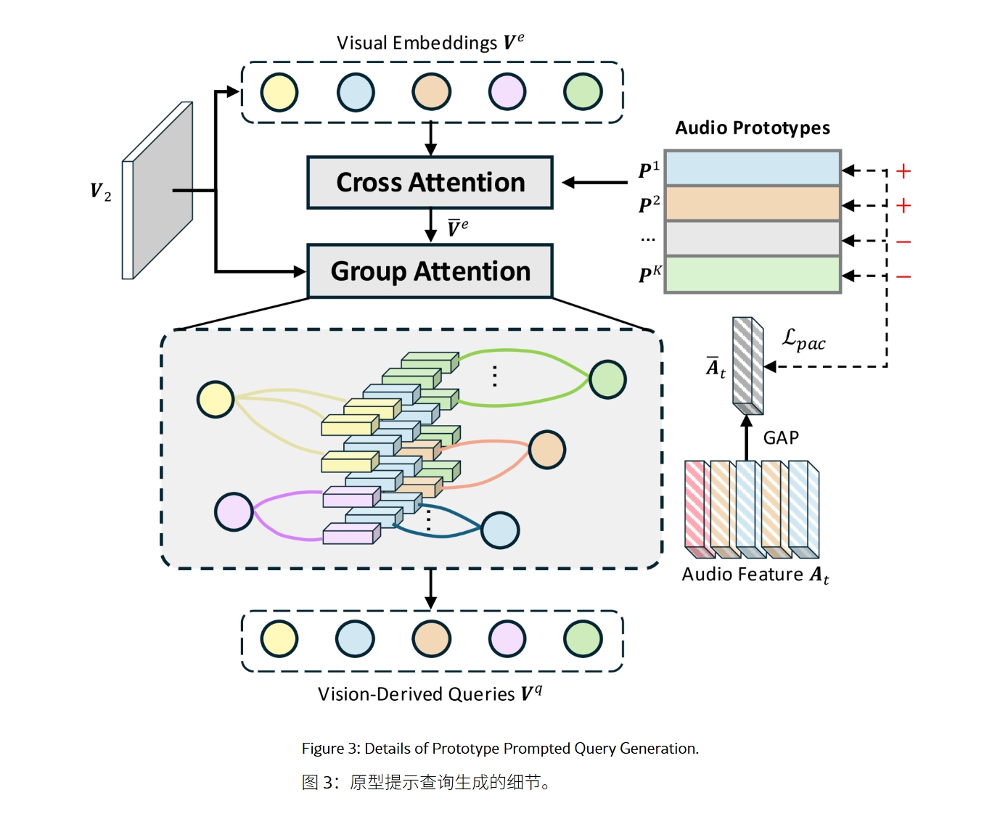
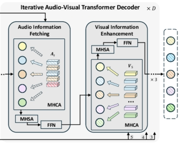

## Revisiting Audio-Visual Segmentation with Vision-Centric Transformer

基于视觉中心 Transformer 重新审视视听分割

> 在 windows 上复现存在问题，detectron2 pip install -e . 时，"OSError: [WinError 182] 操作系统无法运行 %1。 Error loading "D:\Cache\PythonLib\envs\vct_avs\lib\site-packages\torch\lib\shm.dll" or one of its dependencies."  
> 按照 COMBO-AVS 的复现说明看起来得在 mac 或者 linux 上进行复现，或者 detectron2 里面代码需要调整？  
> 等国庆回来看看怎么个事...

> Most related work:
> - [Cooperation Does Matter: Exploring multi-order bilateral relations for audio visual segmentation](https://arxiv.org/abs/2312.06462)
> - [Audio-visual segmentation](https://arxiv.org/abs/2207.05042)
> - [Audio-visual segmentation with semantics](https://arxiv.org/abs/2301.13190)

### Benchmark datasets

[AVSBench 数据集的三个子集](https://github.com/OpenNLPLab/AVSBench)，用的是 related work 中第二篇论文的数据集。

数据文件组织如下：(384x384分辨率, 预处理)

语义标签子集（AVSS）、多源子集（MS3）、单源子集（S4）

```bash
|--AVS_dataset
    |--AVSBench_semantic/
    |--AVSBench_object/Multi-sources/
    |--AVSBench_object/Single-source/
```

### 研究背景与问题动机

#### 研究背景

音视分割（Audio-Visual Segmentation，简称 AVS）任务旨在：根据视频中的音频信号，识别并在图像中分割出正在发声的物体区域。

需要模型在像素层面上理解声音来源，并准确描绘发声物体的边界。


#### 现有问题

目前主流方法大多采用以音频为中心的 Transformer（Audio-Centric Transformer） 架构，物体查询主要由音频特征生成，模型通过音频线索去引导视觉分割。

这种方式存在两个缺点：

| 缺点 | 说明 |
| -- | -- |
| 感知模糊性（Perception Ambiguity） | 音频信号往往是多声源混合的（如人声 + 吉他 + 汽车噪声），从音频特征生成的查询难以区分不同发声体，导致识别混乱。 |
| 视觉细节缺失（Visual Detail Loss） | 音频查询起初不包含图像细节信息，融合视觉特征较晚，导致模型对物体边界和形状的刻画不精确。|


### 核心方法 VCT

为解决上述问题，作者提出一种全新的 “视觉中心（Vision-Centric）” Transformer 框架：从视觉特征生成查询（Vision-Derived Queries），再通过多层音视交互逐步融合对应音频信息。


#### 模型整体结构

VCT 的整体结构可分为三部分:

1. **特征提取**

    - Image Encoder: 使用 Swin Transformer 提取多尺度视觉特征；
    - Audio Encoder: 使用 VGGish 提取音频特征（Mel 频谱输入）。

2. **PPQG 模块（Prototype Prompted Query Generation）**

    - 从视觉特征(以最大的视觉特征为输入)中生成初始查询；
    - 通过“音频原型提示（Audio Prototype Prompting）”与“像素上下文分组（Pixel Context Grouping）”增强查询；
    - 生成兼具视觉细节与语义感知的 **Vision-Derived Queries**。

3. **迭代音视 Transformer 解码器（Iterative Audio-Visual Transformer Decoder）**

    - 查询与音频特征交叉注意（Cross Attention），提取对应声源信息；
    - 查询与多尺度视觉特征交互，增强边界感知；
    - 多轮迭代后输出分割掩码与声音类别预测。(输入 PPQG 生成的查询)


#### PPQG 模块

PPQG 模块包含三个步骤:



| 步骤 | 功能 |
|:---:|:---:|
| 视觉嵌入聚合（Visual Embedding Aggregation）| 将图像高分辨率特征压缩为视觉嵌入向量，保留空间语义|
| 音频原型提示（Audio Prototype Prompting） | 定义一组 Audio Prototype，通过对比学习 $L_{pac}$ 训练音频原型，使它们具备区分类别的能力。交叉注意力机制让视觉查询动态聚合对应的音频特征 |
| 像素上下文分组（Pixel Context Grouping） | 采用 Gumbel-Softmax 进行可微的硬分配，将像素划分给不同查询，使每个视觉查询聚焦于不同的图像区域 |

最终生成的 **Vision Queries** 既包含语义类别先验，又保留丰富的视觉细节。

**Gumbel-Softmax**

假设我们有一张图片，我们想让每个像素“决定”自己属于哪一个查询（Vision Query）。

* 如果直接用 `argmax`（选最大的那个类别），这是一个**离散操作**，不可导，模型无法反向传播学习。
* 如果用普通的 `softmax`，虽然可导，但每个像素都会“平均地”属于多个组（模糊分配），不够清晰。

所以需要一个方法，既能让分配接近 one-hot（硬分配），又能保持可导（能反向传播）。这就是 Gumbel-Softmax。

它能让每个像素更明确地归属到某一个视觉查询，而不是模糊地属于多个; 同时，由于它是可微的，模型可以通过反向传播学习到最优的分组方式。

> 让不同的视觉查询关注图像中的不同区域，形成“语义多样化”的视觉查询。
> 也就是说，查询之间不再重叠或竞争，从而更好地区分不同发声物体。


### 迭代式音视 Transformer 解码器（Iterative Audio-Visual Transformer Decoder）

PPQG 模块已经生成了视觉导向查询（Vision-Derived Queries），但这些查询初始时只包含：局部视觉区域的信息以及通过音频原型提示得到的类别语义先验。

为了让这些查询进一步理解该区域是否在发声（音频关联）和发声物体的形状与边界（视觉细化），作者设计了一个迭代式（iterative）音视 Transformer 解码器来持续融合音频与视觉特征，实现逐步精炼。

#### 解码器结构



一个完整的解码单元包含：

> [音频信息提取块 + 三个视觉信息增强块]  
> 这种结构被重复 D 次（论文中 D=2），最后再接一个音频块进行最终融合。

##### 音频信息提取块（Audio Information Fetching Block）

每个视觉衍生查询通过 MHCA 与当前帧的音频特征交互，以 $A_t$ 作为键和值, 获取其代表区域的相应声音信息，从而确定该区域中的物体是否发声及其音频类别。

##### 视觉信息增强块（Visual Information Enhancement Block）

> 借鉴 Mask2Former 的做法，将上一层预测的掩码作为注意力掩码，限制查询只关注潜在的发声区域，避免干扰。

视觉查询依次与多尺度视觉特征（V5, V4, V3）进行多头交叉注意力交互；每一次交互都能捕获更细粒度的视觉特征。

### 损失函数

模型总损失函数为：

$$
L = \lambda_{cls}L_{cls} + \lambda_{mask}L_{mask} + \lambda_{pac}L_{pac}
$$

其中：

> BCE Loss 相当于前景预测置信度，Dice Loss 相当于前景预测整体区域重叠程度（发声物体占比小）  
> BCE 关注每个像素对不对，Dice 关注整体区域重叠好不好。

* $L_{cls}$：分类损失（交叉熵）
* $L_{mask}$：掩码损失 = Dice 系数损失 + 二分类交叉熵损失（Dice + BCE）
* $L_{pac}$：作者提出的原型-音频对比损失


### 评估

- $M_j$: Jaccard 指数, 计算预测分割与真实标签之间的交并比（IoU）。在 AVSS 子集上，是所有类别平均的 IoU

- $M_f$: F 分数，结合分割结果的精确率和召回率


### 不足

* **计算复杂度较高**：论文在方法部分提到 VCT 包含多层迭代交互解码器，每层又含多个多头交叉注意力（MHCA）与自注意力（MHSA）块。计算量大

* **数据依赖性强**：模型训练依赖数据集标注(语义类别标签)

> 3.2 The matching ground truth M* indicating which audio event categories are actually present in the current audio can be obtained from the dataset annotation）

