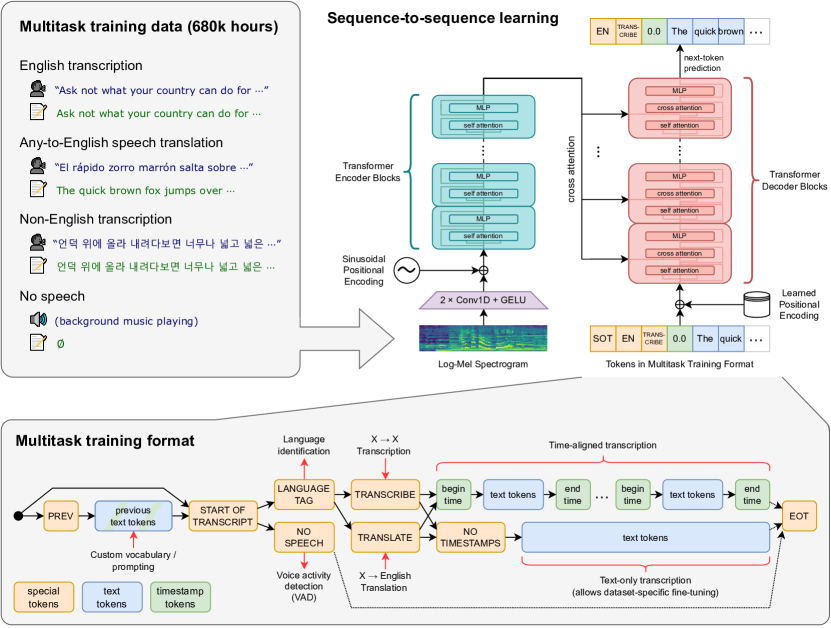
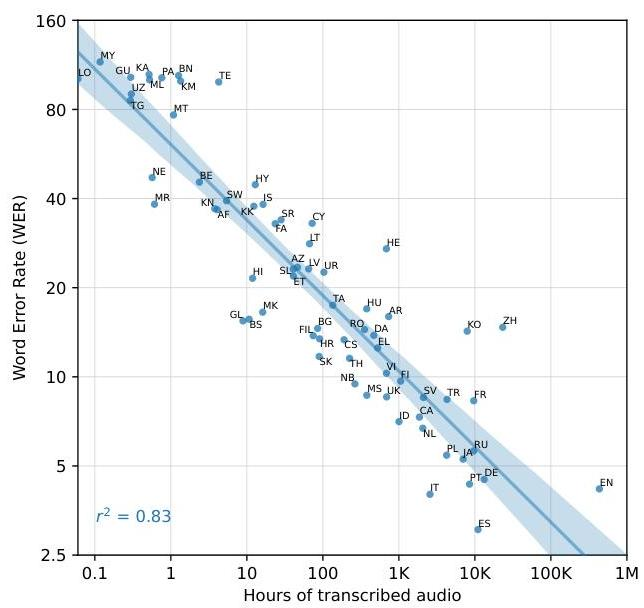

# Robust Speech Recognition via Large-Scale Weak Supervision

通过大规模弱监督实现鲁棒的语音识别

[项目代码](https://github.com/openai/whisper)

import { Tabs, TabItem } from 'astro-pure/user'
import { CardList } from 'astro-pure/user'
import { Spoiler } from 'astro-pure/user'

<Tabs>
  <TabItem label="摘要">
    <CardList list={
      [
        { title: '我们研究了仅通过预测互联网上海量音频转录文本来训练的语音处理系统的能力。当模型扩展到68万小时的多语言和多任务监督数据时，所得模型在标准基准测试上展现出良好的泛化能力，并且在无需任何微调的零样本迁移场景下，其性能常常能与先前的全监督结果相媲美。与人类相比，这些模型在准确性和鲁棒性上均接近人类水平。我们正在发布模型和推理代码，旨在为鲁棒语音处理的后续研究奠定基础。' }
      ]
    } />
  </TabItem>

  <TabItem label="问题">
    <CardList list={
      [
        { title: '传统自动语音识别系统在多样化的音频环境、口音和录音条件下难以实现泛化和鲁棒性' },
        { title: '现有的监督模型通常需要高质量、精心策划的数据集，并且在域外数据上表现不佳' },
        { title: '自监督预训练方法仍然需要针对特定自动语音识别任务在标记数据上进行微调，限制了它们的开箱即用实用性' },
      ]
    } />
  </TabItem>

  <TabItem label="结果">
    <CardList list={
      [
        { title: 'Whisper 模型在包括 LibriSpeech、TED-LIUM3 和 Common Voice 在内的 12 个多样化英语自动语音识别数据集上，实现了有竞争力或更优的词错误率（WER）' },
        { title: '与监督系统和商业系统相比，这些模型对噪声和音频质量变化表现出更好的鲁棒性，在挑战性条件下保持较低的错误率' },
        { title: 'Whisper 提供对 67 种语言的强大多语言支持，性能与训练数据量相关，并展示了有效的零样本跨语言迁移' },
      ]
    } />
  </TabItem>

  <TabItem label="方法">
    <CardList list={
      [
        { title: 'OpenAI 的 Whisper 使用一个编码器-解码器 Transformer 架构，该架构在包含 68 万小时音频的大型数据集上进行训练，这些音频配有来自网络、弱监督的转录本' },
        { title: '该模型采用多任务学习方法，使其能够联合学习语音识别（转录）、语音翻译和语言识别' },
        { title: '训练策略侧重于零样本泛化，旨在开发一个能够在多样化音频条件和任务中表现出色而无需特定微调的单一模型' },
      ]
    } />
  </TabItem>

  <TabItem label="要点">
    <CardList list={
      [
        { title: '在 68 万小时多样化、弱监督的音频-转录对上训练自动语音识别模型，可实现跨不同音频条件和口音的鲁棒泛化' },
        { title: '多任务学习框架允许单个编码器-解码器 Transformer 同时执行语音识别、翻译和语言识别' },
        { title: '大规模和多样化的数据可以弥补大型数据集中转录本的噪声和较低质量，从而实现强大的零样本性能而无需微调' },
      ]
    } />
  </TabItem>
</Tabs>


<CardList title='目录' list={
  [
    { title: 'Background', link: '#background' },
    { title: '数据处理', link: '#数据处理' },
    { title: '模型架构', link: '#模型架构',
      children: [
        { title: 'Embedding', link: '#embedding'},
        { title: 'Encoder-Decoder', link: '#encoder-decoder'},
        { title: 'Multitask Format', link: '#multitask-format'},
      ]
    },
    { title: '实验结果', link: '#实验结果' }
  ]
} />

## Background

传统的 ASR 系统通常遵循以下两种方法之一：

- 监督学习：在较小的、高质量的数据集（如 LibriSpeech（960 小时））上训练的模型在特定基准测试中取得了非常好的结果，但通常无法推广到不同的口音、噪声条件或特定领域的内容。

- 自监督预训练：像 Wav2Vec 2.0 这样的方法在大量的未标记音频数据上进行预训练以学习表示，但需要在标记数据上进行微调以完成特定的 ASR 任务。

语音识别中的主要挑战包括：

- 泛化：模型通常在干净的、领域内的数据上表现良好，但在现实世界的变化中表现不佳。
- 鲁棒性：在嘈杂的环境或非母语人士的情况下，性能会下降。
- 资源需求：需要针对特定任务进行微调限制了可访问性。

## 数据处理

与以前依赖干净的、精心策划的数据集的方法不同，Whisper 使用来自互联网的 680,000 小时的音频-文本对。

这些文本的质量各不相同（有些是机器生成的，有些是未对齐的），此外，庞大的数量和多样性弥补了噪声。

由于互联网上获取的数据质量太低, 采用了一些方法来提高数据质量:

- 许多互联网上的转录是机器生成的，而使用混合了人工和机器生成数据进行训练会损害性能。
  基于一些启发式方法来检测并滤去机器生成的

- 使用 Audio Language Detector, 在 VoxLingua107 上进行了微调，用于确保口语与 CLD2 所识别的转录语言匹配。
  如果语音和转录语言不匹配, 则滤去该数据. 文本语言是英文的除外, 将其当做 X -> en 的数据用于 Speech Translation 的示例. 用模糊去重减少训练数据集中的重复内容

- 将 Audio 按照 30s 的切片间隔拆分为若干个切片并和时间片上出现的文本子集进行配对。
  在所有音频上进行训练，包括没有语音的片段，并使用这些片段作为语音活动检测的训练数据。

- 在训练初始模型后, 汇总各数据源以及其模型表现, 按照错误率和数据源大小的组合进行排序，以便高效地识别和移除低质量数据

## 模型架构



AudioEncoder-TextDecoder

### Embedding

对于标准的Transformer模块，要求输入的是token（向量）序列，即二维矩阵[num_token, token_dim]

因此要对音频进行处理，将其转换为token序列。在输入到 Encoder 之前, 所有的音频都重采样16kHz, 并在 25 毫秒的窗口上计算 80 通道的对数幅度梅尔谱图表示，步长为 10 毫秒。

梅尔谱图可以当作一个二维的矩阵$X[t,f]$，其中一维是时间步，另一维是80个梅尔频率带。计算出的梅尔频谱图进行全局归一化，使其值在 -1 到 1 之间，并且在预训练数据集上具有近似零均值

把处理后的梅尔谱图输入到两个滤波器宽度为 3 的卷积层和 GELU （高斯误差线性单元）激活函数组成的干路中，其中第二个卷积层的步长为 2。然后向干路输出添加正弦位置嵌入，得到音频嵌入。

### Encoder-Decoder

没什么特别的

mlp

```py
    self.mlp = nn.Sequential(
        Linear(n_state, n_mlp), nn.GELU(), Linear(n_mlp, n_state)
    )
```

### Multitask Format

模型的统一接口，在相同的输入音频信号上执行许多不同的任务：转录、翻译、语音活动检测、对齐和语言识别

- `<|startoftranscript|>`: 指示预测的开始。预测正在说的语言，该语言在训练集中由一个独特的标记表示（总共 99 个）。这些语言目标来源于 VoxLingua107 数据集。

- `<|nospeech|>` : 音频片段中没有语音

- `<|transcribe|>` 或 `<|translate|> `:转录或翻译

- `<|notimestamps|>`：标记来指定是否预测时间戳, 预测相对于当前音频片段的时间，将所有时间量化到最接近的 20 毫秒

- `<|endoftranscript|>`: 结束时间标记

## 实验结果

为 Whisper 提供支持的海量数据集（680,000 小时）包括：

65% 英语语音识别 (438,218 小时)
17% 多语种语音识别 (117,113 小时)
18% 翻译 (125,739 小时)


### 训练数据量与性能

各种语言的转录音频小时数的词错误率 (WER)



训练细节包括：

- 各种尺寸的模型（从“tiny”到“large-v2”）
- 数据并行和 FP16 以实现高效训练
- 具有梯度范数裁剪的 AdamW 优化器
- 没有数据增强或正则化（依赖于数据集的多样性）


