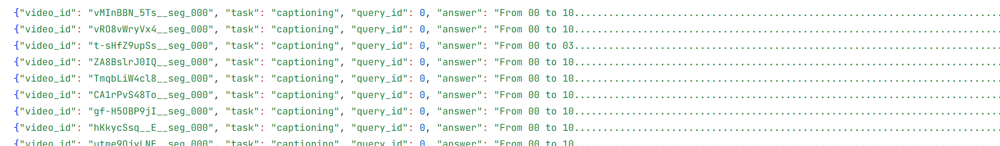

## 测试实验1

### Datasets

考虑到 Qwen2.5-omni 对于显存的需求较大，基于 LongVALE 初始数据集，切割视频为 30s 内片段且保证包含时间，对于单个事件长度 > 30s 的片段，丢弃

- 视频数目：1172 -> 5386（丢弃83个原始视频）
- 事件数目：13867 -> 11612（丢弃2255个事件）

### 测试结果

#### Grounding

任务描述：输入事件，输出对应其时间戳

输入 $T_i$, 输出 $(s_i, e_i)$

- mIoU ：预测时间段与标注时间段的平均交并比，IoU = 交集长度 / 并集长度，通常以百分比显示；越大越好。
- R1@0.3 / R1@0.5 / R1@0.7 ：Top-1 召回率，在 IoU 分别≥0.3/0.5/0.7 的阈值下，预测的首个时间段命中比例；越大越好。

|             | mIoU | R1@0.3 | R1@0.5 | R1@0.7 |
|-------------|------|--------|--------|--------|
| LongVLAE    | 46.37| 64.16  | 45.40  | 27.27  |
| Qwen2.5-omni-3B | 16.80| 19.21  | 6.98   | 2.62   |

#### Caption

任务描述：输入视频，输出视频中所有事件及其时间戳

- soda_c ：密集视频字幕评价中的覆盖/对齐类指标（SODA 家族中的 coverage 指标），衡量预测的事件字幕与其时间片段对标注的覆盖与对齐质量；越大越好。
- METEOR ：基于词形还原、同义词与片段匹配的文本质量指标；越大越好。
- CIDEr ：基于 TF-IDF 的共识度指标，衡量预测字幕与多参考字幕的一致性；越大越好。

输入 $V \in \mathbb{R}^{T \times H \times W \times C}$, 输出 $\{s_i, e_i, T_i\}$ all

|             | soda_c | METEOR | CIDEr |
|-------------|------|--------|--------|
| LongVLAE    | 5.37 | 4.91  | 3.80  |
| Qwen2.5-omni-3B | 2.30 | 1.82  | 2.02  |

#### Seg_Captioning

任务描述：输入时间片段（起始时间 $s_i$ 和结束时间 $e_i$），输出对应时间片段中的事件

输入 $(s_i, e_i)$, 输出 $T_i$

- BLEU4 ：4-gram 精确率的几何平均，关注 n-gram 重合度；越大越好。
- Rouge ：主要是召回型的 n-gram/最长公共子序列重合度（常见 ROUGE-L）；越大越好。

|             | BLEU4 | METEOR | Rouge | CIDEr |
|-------------|------|--------|--------|--------|
| LongVLAE    | 5.95 | 11.53  | 23.29  | 25.00  |
| Qwen2.5-omni-3B | 3.05 | 4.20  | 7.34  | 10.44  |

