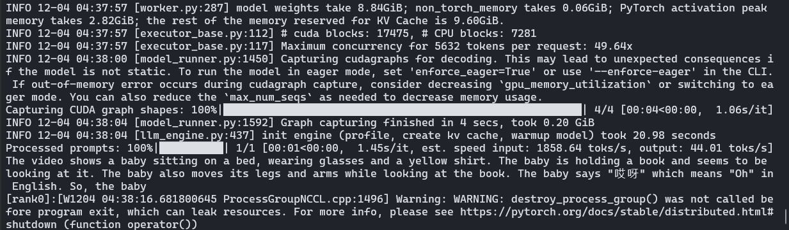
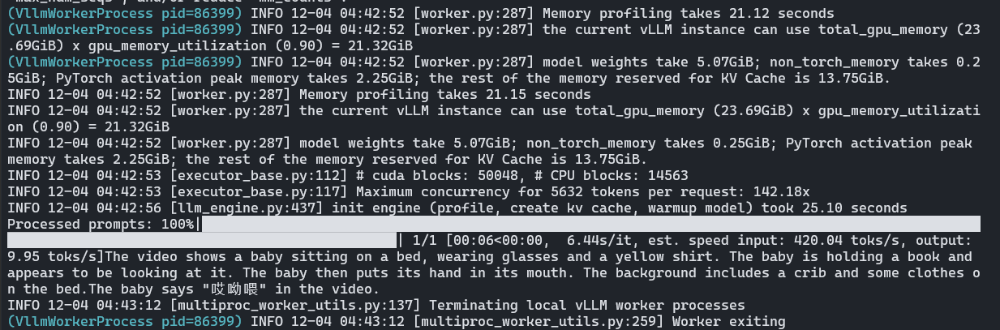

## Record

### 2025-12-1

修改 qwen_eval prompt 进行新测试

### 2025-12-2~2025-12-3

#### vllm 环境搭建及 debug

先试了 qwen-2.5-omni 仓库自己给的方法，完全不可行，一看 issue 差评如潮

> 一个搞笑的，由于他们把根目录占满了，我删除环境的时候报错空间不足还删不了，只能 \rm -rf 掉环境

```zsh
conda create --prefix /data1/conda/vllm-qwen python=3.10 -y
conda activate /data1/conda/vllm-qwen
export CC=/usr/bin/gcc-9
export CXX=/usr/bin/g++-9
pip install torch torchvision torchaudio --index-url https://download.pytorch.org/whl/cu118
pip install xformers==0.0.29.post2 --no-build-isolation

# pip install vllm --extra-index-url https://download.pytorch.org/whl/cu118
# 上面直接下好像不行，或者可能得加一个 --torch-backend=auto 来选定 cu118
pip install vllm-0.8.5.post1+cu118-cp38-abi3-manylinux1_x86_64.whl
```

用空闲的卡并配置 modelscope 下载，不过这里用本地模型 `model_name = "../cache/modelscope/Qwen/Qwen2.5-Omni-3B"`, 

> Qwen2.5-Omni-7B 用 vllm 在 3090 上超显存了，裸模型加载好像就 25G 左右（with flash-attn），等能迁移数据集再换到 77 的上面测（77 上面没空间了已经，或者等后面卡多的时候在75 上并行）

```py
os.environ["VLLM_USE_MODELSCOPE"] = "True"
os.environ["CUDA_VISIBLE_DEVICES"] = "1,7"
```

#### demo 测试

由于最新提供的 Qwen2.5-omni vllm 示例代码基于较新的 vllm 版本，而在较新的版本中目前还没有对 cu118 进行支持，目前使用的也是旧版的 vllm 库，里面的代码和新代码有点不同

```py
# 这个 convert_image_mode 在旧版 vllm 中是没有的，不过可以直接从新版的代码里面复制过来
# from vllm.multimodal.image import convert_image_mode
# 目前好像用不到这个函数，记录一下先

# from vllm.utils.argparse_utils import FlexibleArgumentParser
from vllm.utils import FlexibleArgumentParser
```

查看 0.8.5.post1 的源码，里面是说当时 V1 版本的 vllm 不支持 use_audio_in_video，设置

```py
os.environ["VLLM_USE_V1"] = "0"
```


```py
llm = LLM(
    model=model_name,
    dtype=bfloat16,
    max_model_len=8192,
    max_num_seqs=5,
    limit_mm_per_prompt=query_result.limit_mm_per_prompt,
    seed=args.seed,
    # 默认是 0.8 好像，控制 vllm 分配的 gpu 显存比例
    # gpu_memory_utilization=0.6,

    # 并行推理开启
    # tensor_parallel_size=2,
    # enforce_eager=True,

    # 使用 modelscope
    trust_remote_code=True
)
```

demo 结果：



#### 简单并行测试

nccl 存在问题，据说 nvidia-nccl-cu11 中的 nccl 是基于 cu110 编译的，无法使用流功能，需要配置 `enforce_eager=True`（更好的解决方案是重新编译 cu118 的 nccl，或者升级到cu12x）

补充参数：

```py
llm = LLM(
    model=model_name,
    dtype=bfloat16,
    max_model_len=8192,
    max_num_seqs=5,
    limit_mm_per_prompt=query_result.limit_mm_per_prompt,
    seed=args.seed,

    # 并行推理开启
    tensor_parallel_size=2,
    enforce_eager=True,

    # 使用 modelscope
    trust_remote_code=True
)
```

