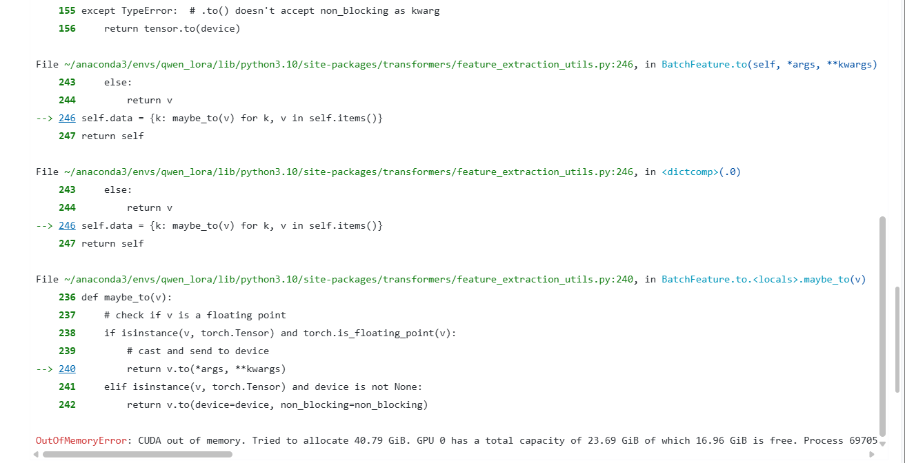

## Record

在 https://github.com/Cosmo-klara/Qwen_R 可以获取本周的代码变动

### 2025-12-8

以 VIT lora 训练上手 tranformers peft


### 2025-12-9 - 2025-12-13

8号晚上吃烧烤被同学叫去吃烧烤，给我俩都干进医院了bushi

### 2025-12-15 - 2025-12-16

开始着手 qwen2.5-omni lora 训练

首先尝试去继承 Qwen2.5-omni 使用的 VideoProcessor 去固定帧采样；在推理上先做简单测试

```python
class FixedFrameQwen2VLVideoProcessor(Qwen2VLVideoProcessor):
    def __init__(self, num_frames=50, **kwargs):
        super().__init__(**kwargs)
        self.fixed_num_frames = num_frames

    def sample_frames(
        self,
        metadata: VideoMetadata,
        temporal_patch_size: Optional[int] = None,
        **kwargs,
    ):
        temporal_patch_size = temporal_patch_size or self.temporal_patch_size

        num_frames = round(self.fixed_num_frames / temporal_patch_size) * temporal_patch_size
        num_frames = min(num_frames, metadata.total_num_frames)

        indices = torch.linspace(
            0,
            metadata.total_num_frames - 1,
            steps=num_frames,
        ).long()

        return indices

    video_processor = FixedFrameQwen2VLVideoProcessor.from_pretrained(model_dir)
    processor = Qwen2_5OmniProcessor.from_pretrained(
         model_dir,
         video_processor=video_processor,
    )
```

完整代码在仓库 test_wr.ipynb 中，这时候我选用训练集中的第一个视频作为测试（165s）

记录参数 

```py
print("video_grid_thw:", inputs["video_grid_thw"])
"""
video_grid_thw: tensor([[165,  26,  46]], device='cuda:0') # 注意到这里的 165 和视频时长是一样的
"""
print(inputs["pixel_values_videos"].shape) # 这个是后面发现问题才加上看的
"""
torch.Size([197340, 1176])
"""
```

没发现修改实际上没有效果，因为运行是成功的，还以为修改成长视频可运行的了

然后去改 lora ，代码在仓库的 lora_test_wr.ipynb 中

写了一个加载训练数据集的类

> 这里我有个疑问，我看 LongVALE 里面是两阶段训练且用了纯视觉的部分（VTimeLLM 里的），我做微调的时候也要和其保持一致吗？

> 这里还有一个问题，LongVALE 数据集中提供的时间戳是绝对时间，而在其 dataset 中专门把绝对时间做了转化到 0-99 的百分相对时间再输入模型，这个也需要保持一致吗？如果不保持一致，最后计算效果的时候就要调整到百分比来算吧

然后是 Debug，用 `model = Qwen2_5OmniThinkerForConditionalGeneration` 而不是 `Qwen2_5OmniForConditionalGeneration`

查看 Qwen2.5-omni 结构
```
for name, module in model.named_modules():
    print(name,"=", module)
```

配置 Lora 参数
```python
config = LoraConfig(
    r=16,
    lora_alpha=16,
    target_modules=["q_proj", "v_proj", "k_proj", "o_proj", "up_proj", "down_proj"],
    # target_modules=["q_proj", "v_proj", "k_proj", "o_proj", "gate_proj", "up_proj", "down_proj"],
    lora_dropout=0.05,
    bias="none",
)
```

```shell
           ┌─ gate_proj ── activation ──┐
x ──┬──────┤                            ⊙ ── down_proj ── out
    │      └─ up_proj   ───────────────┘
```

+ 不调 gate_proj

    trainable params: 31,158,272 || all params: 4,734,622,720 || trainable%: 0.6581

+ 调 gate_proj

    trainable params: 41,084,928 || all params: 4,744,549,376 || trainable%: 0.8659

爆显存了，一开始没考虑采样的问题，也没仔细看报错，以为是 lora 配置的问题



打印看看调了那些层

```python
for name, module in model.named_modules():
    if hasattr(module, "lora_A"):
        print(name)
```

发现里面有 audio_tower 和 visual.blocks 的部分，冻结这部分参数

```python
for name, param in model.named_parameters():
    if ("audio_tower" in name or "visual" in name):
        param.requires_grad = False
```

查资料找到其他节省显存的方法：

```python
# 启用梯度检查点
model.gradient_checkpointing_enable()
# 不缓存 KV Cache
model.config.use_cache = False
```

还是爆显存，报错都不变的

在自定义的 QwenOmniDataCollator 中加入了一些调试信息

```python
    print(batch["video_grid_thw"].shape)
    print(batch["pixel_values_videos"].shape)
    
    for k, v in batch.items():
        if isinstance(v, torch.Tensor):
            print(k, v.shape, v.numel() * v.element_size() / 1024**3, "GB")
```


可以看到 `pixel_values_videos torch.Size([9309664, 1176]) 40.7850923538208 GB`；疑问大大!

9309664 这个形状也不太正常，虽然训练集加载的第一个视频确实有点长，519s，尝试了很久也没找到问题所在，简单检查也没问题

```python
    print(type(processor.video_processor))
    print(hasattr(processor.video_processor, "sample_frames"))
    """
    <class '__main__.FixedFrameQwen2VLVideoProcessor'>
    True
    """
```

以为是 prcessor 里面处理有问题，在自定义的 DataCollator 中直接读视频信息，可以运行,不过卡在这个问题上，还不知道问题是什么？

> 看报错感觉是没有视频占位符，但是在问答对里面是有 `<video>` 标签的，可能是 Qwen2.5-omni 的标签不太一样？如果是的话数据应该要重新组织，可能还要参照 LongVALE 里面的处理

> 一个其他的问题是我观察到数据里面有多轮问答这种，`<video>` 只在第 1 轮问答对中，其他轮问答对中没有 <video> 标签，这是否会导致问题？还有就是我不太清楚多轮问答该如何处理？

这两个尚需处理的问题，我目前在询问 LLaMAFactory 的一个活跃贡献者

```shell
ValueError: Videos features and image tokens do not match: tokens: 0, features 7475
```

然后就发现问题出在 processor 上；回推理上面打印 `print(inputs["pixel_values_videos"].shape)`

发现 165s 的视频才 `torch.Size([197340, 1176])`，而且 `video_grid_thw: tensor([[165,  26,  46]], device='cuda:0')` 显然不是处理成 100 帧，或者说如果处理成 100 帧，怎么实现 TMoPE 的绝对时间对齐呢；重读代码发现会 padding 到时间大小的帧，fps = 2 且 temporal_patch_size = 2；每秒采两帧，每两帧一个时间 token，那一个时间 token 就是绝对时间上的一秒

猜测内部还有 padding 或者扩展之类的操作，因为音频没改，最后视频也会对齐到音频的时间长度。所以没有作用。

因此之前的修改可以报废了，但也说明推理 165s 视频也是可行的，问题在 lora 的代码上；

没找出来问题。。。回来改 infer 的代码，

```py
video_processor = FixedResQwen2VLVideoProcessor.from_pretrained(model_dir)
video_processor.fps = 1.0
processor = Qwen2_5OmniProcessor.from_pretrained(
    model_dir,
    video_processor=video_processor,
)
```

这个执行不了，因为这里其实是不过 processor 的视频处理部分的，而是通过 process_mm_info 处理的，这里传入 processor 的是经由 process_mm_info 解析路径然后提取的视频数据和音频数据；所以 processor 在这里并不负责视频帧采样的逻辑，

不过可以在 conversation 中给 video 设置 fps 为 1.0，

```py
for msg in conversation:
    if msg["role"] == "user":
        for ele in msg["content"]:
            if ele.get("type") == "video":
                ele["fps"] = 1.0   # 设置 1fps
```

也可以继承 processor 使用固定分辨率而不是可变分辨率（似乎并不需要）

```py
from transformers.image_utils import SizeDict

class FixedResQwen2VLVideoProcessor(Qwen2VLVideoProcessor):
    def _preprocess(
        self, videos, do_resize=True, size=None, interpolation=None, **kwargs
    ):
        # 固定分辨率
        fixed_size = SizeDict(height=224, width=224)
        for i, video in enumerate(videos):
            videos[i] = self.resize(video, size=fixed_size, interpolation=interpolation)
        return super()._preprocess(videos, do_resize=False, size=fixed_size, interpolation=interpolation, **kwargs)
```

fps 2 -> 1
tensor[[165, 16, 16]] -> tensor[[82, 16, 16]]
torch.Size([42240, 1176]) -> torch.Size([20992, 1176])

可以看到形状减少了一半多一点，符合预期


### 2025-12-17

和上面推理处理不同，在 lora 的代码中是传入的视频路径和 text，也就是纯 conversation 的部分，会走 processor 内部的处理，但是由于 tranformers 库里面的逻辑，`video_processor = FixedFrameQwen2VLVideoProcessor.from_pretrained(model_path)` 这样继承的 processor 里 `do_sample_frames` 默认的值是 False，也就是会直接不采样视频帧，直接使用视频原始帧。

所以之前这样

```py
video_processor = FixedFrameQwen2VLVideoProcessor.from_pretrained(model_path)
processor = Qwen2_5OmniProcessor.from_pretrained(
    model_path,
    video_processor=video_processor,
)
```

配置的 processor 在推理时没使用，因此看不出问题，在 lora 训练中使用，所以显存爆炸, 本来以为`Qwen2_5OmniProcessor.from_pretrained`这样会把 `do_sample_frame` 设置为 True 的，结果直接被忽略了

按照下面的方法使用就能正常采样视频帧了

```python
video_processor = FixedFrameQwen2VLVideoProcessor.from_pretrained(model_path)
video_processor.do_sample_frames = True
video_processor.fps = 2.0
processor = Qwen2_5OmniProcessor.from_pretrained(
    model_path,
    video_processor=video_processor,
)
```

不过由于不太清楚 Qwen2.5-omni 的模板输入，修改使用推理中加载数据的方式

在dataset中加载 conversation 部分，然后在用 apply_chat_template 处理，然后调整成批处理就行.调整后可推理的代码在库中 lora.ipynb 里

目前还是爆显存但是