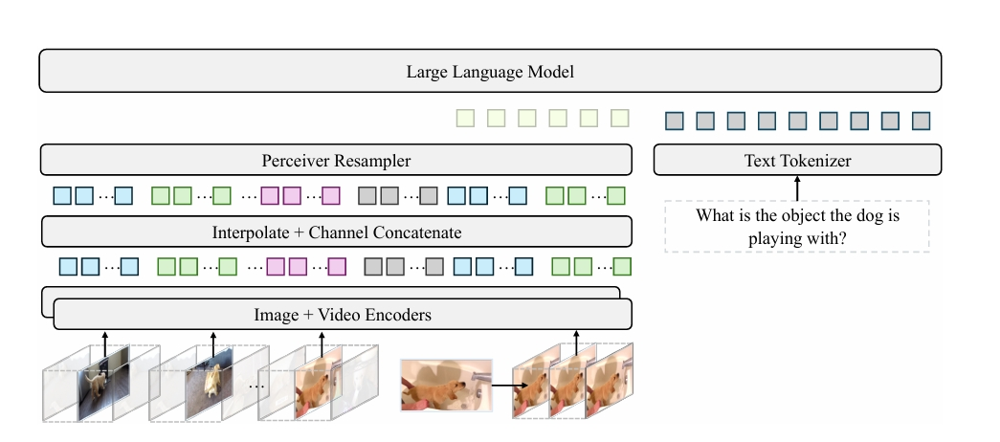

## Record

在 https://github.com/Cosmo-klara/Qwen_R 可以获取本周的代码变动

### 2025-12-18

+ 解决没有 loss 的问题，由于训练数据和 transformer 中标准的格式不同，label 需要自己选择，实现后 labels 有效 token 只剩 `<|VIDEO|>`，未包含 assistant 文本

debug：一直都是 |VIDEO| 占位符

QwenOmniProcessor 会在 视频 patch 展开后动态插入 `<|VIDEO|>` token，如果按“字符位置 / 拼接文本”计算 labels，对齐关系会被破坏，assistant token 的真实位置只能在 processor 之后的 input_ids 中确定。在 processor 输出的 input_ids 中定位 <|im_start|> assistant，只对 assistant 回复区间做 label，其余位置置为 -100 mask 掉。

+ 解决没有梯度的问题，Loss requires_grad: False，loss 有值但 loss.requires_grad=False

因为用了 model.gradient_checkpointing_enable()，得启用 model.enable_input_require_grads()

### 2025-12-19

由于数据集存在多轮次对话，之前实现的时候处理的是拆成多个单轮对话，不过这样训练时间显著增加（370h），因为相当于近 10 倍音视频特征提取的次数，看了 LongVALE 的 dataset 实现，发现是直接将多轮次对话拼接起来，只做一个超长度后按轮次截断的处理。

重新实现了多轮对话训练的策略，实现了和 LongVALE 类似的多轮对话策略，超长按照轮次截断，通过了单元测试，只是没卡跑不了还

### 2025-12-21

没卡用，被占满了，看论文和找数据集

VideoLLaMA 2/ Fork-Merge Decoding

Apollo: An Exploration of Video Understanding in Large Multimodal Models



这个的有点像 [Q-Former](https://arxiv.org/abs/2303.15105)，应该是源自 [Perceiver: General Perception with Iterative Attention](https://arxiv.org/abs/2103.03206)

或许这种架构更适合长视频？里面还提到使用 fps 比均匀采样效果更好，但实际上似乎是因为每帧令牌数（tpf）

### 2025-12-22

等卡，写了一个先把音频提出来的脚本，理论上节省一下训练时提取音频的时间；

明天的工作计划：

1. 看论文，整理 Q-Former 这种架构的思路，主要参考 Apollo: An Exploration of Video Understanding in Large Multimodal Models；这里面提到对于长视频理解的部分可以看看

2. 看 SlowFast-LLaVA-1.5 这个也是长视频理解

3. 考虑是否从仅视觉模型进行训练，在融合音视频上选择 Q-Former 这种架构的思路，用音频作为可选线索辅助视觉模型理解长视频？


### 2025-12-23

今天空了两张卡出来，在训练过程中又遇到了显存不足的问题，仔细看看了，发现是在计算 Cross-Entropy Loss 的时候爆的显存，

print("vocab size:", processor.tokenizer.vocab_size) 发现 vocab size 是 151643, 而 LongVALE 的 vocab size 是 32000，这个调整一下之前多轮对话策略的 max_total_tokens，设置 `total_tokens = input_tokens + label_tokens`

然后用 total_tokens 和传入的 max_total_tokens 进行比较，如果超出就删除最早的一轮对话的 token，这里还要注意因为后面发现有个数据单轮对话就超长度爆显存了，所以在比较的时候不能因为是最后一轮就保留

> 好像有点 bug 代码，看日志看到有 label token = 0 的，但是没有空卡不好测试的

#### 训练相关

因为显存是在算 Cross-Entropy Loss 的时候爆的，所以在看有没有什么能优化显存的方法，然后看到一篇看起来效果非常夸张的的论文 https://arxiv.org/abs/2411.09009v1

这个论文就是讲随着语言模型的规模不断扩大，它们的词汇量也随之增长，这导致在训练过程中，LLMs 的内存占用不均衡地集中到了损失计算中的交叉熵；因为交叉熵损失计算需要具体化一个维度为 `N × V`（其中 N 是 token 数量，V 是词汇表大小）的 logits 矩阵；

提出剪枝交叉熵（CCE）方法：一个极度节省显存的交叉熵损失实现方式，能够在训练大语言模型时避免产生巨大的 logits 张量；想着用一下这个损失函数来，不过看了里面代码的实现和现版本的 transformer 很不一样，先不尝试了

下面是记录探寻 transformers 库中模型 self.loss_function 实现的过程

发现 transformers 在模型的 forward 中直接调用了 self.loss_function

```py
    loss = None
    if labels is not None:
        loss = self.loss_function(
            logits=logits, labels=labels, vocab_size=self.config.get_text_config().vocab_size
        )
```

往上定位 self.loss_funciton 的实现时，发现其定义在父类 PreTrainedModel 中( src/transformers/modeling_utils.py 内)：

```py
class Qwen2_5OmniPreTrainedModel(PreTrainedModel):
class Qwen2_5OmniPreTrainedModelForConditionalGeneration(Qwen2_5OmniPreTrainedModel):
class Qwen2_5OmniThinkerForConditionalGeneration(Qwen2_5OmniPreTrainedModelForConditionalGeneration, GenerationMixin):
```

```py
    @property
    def loss_function(self):
        if hasattr(self, "_loss_function"):
            return self._loss_function

        loss_type = getattr(self, "loss_type", None)

        if loss_type is None or loss_type not in LOSS_MAPPING:
            logger.warning_once(
                f"`loss_type={loss_type}` was set in the config but it is unrecognized. "
                f"Using the default loss: `ForCausalLMLoss`."
            )
            loss_type = "ForCausalLM"
        return LOSS_MAPPING[loss_type]

    @loss_function.setter
    def loss_function(self, value):
        self._loss_function = value
```

首先会检测是否包含 _loss_function 属性，如果存在该属性，则直接使用 self._loss_function 自定义定义的损失函数；

然后没有自定义损失函数的话就通过 LOSS_MAPPING 字典映射，找 loss_type 对应的损失函数；如果 loss_type 不在 LOSS_MAPPING 中或者 loss_type 为 None，默认使用 “ForCausalLM” 对应的损失函数

在 LOSS_MAPPING 中找 "ForCausalLM": ForCausalLMLoss, 实现如下：

```py
def ForCausalLMLoss(
    logits,
    labels,
    vocab_size: int,
    num_items_in_batch: torch.Tensor | None = None,
    ignore_index: int = -100,
    shift_labels: torch.Tensor | None = None,
    **kwargs,
) -> torch.Tensor:
    # Upcast to float if we need to compute the loss to avoid potential precision issues
    logits = logits.float()

    if shift_labels is None:
        # Shift so that tokens < n predict n
        labels = nn.functional.pad(labels, (0, 1), value=ignore_index)
        shift_labels = labels[..., 1:].contiguous()

    # Flatten the tokens
    logits = logits.view(-1, vocab_size)
    shift_labels = shift_labels.view(-1)
    shift_labels = shift_labels.to(logits.device)
    loss = fixed_cross_entropy(logits, shift_labels, num_items_in_batch, ignore_index, **kwargs)
    return loss
```

其中 fixed_cross_entropy 实现如下：

```py
def fixed_cross_entropy(
    source: torch.Tensor,
    target: torch.Tensor,
    num_items_in_batch: torch.Tensor | None = None,
    ignore_index: int = -100,
    **kwargs,
) -> torch.Tensor:
    reduction = "sum" if num_items_in_batch is not None else "mean"
    loss = nn.functional.cross_entropy(source, target, ignore_index=ignore_index, reduction=reduction)
    if reduction == "sum":
        # just in case users pass an int for num_items_in_batch, which could be the case for custom trainer
        if torch.is_tensor(num_items_in_batch):
            num_items_in_batch = num_items_in_batch.to(loss.device)
        loss = loss / num_items_in_batch
    return loss
```

可以看到没有做优化之类的；或许可以参照 [cce](https://github.com/apple/ml-cross-entropy) 或者 [Liger-Kernel](https://github.com/linkedin/Liger-Kernel) 里面提到的减少训练显存的使用；

后面发现 transformers 已经支持了 Liger-Kernel，需要在 TrainingArguments 中启用，还有就是可以开 torch_compile=True ；等跑完一轮试试

#### 后期工作相关

从一个仅视觉的模型出发，扩展到带音频和语音的多模态模型？

LongVALE 三个任务：

+ Grounding：事件描述，提示说明结合视觉和音频，输出相对的时间戳

+ Captioning：无删减视频，输出全部事件描述及时间戳

+ Seg Captioning：给出相对时间戳，输出对应的事件描述

也就是说两个模态的时间信息都要保留，如果直接省去一些帧会影响模型对于时间的判断吧？

那如果要实现去掉冗余帧，应该先按 fps 采样，然后计算每帧的 Token 和全局文本 Token 的注意力权重，在保留注意力得分高的关键视觉 Token 的前提下，动态选择帧采样策略，然后训练模型。不过这样只能学习相对时间的观念吧？因为训练的时候如果用真实时间，但是帧采样率不同会让模型误判时间？

此外，音频 token 该怎么用呢？用音频对应提示吗，按理说音频信息的采用是为了更好的描述视频内容（Captioning 和 Seg Captioning），以及在 Grounding 中参照音频划分多模态的事件边界；所以音频和文本与视频都有相关；该怎么做呢？

和文本是要丰富表述（也相当于是丰富视觉信息？），和视频是要判断边界


#### 一些参考论文收集的资料

Apollo: An Exploration of Video Understanding in Large Multimodal Models

+ fps 采样在模型训练和推理过程中优于均匀采样
+ 每秒令牌数（tps） 和 fps 之间存在权衡，每帧 8-32 个 token 为最佳。发现对 fps 的依赖性很小，每帧令牌数（tpf）和 tps 更为确定


