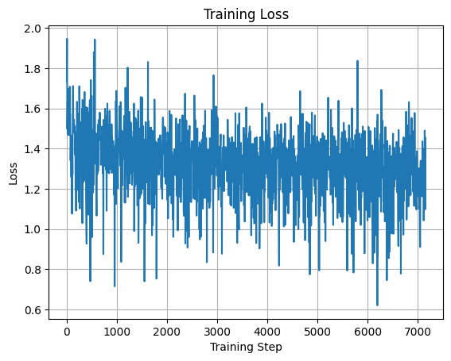
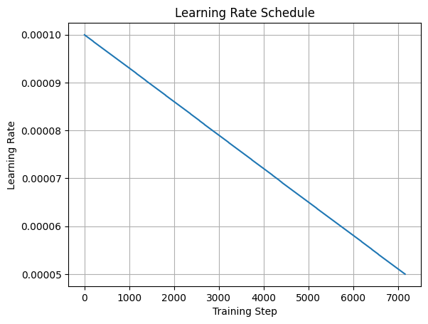
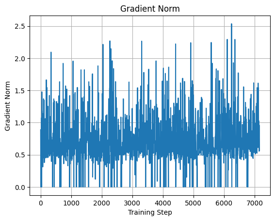
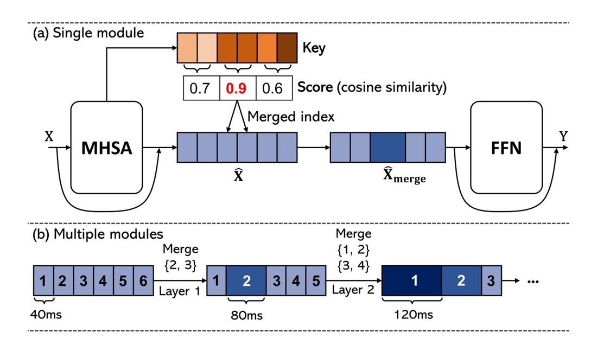
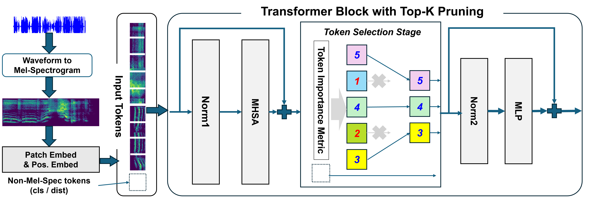
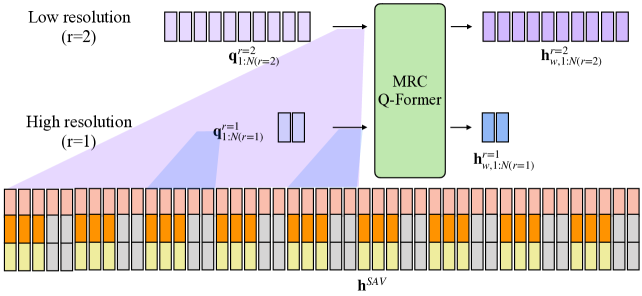
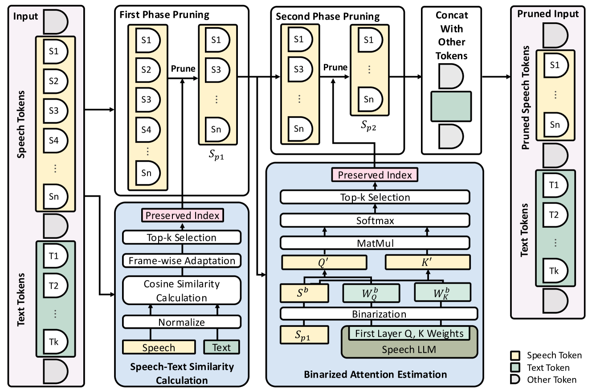
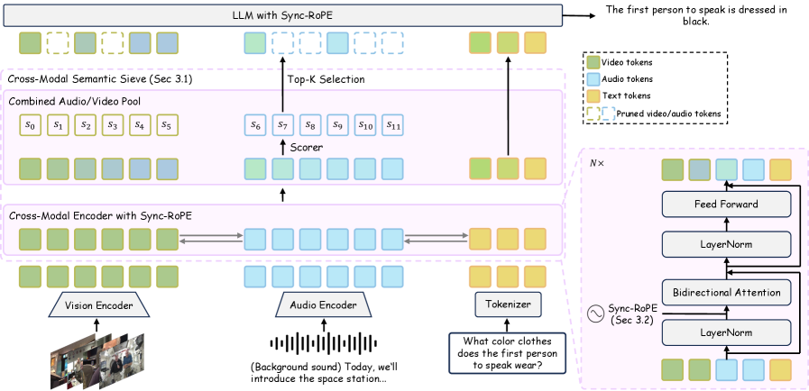

## Record

在 https://github.com/Cosmo-klara/Qwen_R 可以获取本周的代码变动

### 2025-12-24

+ 核验 longvale 代码，确认其在训练是使用单轮对话多轮对话混合训练，在评估时仅使用单轮对话。

+ 重新修改为单轮对话训练，训练数据长度如下：

```py
print(len(train_dataset))
# 75075 ( 如果是多轮对话，长度 = 视频数 7240)
```

这里不同于给出的 91,863 events 是因为在训练数据中存在 captioning 的任务（一个 A 中会包含多个事件）

+ 进行一些 baseline 中对于 Qwen2.5-omni的修改的合理性的验证

    总的来说调整的地方如下：

    在 bulid 对话的时候添加参数 `max_frames`，这样在经过 process_mm_info 时会自动限制最大帧数目为 50 帧。
    ```py
    {"type": "video", "video": sample["video_path"], "max_frames": 50},
    ```

    ```py
    ========== Omni Batch Debug ==========
    [Text]
    input_ids: torch.Size([1, 8153])
    attention_mask: torch.Size([1, 8153])
    labels: torch.Size([1, 8153])
    label tokens: 14

    [Video]
    pixel_values_videos: torch.Size([6400, 1176])
    dtype: torch.float32
    video_grid_thw: tensor([[25, 16, 16]])
    video tensor size: 28.71 MB

    [Audio]
    input_features: torch.Size([1, 128, 30000]), 14.65 MB
    =====================================


    [SYSTEM]
    "\nYou are Qwen, a virtual human developed by the Qwen Team, Alibaba Group, capab..."
    "\n"

    [USER]
    "\n"
    <|vision_bos|>
    ├─ VIDEO × 128
    ├─ AUDIO × 50
    ├─ VIDEO × 128
    ├─ AUDIO × 50
    ├─ VIDEO × 128
    ├─ AUDIO × 50
    ├─ VIDEO × 128
    ├─ AUDIO × 50
    ├─ VIDEO × 128
    ├─ AUDIO × 50
    ├─ VIDEO × 128
    ├─ AUDIO × 50
    ├─ VIDEO × 128
    ├─ AUDIO × 50
    ├─ VIDEO × 128
    ├─ AUDIO × 50
    ├─ VIDEO × 128
    ├─ AUDIO × 50
    ├─ VIDEO × 128
    ├─ AUDIO × 50
    ├─ VIDEO × 128
    ├─ AUDIO × 50
    ├─ VIDEO × 128
    ├─ AUDIO × 50
    ├─ VIDEO × 64
    ├─ AUDIO × 5822
    <|audio_eos|>
    "<video>\nDuring which frames in the video can we observe someone lifts a freshly..."
    "\n"

    [ASSISTANT]
    *"\nFrom 83.1% to 85.0%."
    "\n"
```

    ```py
    video_grid_thw: tensor([[25, 16, 16]])
    tensor([[T, H, W]])
    T = 时间方向 patch 数, temporal_patch_size = 2 时间上合并一次 token，所以 T = 50 / 2 = 25
    H = 高方向 patch 数, 原始 ViT patch, video_grid_thw 这里过完 processor 应该已经 merge 了，照理来说应该是 8，但是这里是 16，迷惑
    W = 宽方向 patch 数
    ```

    有两个问题：
    1. 为什么 H / W = 16，而不是 8？
    2. AUDIO × 5822 最后剩的有点多，几次变更采样帧数目，时间块内的音频 token 数目还是 50 没有变化，时间窗口的大小没有随着采样帧数目更新吗？


数据记录：

### 2025-12-25

+ 测试之前多轮对话训练 epoch 1 的结果，训练配置如下：

```py
config = LoraConfig(
    r=16,
    lora_alpha=16,
    target_modules=["q_proj", "v_proj", "k_proj", "o_proj", "up_proj", "down_proj"],
    lora_dropout=0.05,
    bias="none",
    # task_type="CAUSAL_LM"
)

args = TrainingArguments(
    output_dir="./r_models",
    remove_unused_columns=False,
    eval_strategy="no",
    save_strategy="epoch",
    learning_rate=1e-4,
    per_device_train_batch_size=batch_size,
    gradient_accumulation_steps=1,
    bf16=True,
    fp16=False,
    fp16_full_eval=False,
    num_train_epochs=2,
    logging_steps=5,
    load_best_model_at_end=False,
)
```

loss 曲线、学习率曲线和梯度范数曲线如下：

|loss 曲线|学习率曲线|梯度范数曲线|
|-|-|-|
||||

多轮对话加载数据集，训练一个 epoch 的时间： 15:18:57

没空卡没跑评估

+ video_grid_thw 形状的问题：

跟踪了一下 video_grid_thw，发现它返回的是 merge（VL processor 中） 前的尺寸，在 2.5-omni 自己的 processor 里手动除以 merge_size^2 来计算实际 token 数。

```py
merge_length_video = self.video_processor.merge_size**2
# ...
if not use_audio_in_video:
    video_seq_length = next(video_grid_thw).prod() // merge_length_video
    sample = sample.replace(self.video_token, "<|video_placeholder|>" * video_seq_length, 1)
else:
    audio_token_indices = np.arange(next(audio_lengths))
    curr_video_grid_thw = next(video_grid_thw)
    height = curr_video_grid_thw[1] // self.video_processor.merge_size
    width = curr_video_grid_thw[2] // self.video_processor.merge_size
    video_token_indices = np.arange(curr_video_grid_thw[0]).reshape(-1, 1, 1)
    video_token_indices = np.broadcast_to(
        video_token_indices, (video_token_indices.shape[0], height, width)
    ).reshape(-1)
```

所以上面的 `video_grid_thw: tensor([[25, 16, 16]])` 是对的， 16 = 8 * 2（merge size）; 因为是 4 个 patch 合成了一个新 patch（28 * 28）

计算的时候就是 16 / 2（merge size） * 28（patch size） = 224, 符合 resize 到 224 * 224 的处理

+ AUDIO token 长度：

    添加新的 debug 打印如下：

    ```py
        [Audio Length]
        valid mel frames: [25689]
        audio seconds (approx): [256.8900146484375]
        audio tokens after encoder: [6422]
    ```

    首先是音频总长度 50 * 12 + 5822 = 6442，这个的话和视频总时长有关，视频时长是 25689 * 10ms = 256.89s, audio tokens = (((25689-1) // 2 + 1)-2) // 2 + 1 = 6422 ( 1 个音频 token 对应真实 40ms )，所以之前的 50 个音频 token 对应的就是 2s 的时间窗口

    ```py
        if audio is not None:
            output_kwargs["audio_kwargs"]["padding"] = "max_length"  # Support "max_length" padding only here
            audio_inputs = self.feature_extractor(audio, **output_kwargs["audio_kwargs"])
            audio_inputs["feature_attention_mask"] = audio_inputs.pop(
                "attention_mask"
            )  # rename feature_attention_mask to prevent conflicts later on
            audio_inputs["input_features"] = audio_inputs.pop(
                "input_features"
            )  # rename input_features to prevent conflicts later on
            input_lengths = (audio_inputs["feature_attention_mask"].sum(-1) - 1) // 2 + 1
            audio_lengths = iter((input_lengths - 2) // 2 + 1)
    ```

### 2025-12-26

开大组会，正好提到 Qwen2.5-VL 的动态分辨率，我之前的实现是直接 resize 到 224 * 224，感觉可以直接用它的动态分辨率改参数，之前试过以此，但是不知道为什么给 processor 传 max_pixel 没有效果

读源码,试着用传

```json
"size" :{
    "shortest_edge": 64 * 28 * 28,
    "longest_edge": 128 * 28 * 28,
}
```

这样是可以动态 resize 的，`video_grid_thw` 的变成 `tensor([[25, 16, 30]])`, 动态 resize 到和原比例近似的且能被 28 整除的分辨率；比如这里这个就是 `[640, 360]` 的原始分辨率，resize 成 `[15 * 28, 8 * 28]`， 8 / 15 = 0.5333 近似 360 / 640 = 0.5625；

接续 25 号的 debug

所以固定帧采样更新的时间窗口对应的真实时间并没有同步到音频，源码实际上做了这一步操作： len(video_grid_thw) = nframes（帧数） / 2 (temporal_patch_size) = T（视频时长） * fps / 2 (temporal_patch_size)

    ```py
        second_per_grid_ts = [self.video_processor.temporal_patch_size / fps] * len(video_grid_thw)
        videos_inputs["video_second_per_grid"] = second_per_grid_ts
    ```

    相当于默认你的帧数目就是视频总的时长，但是很奇怪的是 `seconds_per_chunk` 又设定的是 2; 完全没用上 second_per_grid_ts 来算时间，所以视频还是 2 帧合成一个 token（认为是 2fps 采样）对应真实时间一秒，接上音频的 50个 token；但是实际的时间关系错了；

    ```py
    <|vision_bos|>
    ├─ VIDEO × 240
    ├─ AUDIO × 50
    ├─ VIDEO × 240
    ├─ AUDIO × 50
    ├─ VIDEO × 240
    ├─ AUDIO × 50
    ├─ VIDEO × 240
    ├─ AUDIO × 50
    ├─ VIDEO × 240
    ├─ AUDIO × 50
    ├─ VIDEO × 240
    ├─ AUDIO × 50
    ├─ VIDEO × 240
    ├─ AUDIO × 50
    ├─ VIDEO × 240
    ├─ AUDIO × 50
    ├─ VIDEO × 240
    ├─ AUDIO × 50
    ├─ VIDEO × 240
    ├─ AUDIO × 50
    ├─ VIDEO × 240
    ├─ AUDIO × 50
    ├─ VIDEO × 240
    ├─ AUDIO × 50
    ├─ VIDEO × 120
    ├─ AUDIO × 5822
    <|audio_eos|>
    ```

    修改成用 fps 采样，限制最大帧数 50 帧 `fps = max_frames（50） / duration`

    ```python
        batch = self.processor(
            text=texts,
            videos=videos,
            audio=audios,
            padding=True,
            return_tensors="pt",
            videos_kwargs={
                "max_frames": max_frames,
                "fps": fps,
                "do_sample_frames": True, # 必须
                "do_resize": True,
                "size" :{
                    "shortest_edge": 64 * 28 * 28,
                    "longest_edge": 128 * 28 * 28,
                },
                "min_pixels": 224 * 224,
                "max_pixels": 448 * 224,
                "use_audio_in_video": True, # 在外部设置无效了
            },
            # use_audio_in_video=True,
        )
    ```

    报错，需要传 metadata 传进去，能拿到 metadata.fps, 但是没用 metadata.total_num_frames, 能解决；但是好像可以直接在处理视频的时候直接采样 50 帧，然后关闭 processor 中的 `do_sample_frames`，这样就可以不过使用 metadata.fps 和 metadata.total_num_frames 的计算步了

    效果应该是一样的，记录一下目前的配置：

    ```python
    {"type": "video", "video": sample["video_path"], "nframes": 50},
    # ...
    duration = sample["duration"]
    seconds_per_chunk = duration / num_frames # 这里不用整除 //；时间表示更细
    fps = num_frames / duration if duration and duration > 0 else 2.0
    batch = self.processor(
        text=texts,
        videos=videos,
        audio=audios,
        padding=True,
        return_tensors="pt",
        videos_kwargs={
            "seconds_per_chunk": seconds_per_chunk * 2, # 这里需要 * 2，是因为 temporal_patch_size = 2, 
            "max_frames": num_frames,
            "fps": fps,
            "do_resize": True,
            "size" :{
                "shortest_edge": 64 * 28 * 28,
                "longest_edge": 128 * 28 * 28,
            },
            "min_pixels": 224 * 224,
            "max_pixels": 448 * 224,
            "use_audio_in_video": True,
        },
    )
    ```


    + "seconds_per_chunk": seconds_per_chunk, 时间区间变小，但是因为 temporal_patch_size = 2, 两帧融合导致只有一帧是在多出来的时间窗口内

        ```python
        <|vision_bos|>
        ├─ VIDEO × 120
        ├─ AUDIO × 128
        ├─ VIDEO × 1
        ├─ AUDIO × 128
        ├─ VIDEO × 119
        ├─ AUDIO × 128
        ├─ VIDEO × 1
        ├─ AUDIO × 128
        ├─ VIDEO × 119
        ├─ AUDIO × 128
        ├─ VIDEO × 1
        ├─ AUDIO × 128
        ├─ VIDEO × 119
        ├─ AUDIO × 128
        ├─ VIDEO × 1
        # ...
        ```

    + 目前的结果：

    ```py
    ========== Omni Batch Debug ==========
    [Text]
    input_ids: torch.Size([1, 8828])
    attention_mask: torch.Size([1, 8828])
    labels: torch.Size([1, 8828])
    label tokens: 14
    valid text tokens: [8828]
    label tokens (not -100): [14]

    [Video]
    pixel_values_videos: torch.Size([9100, 1176])
    dtype: torch.float32
    video_grid_thw: tensor([[25, 14, 26]])
    video tensor size: 40.82 MB

    [Audio]
    input_features: torch.Size([1, 128, 30000]), 14.65 MB

    [Audio Length]
    valid mel frames: [25689]
    audio seconds (approx): [256.8900146484375]
    audio tokens after encoder: [6422]

    <|vision_bos|>
    ├─ VIDEO × 91
    ├─ AUDIO × 256
    ├─ VIDEO × 91
    ├─ AUDIO × 256
    ├─ VIDEO × 91
    ├─ AUDIO × 256
    ├─ VIDEO × 91
    ├─ AUDIO × 256
    ├─ VIDEO × 91
    ├─ AUDIO × 256
    ├─ VIDEO × 91
    ├─ AUDIO × 256
    ├─ VIDEO × 91
    ├─ AUDIO × 256
    ├─ VIDEO × 91
    ├─ AUDIO × 256
    ├─ VIDEO × 91
    ├─ AUDIO × 256
    ├─ VIDEO × 91
    ├─ AUDIO × 256
    ├─ VIDEO × 91
    ├─ AUDIO × 256
    ├─ VIDEO × 91
    ├─ AUDIO × 256
    ├─ VIDEO × 91
    ├─ AUDIO × 256
    ├─ VIDEO × 91
    ├─ AUDIO × 256
    ├─ VIDEO × 91
    ├─ AUDIO × 256
    ├─ VIDEO × 91
    ├─ AUDIO × 256
    ├─ VIDEO × 91
    ├─ AUDIO × 256
    ├─ VIDEO × 91
    ├─ AUDIO × 256
    ├─ VIDEO × 91
    ├─ AUDIO × 256
    ├─ VIDEO × 91
    ├─ AUDIO × 256
    ├─ VIDEO × 91
    ├─ AUDIO × 256
    ├─ VIDEO × 91
    ├─ AUDIO × 256
    ├─ VIDEO × 91
    ├─ AUDIO × 256
    ├─ VIDEO × 91
    ├─ AUDIO × 256
    ├─ VIDEO × 91
    ├─ AUDIO × 278
    <|audio_eos|>
    ```

#### 问题 1

我比较了一下在 processor 中进行采样和在 process_mm_info 数据提取中进行帧采样

他们在实现上稍微有所不同，

+ process_mm_info 数据提取(这个内存效率高一些)

`idx = torch.linspace(0, total_frames - 1, nframes).round().long()` 生成索引, linspace 是固定首尾，中间均匀插值，保证第 0 帧和最后一帧一定会被选中。索引是整数帧位置，直接映射到视频文件的帧

+ processor 中进行采样

`indices = torch.arange(0, total_num_frames, total_num_frames / num_frames).int()`, arange 是固定步长，可能因取整误差导致最后一帧未被选中（比如总帧数不是 50 的整数倍时）。

这样得到的视频帧数据稍有偏差

### 2025-12-29 - 2025-12-31

这周在看 [Awesome Multimodal Token Compression](https://arxiv.org/abs/2507.20198) （一篇多模态标记压缩的综述）里面提及的论文；

记录一些和音频相关的：

+ Token Stacking：将多个连续的 token 沿着 token 的隐藏维度进行堆叠，需要 MLP 重新调整维度。eg. SLAM-ASR、LLaMA-Omni、Llama-AVSR

+ Pooling: Qwen2-audio 和 Qwen2.5-Omni 就是步长为 2 的池化；

+ Temporal Convolution：对于音频 token，在时间维度上应用 1D 卷积减少 token 数量。 eg. [SpeechVerse](https://arxiv.org/abs/2405.08295)、[Baichuan-Audio](https://arxiv.org/abs/2502.17239)、[OSUM](https://arxiv.org/abs/2501.13306)、[LUCY](https://arxiv.org/abs/2501.16327)

+ **Similarity-based audio-centric Compression**: [A-ToMe](https://arxiv.org/abs/2306.16009) 在 MHSA 和 FFN 中间插入一个 token 合并模块，合并具有高余弦相似度的相邻音频 token

    : 这个还能保持时间信息

+ Attention-based audio-centric Compression:

    Attention in Encoder: [Token Pruning in Audio Transformers](https://arxiv.org/abs/2504.01690) :TopK token 剪枝, 仅保留按注意力分数幅度排名前 K 的音频 token

    

+ Query-based audio-centric Compression:

    + Token Distillation: 利用可学习的查询 Token 将全面的音频信息蒸馏为紧凑的固定长度表示; eg. [SALMONN 系列](https://arxiv.org/html/2406.15704v1)

    > 由于 longvale 数据集音频存在指导时间边界的作用, QFomer 压缩会丢失细粒度的时间信息

    


    MRC Q-Former: 从不同时间分辨率的多长度输入中提取视听特征。详细结构如图所示。首先，同步输入流在多个不同分辨率下被划分为固定长度的窗口，例如每隔 1、5 或 10 秒

    音频和视频帧在每个视频帧（即每 0.5 秒）处同步，通过零填充使两个序列具有相同的长度

    在将所有分辨率的输出查询向量发送至 LLM 之前，会使用一个投影层将它们组合起来

+ **Cross-Modal Selection**: [Speechprune](https://arxiv.org/abs/2412.12009): 这是通过计算基于余弦相似性的跨模态相似度矩阵(音频-文本相关性)来实现的，然后用这个矩阵指导音频标记的压缩。(时序信息能在文本中体现出来吗? seg_captioning 和 grounding 的话应该是可以;但是单纯 captioning 的话..)

    

    检查语音和文本 token 嵌入之间的余弦相似度来移除语义上不相关的语音 token，然后还有一次注意力剪枝, 第一层 Transformer 提供的注意力分数对音频 token 进行 top k 剪枝


### 2025-01-04

然后是两篇比较新的paper


[MMS-LLaMA](https://arxiv.org/abs/2503.11315v2): AV QFormer 预先合并视觉音频模态,然后接 QFormer; 感觉时间上信息损失多, 和 benchmark 可能匹配性不好


这篇我得单独看看：

[EchoingPixels: Cross-Modal Adaptive Token Reduction for Efficient Audio-Visual LLMs](https://arxiv.org/abs/2512.10324v1)



跨模态编码器, 可以借鉴的是同时段的音视频 token 基于重要性分别打分, 然后分配不同的数目, 可以结合 top k 剪枝


### 2025-01-05


### 2025-01-06


