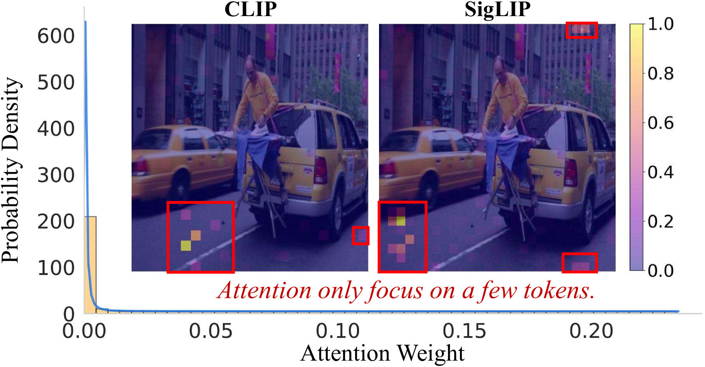
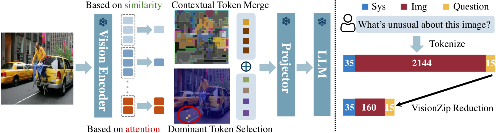
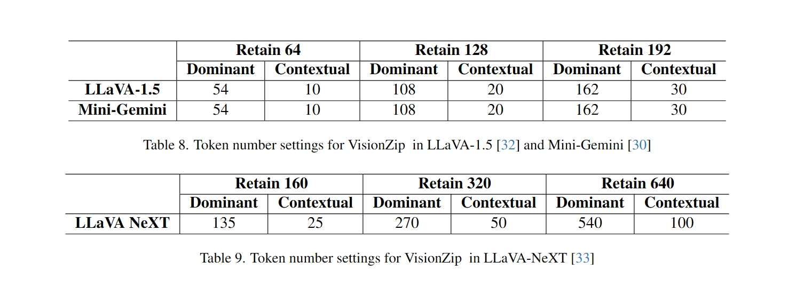
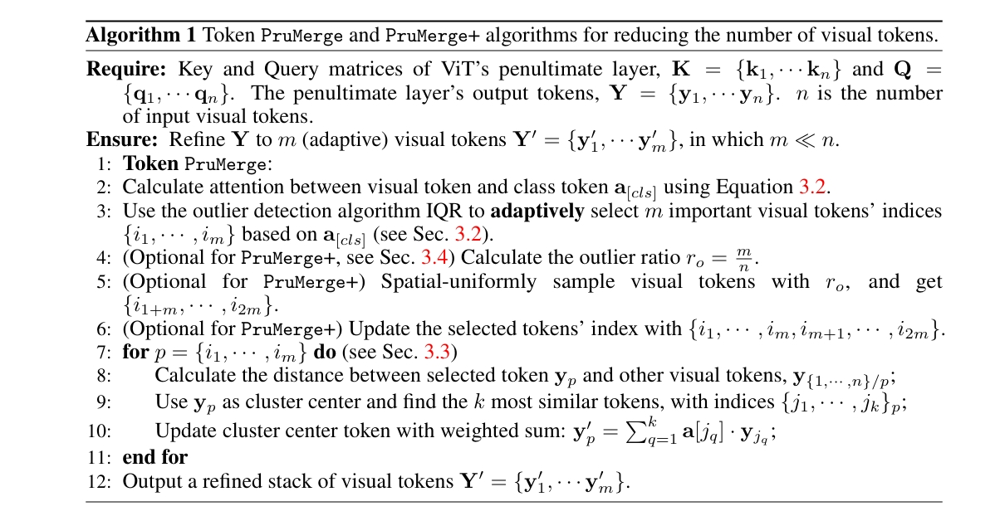
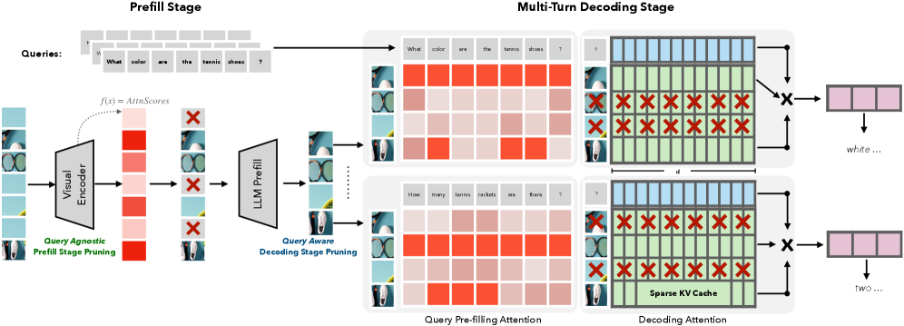
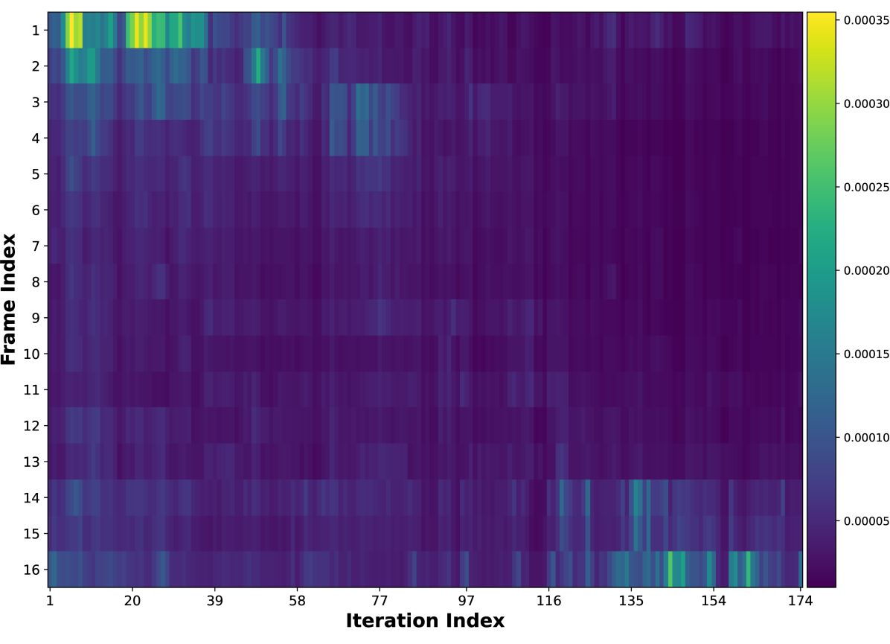
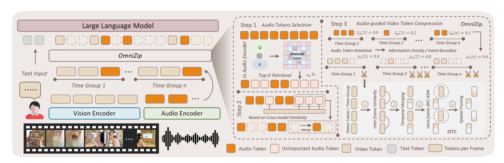

## Record

在  可以获取本周的代码变动

### 2025-01-08

重新测了一遍，目前的处理后 token 的形状和各模态的 token 数目与交错情况

```py
=== Sample 0 ===
有效 token 拼接文本:
From 83.1% to 85.0%.

========== Omni Batch Debug ==========
[Text]
input_ids: torch.Size([1, 8053])
attention_mask: torch.Size([1, 8053])
labels: torch.Size([1, 8053])
label tokens: 14
valid text tokens: [8053]
label tokens (not -100): [14]
```

8053 = 1500（V） + 6422（A） + 14（L）+ 117（~L）

```py
[Video]
pixel_values_videos: torch.Size([6000, 1176])
dtype: torch.float32
video_grid_thw: tensor([[25, 12, 20]])
video tensor size: 26.92 MB

```

6000 = 25 * 12 * 20; merge 后实际 token 数目 / 4 = 1500

25 个视频帧( T 维度上合并了一次，初始是 50 )，每个视频帧有 12 * 20 个 patch（未合并）

合并后是 6 * 10 个 patch；也就是说合并完成后一帧（对应原始两帧）对应 60 个 patch token

```py
[Audio]
input_features: torch.Size([1, 128, 30000]), 14.65 MB

[Audio Length]
valid mel frames: [25689]
audio seconds (approx): [256.8900146484375]  # 音频真实时长
audio tokens after encoder: [6422]

"""
原始音频 (16kHz)
    ↓ Mel提取 (100 fps, 25ms窗口, 10ms hop)
Mel频谱: 100帧/秒，每帧基于25ms音频
    ↓ Qwen2-Audio编码器 (时间下采样)
音频表示: 25帧/秒，每帧对应40ms音频
"""

```

真实音频 mel 帧数 t_real； window = 25 ms，hop = 10 ms，1 个 mel frame ≈ 0.01 s

音频编码后的 token 数，经过两次降采样 1/4，25 fps，实际数值也就等于 t_real / 4

```py
=====================================

<|vision_bos|>
├─ VIDEO × 120
├─ AUDIO × 513
├─ VIDEO × 120
├─ AUDIO × 513 # 6422 * 4 / 50
├─ VIDEO × 120
├─ AUDIO × 513
├─ VIDEO × 120
├─ AUDIO × 513
├─ VIDEO × 120
├─ AUDIO × 513
├─ VIDEO × 120
├─ AUDIO × 513
├─ VIDEO × 120
├─ AUDIO × 513
├─ VIDEO × 120
├─ AUDIO × 513
├─ VIDEO × 120
├─ AUDIO × 513
├─ VIDEO × 120
├─ AUDIO × 513
├─ VIDEO × 120
├─ AUDIO × 513
├─ VIDEO × 120
├─ AUDIO × 513
├─ VIDEO × 60
├─ AUDIO × 266
<|audio_eos|>

```

一个时间窗口内包含两帧视频帧，用这个对应的时间长度来划分时间窗口，时间窗口的大小也就是原始时间的 t_real / 50 * 2(时间压缩一次) * 2（一个窗口放两帧）

相同时间窗口内的对应全部音频帧，也就是 t_real / 4 * 4 / 50 = t_real / 50；原始实现是固定 2s 内的音频 token 50 个，然后放视频的 token，视频就是原始 4 帧，时间合并一次 2 帧；

因此最后有 13 个时间窗口（25 帧无法整除，最后一个窗口只有一个视频帧；和剩下的所有音频帧）

如果让时间更细一点，可以把让一个时间窗口只覆盖一个视频帧（也就是我目前训练设置的）

```py

<|vision_bos|>
├─ VIDEO × 60
├─ AUDIO × 256
├─ VIDEO × 60
├─ AUDIO × 256
├─ VIDEO × 60
├─ AUDIO × 256
├─ VIDEO × 60
├─ AUDIO × 256
├─ VIDEO × 60
├─ AUDIO × 256
├─ VIDEO × 60
├─ AUDIO × 256
├─ VIDEO × 60
├─ AUDIO × 256
├─ VIDEO × 60
├─ AUDIO × 256
├─ VIDEO × 60
├─ AUDIO × 256
├─ VIDEO × 60
├─ AUDIO × 256
├─ VIDEO × 60
├─ AUDIO × 256
├─ VIDEO × 60
├─ AUDIO × 256
├─ VIDEO × 60
├─ AUDIO × 256
├─ VIDEO × 60
├─ AUDIO × 256
├─ VIDEO × 60
├─ AUDIO × 256
├─ VIDEO × 60
├─ AUDIO × 256
├─ VIDEO × 60
├─ AUDIO × 256
├─ VIDEO × 60
├─ AUDIO × 256
├─ VIDEO × 60
├─ AUDIO × 256
├─ VIDEO × 60
├─ AUDIO × 256
├─ VIDEO × 60
├─ AUDIO × 256
├─ VIDEO × 60
├─ AUDIO × 256
├─ VIDEO × 60
├─ AUDIO × 256
├─ VIDEO × 60
├─ AUDIO × 256
├─ VIDEO × 60
├─ AUDIO × 278
<|audio_eos|>
```

目前训练约 170h 一个 epoch，训练集 len 75075；之前 7500 多轮对话训练集的时候要 15.5h；感觉离收敛还很远啊

### 2025-01-09 - 2025-01-13

infer only token 压缩相关的论文：

#### 仅视觉、查询无关方法、空间冗余

+ (VisionZip)[https://arxiv.org/abs/2412.04467v1]: 仅视觉的压缩，不训练的情况下也能有较好的效果，也可简单微调



可视化了视觉编码器倒数第二层每个 token 的注意力，该层是大多数 VLMs（如 LLaVA）获取输入视觉 token 的选定层

注意力集中在仅少数几个 token 上，而许多 token 仅具有非常低的注意力分数，这表明视觉 token 中存在显著的冗余



Dominant Token Selection：根据视觉 token 的注意力分数选择聚合大量信息的主导 token

对于带有 CLS token 的模型 (如 CLIP)，利用 CLS token 的注意力分数来识别关键视觉 token。选择 CLS token 最关注的 token

对于不带 CLS token 的模型 (如 SigLIP)，计算每个 token 在序列中从所有其他 token 接收到的平均注意力。平均注意力分数较高的 token 保留

Contextual Tokens Merging：其余 token 根据语义相似性进行合并以产生上下文 token

只关注上一步没有被选中的剩余 token，把这些剩余 token 分成两组：

目标 token (Targets)：从剩余 token 中均匀采样出来的，数量会比总的剩余 token 少很多。
合并 token (Merge)：剩下的所有未被选为目标 token 的 token，最终合并到最相似的目标 token中。

基于相似度（Key Values）合并 token：计算每个合并 token的 Key 和每个目标 token 的 Key 之间的点积。对于每个合并 token，它会被分配到与它相似度最高的那个“目标 token”那里，一旦所有的合并 token 都找到了它们最相似的 目标 token，分配到同一个目标 token 下的所有合并 token 的特征进行平均。



固定的设置

+ (LLaVA-PruMerge)[https://arxiv.org/abs/2403.15388v5]

在 VisionZip 之前的一篇论文，只关注了 CLIP 这类带 cls token 的模型，方法和 VisionZip 几乎一致，区别在于：



剪枝的关键 token 是通过一个叫四分位距（IQR）异常值检测方法来选择的，自适应地识别和选择每张图像中具有异常注意力值的视觉 token

然后是非关键 token 的合并是一个加权的求和，并且并不会增加额外的 token，而是直接加权求和到剪枝保留的 token 中


#### 仅视觉、查询相关方法、空间冗余

+ SparseVILA 上周大组会讲的，这个主要是对(SparseVLM)[https://arxiv.org/abs/2410.04417v4] 的一个改进，把视觉-查询剪枝的部分迁移到 decoder 的部分，在 prefill 阶段只进行查询无关剪枝移除冗余视觉 token（其实是保留显著token）



#### 仅视觉、查询相关方法、时空冗余

+ (DyCoke)[https://arxiv.org/abs/2411.15024v3]



在生成响应的过程中，模型对输入视频中不同帧的注意力是动态变化的。也就是说，在生成响应的早期阶段，某些帧可能很重要，而在生成响应的后期阶段，另一些帧可能变得更重要。

这种动态的注意力模式促使 DyCoke 提出了动态剪枝的策略，而不是一次性剪枝所有不重要的 token。和 SparseVILA 有相似之处。

两阶段剪枝过程：


1. 视觉 token 时间合并（TTM）模块：在预填充阶段合并跨帧表现出显著时间冗余的视觉 token

使用一个滑动窗口（长度为 4 帧）对输入视频进行连续采样，将视觉 token 分成两组：奇数组 (O) 和偶数组 (E)。在一个 4 帧的窗口内，第 1 帧和第 3 帧的 token 属于奇数组，而第 2 帧和第 4 帧的 token 属于偶数组。

在 O 和 E 之间，TTM 会计算它们对应位置的 token 的余弦相似度。$S = \cos(\theta) = \frac{h_i \cdot h_j}{\|h_i\| \|h_j\|} $， $h_i$ 和 $h_j$ 分别代表两个要比较的 token 的嵌入向量。

对于 E 中与 O 中 token 具有高相似度的 token，剪枝偶数组中的对应 token（2，4）；

随后计算 O 内部帧之间的相似度（1，3），在采样窗口中，保留第一帧的完整 token，而剪枝 O 中其余帧中与第一帧高度相似的对应 token。

TTM 有一个预设的剪枝率 $k\%$，用来控制要减少的 token 比例。上述过程会针对每个后续的采样窗口重复进行，直到处理完所有视频帧。


2. KV 缓存动态剪枝：在解码阶段动态移除 KV 缓存中较少关注的视觉 token

在第一个解码迭代时，对于一个具有 $N_{lm}$ 层的 LLM，DyCoke 会计算预测 token（即当前要生成的 token 的隐藏状态）与层 $L$ 处的视觉 token 之间的交叉注意力权重。

这会得到一个平均注意力分数矩阵 $A^{(L)}$，其计算公式为：$A^{(L)} = \text{Softmax}\left( \frac{Q^{(L)}(K^{(L)})^\top}{\sqrt{D}} \right)$

其中 $Q^{(L)}$ 是预测 token 在层 $L$ 的查询向量，而 $K^{(L)}$ 是视觉 token 在层 $L$ 的键向量，$D$ 是键向量的维度。

根据 $A^{(L)}$ 计算一个阈值 $\tau$，对于注意力分数在前 $p\%$ 的视觉 token 的索引，构成集合 $I_p^{(L)}$。这些被认为是当前解码步中对生成下一个 token 最重要的视觉 token。更新 KV 缓存，只保留这些具有高注意力分数的 token 的键值对。

为了避免重要 token 被永久丢弃，引入动态剪枝缓存（DP cache），在当前解码步中被剪枝（即注意力分数不在前 $p\%$）的 token 的索引被定义为集合 $J^{(L)} = \{i \mid i \notin I_p^{(L)}\}$，被剪枝的 token 会被移动并存储在 DP cache 中：

在后续的解码迭代中，模型可能会需要重新关注之前被剪枝的 token。为了处理这种情况，DyCoke 会在特定的迭代 $N$ 重新评估注意力分布。

通过计算不同解码迭代之间的注意力分布的余弦相似度来判断何时需要更新 KV 缓存。当观察到较低的相似度时，KV 缓存更新。重新计算层 $L$ 的交叉注意力矩阵，注意力分数不再属于前 $p\%$ 的 KV 缓存中的 token 则会被移出 KV 缓存，并存储回 DP cache，反之亦然。

这个动态过程在每个解码阶段重复进行，确保 KV 缓存和 DP 缓存能够根据模型对视觉信息的实时关注度进行优化，从而实现动态的 token 压缩

### 2025-01-14

DyCoke 团队的新作：[OmniZip](https://arxiv.org/abs/2511.14582)



三步剪枝：

1. 音频 token 选择：根据音频编码器生成的注意力分布来筛选音频 token

使用音频编码器 `g_a` 的最后一层计算音频 token 的注意力矩阵 `A`，即 `A = Softmax(QK^T / sqrt(d))`。

计算每个音频token从所有其他音频token接收到的平均注意力。这个平均注意力分数形成了一个向量 `a_avg`，**分数越高的token被认为越显著（更重要），因为它在音频序列中获得了更多的关注**

> 这个和视觉显著剪枝完全一样啊感觉，但是没有依据？可能需要可视化一下

由于许多模型（其实就是说Qwen2.5-omni吧。。）会进行音频token的池化操作，OmniZip 也会对 `a_avg` 应用相同的平均池化操作（1/4）。

根据计算出的重要性分数，选择具有最高注意分数的音频token，预设百分比 `ρ_a` 确定要保留的 token 比例。例如，如果 `ρ_a` 为30%，则选择注意力分数最高的30%的音频token，其余的注意力分数较低的token则被视为非显著性token。

2. 音频锚点整合

> 这一步还有不太清楚的地方，锚点的数目是怎么定的 / 合并到锚点的方式是什么？

从非显著音频 token 中均匀采样锚点，使用音频和视频 token 之间的跨模态相似度评估候选 token ：

为了使不同模态的 token 在比较相似性时具有可比性，对其进行 L2 范数归一化处理

$$ \hat{H} = \text{Diag}\left(\sqrt{\text{diag}(HH^\top) + \varepsilon}\right)^{-1}H $$

其中：
- $H$ 代表原始的令牌嵌入矩阵（可以是音频令牌或视频令牌）。
- $H^\top$ 是 $H$ 的转置。
- $\text{diag}(M)$ 提取矩阵 $M$ 的对角线元素作为一个向量。
- $\text{Diag}(v)$ 将向量 $v$ 转换为一个对角矩阵。
- $\varepsilon$ 是一个非常小的常数，通常设置为 $10^{-6}$，用于避免除以零或数值不稳定性。
- $\hat{H}$ 是经过L2归一化后的 token 嵌入矩阵。


计算跨模态余弦相似度，选择与锚点音频 token 对应配对视频片段最相关的 top‑G 音频标记，并将它们合并到锚点中

$$S_{\text{cross}} = \hat{H}_a \hat{H}_v^\top$$

等到一个 $n_a \times n_v$ 的余弦相似度矩阵，但是后面这里说“选择与配对视频片段最相关的top‑G音频token，并将它们合并到锚点中，其中G是每个锚点合并的token数量。” 这里没太看懂，得看代码

3. 音频指导视频token压缩

设置总视频标记剪枝比例为 $ρ_v$, 在前面两步后，对于每个时间窗口 $i$，OmniZip会计算一个“每窗口音频保留分数” $S_a(i) \in [0, 1]$。这个分数反映了在该时间窗口内信息的重要性或者说密度。

利用 $S_a(i)$ 来动态地为每个时间窗口 $i$ 分配一个初始视频修剪比例 $ \rho_v'(i) = \rho_{\max} - (\rho_{\max} - \rho_{\min}) \cdot S_a(i) $

其中：
-  $\rho_{\max}$ 是视频修剪率的上限（例如，0.75）。
-  $\rho_{\min}$ 是视频修剪率的下限（例如，0.35）。

这个公式确保了 $\rho_v'(i)$ 的值介于 $\rho_{\min}$ 和 $\rho_{\max}$ 之间。当 $S_a(i)$ 高时，$\rho_v'(i)$ 接近 $\rho_{\min}$（修剪少）；当 $S_a(i)$ 低时，$\rho_v'(i)$ 接近 $\rho_{\max}$（修剪多）。

在确定了每个时间窗口的最终视频令牌修剪比例后，使用 ISTC（Interleaved Spatio-Temporal Compression）模块来实际执行视频令牌的修剪。

在每个时间窗口内独立执行剪枝，首先计算相邻帧中相同位置标记之间的余弦相似度，类似 DyCoke 的 O 和 E 组计算，对于帧1和帧3中的token，通过基于密度的峰值聚类（DPC‑KNN）应用基于聚类的剪枝？（这个和 DyCoke 不太一样），计算 token 局部密度及其到最近高密度 token 的距离得到一个密度分数，然后剪枝

### TODO

测试这篇论文的结果，一个新的数据集，任务变成让 Qwen2.5-omni 能处理长视频？

数据集：

- (Video-MME)[https://video-mme.github.io/home_page.html]
- (WorldSense)[]


目前想到的可以改的地方是

+ 音频 token 选择的部分可能可以分析一下

+ 没有用到 text


