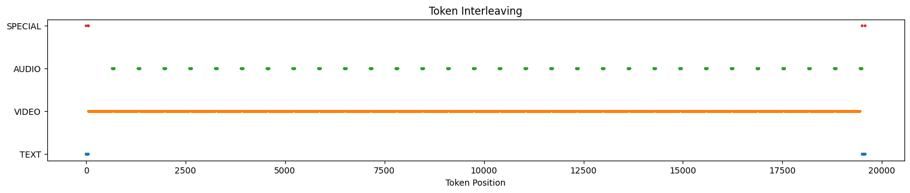
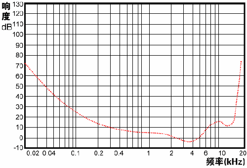

## Record

在  可以获取本周的代码变动

## TODO

- [x] 音频压缩原理（mp3，aac）
- [x] token 压缩方法汇总（音频/视频/both）
- [x] WorldSense token 统计
- [] attn map lmm

### WorldSense token 统计

```bash
========== Token Statistics Summary ==========
            mean        max        min
# TEXT        76.6        656        48 这个 TEXT 不太对，少写了一部分，复制官方模板的时候漏了一点
VIDEO       38601.2     114816     4485
AUDIO       3091.2      7500       390
# SPECIAL     9.0         9          9
TOTAL       41778.1     122515     4944
```

```bash
========== Omni Token Debug ==========
Total tokens: 19582
Token stats: {'SPECIAL': 9, 'TEXT': 132, 'VIDEO': 17940, 'AUDIO': 1501}

# 视频总时长 60s， 17940 / 598 = 30，30 * 4 = 120 帧（2FPS）
# 视频分辨率
('SPECIAL', 1)
('TEXT', 53)
('SPECIAL', 1)
('TEXT', 1)
('SPECIAL', 1)
('TEXT', 2)
('SPECIAL', 2)
('VIDEO', 598) # 2s 窗口内原始 4 帧， T-Merge 后 2 帧，
('AUDIO', 50) # 40ms，2s 窗口
('VIDEO', 598)
('AUDIO', 50)
('VIDEO', 598)
('AUDIO', 50)
('VIDEO', 598)
('AUDIO', 50)
('VIDEO', 598)
('AUDIO', 50)
('VIDEO', 598)
('AUDIO', 50)
('VIDEO', 598)
('AUDIO', 50)
('VIDEO', 598)
('AUDIO', 50)
('VIDEO', 598)
('AUDIO', 50)
('VIDEO', 598)
('AUDIO', 50)
('VIDEO', 598)
('AUDIO', 50)
('VIDEO', 598)
('AUDIO', 50)
('VIDEO', 598)
('AUDIO', 50)
('VIDEO', 598)
('AUDIO', 50)
('VIDEO', 598)
('AUDIO', 50)
('VIDEO', 598)
('AUDIO', 50)
('VIDEO', 598)
('AUDIO', 50)
('VIDEO', 598)
('AUDIO', 50)
('VIDEO', 598)
('AUDIO', 50)
('VIDEO', 598)
('AUDIO', 50)
('VIDEO', 598)
('AUDIO', 50)
('VIDEO', 598)
('AUDIO', 50)
('VIDEO', 598)
('AUDIO', 50)
('VIDEO', 598)
('AUDIO', 50)
('VIDEO', 598)
('AUDIO', 50)
('VIDEO', 598)
('AUDIO', 50)
('VIDEO', 598)
('AUDIO', 50)
('VIDEO', 598)
('AUDIO', 50)
('VIDEO', 598)
('AUDIO', 50)
('VIDEO', 598)
('AUDIO', 51)
('SPECIAL', 2)
('TEXT', 73)
('SPECIAL', 1)
('TEXT', 1)
('SPECIAL', 1)
('TEXT', 2)
```




### 音频压缩原理（mp3，aac）

MPEG‑1LayerIII编码方案涉及多相滤波器组的分析、离散余弦变换、快速傅里叶变换、心理声学建模、非均匀量化、Huffman编码

PCM 音频 -> 分帧 -> 分频（子带分析） -> MDCT变换 -> 心理声学分析 -> 量化与编码 -> 熵编码 -> MP3码流

#### PCM 分帧（Frame）

原始音频是连续的 PCM 波形（采样率如 44.1 kHz，每个样本 16 bit 量化），将音频分成 每帧 1152 个采样点（Layer III 的标准，约为 26ms）

#### 多相滤波器组的分析（子带滤波与分频）

MP3 使用 32 个子带滤波器，把音频分成 32 个频率子带（30 Hz～16 kHz 左右）。把声音按高低音分成 32 份，每份独立处理和压缩

#### MDCT（Modified Discrete Cosine Transform）

> MDCT：定义了四种窗口：正常、启动、短和停止。心理声学模型根据平稳度（前后帧变化）指示应用哪种窗口类型

> 形象一点就是用 X 个小钟敲击拟合一个大钟发出的声音，每个小钟的频率不同，代表不同的频率成分。DCT 就是把这个声音分解成 X 个小钟的频率成分，每个小钟的振幅代表了这个频率成分的强度。

DCT:

$$
X[k] = \sum_{n=0}^{N-1} x[n] \cdot \cos\Big[\frac{\pi}{N}(n+0.5) k \Big]
$$

在子带滤波基础上，再做 MDCT（改进离散余弦变换），把时域信号转换为频域信号，每组（32）再分为 18 个子频带，共有 576 个频带。也就是就是把原来 32 个粗频带在时间上的变化转换成这一段时间内 576 个细粒度的频率强度系数。

#### 心理声学模型（Psychoacoustic Model）

> 近似到 token 上分析组内 token 相似度进行合并？比如高相似度的可以合成一个，类似的论文在视觉上是 A-ToMe


对 PCM 波形做 FFT 得到每帧频谱图，然后根据其分析那些各个子带的遮蔽域值，比较当前两帧和之前两帧的频谱的差异大小判断是否平稳，平稳用长窗口（频率分辨率高），反之用短窗口（时间分辨率高），具体的窗口帧长未知。

然后用心理声学模型进行两个分析，一个是响度和频率，如下人耳可听最小响度曲线图，以此进行初步的频率过滤（但是没有看到文章中具体用这个的地方，提到了，我猜测可能会用在滤波之前）



另一个是利用人耳听觉系统的遮蔽效应特性（弱信号越接近强信号的中心，遮蔽效应会越严重，同一时间内强的声音会掩盖弱的声音），根据 FFT 得到的频谱特性找出各频率点上的音调成分和非音调成分（噪音）；根据掩蔽域曲线确定各个音调成分和非音调成分在其它频率点的掩蔽域值；

> 这个能用于压缩，但是怎么衡量强信号和弱信号，从 token 的角度讲？以及相应的遮蔽的时间范围？直接按照 40ms 对应出来看的可行性？

最后求出各频率点的总体掩蔽域，并折算到 MDCT 得到的编码子带中，得到每个子带的信掩比SMR（信号强度与掩蔽阈值的比率）

#### 非均匀量化、Huffman编码

双重迭代回路确定量化步长，将量化噪声控制在掩蔽阈值以下，同时计算保证整体编码比特总和小于可用比特，已量化的值使用 Huffman 编码。

形象的：

576个MDCT系数 = 576个不同强度的音符

可用比特 = 存钱罐容量

内循环：控制每个音符的大小，让所有音符总大小 ≤ 存钱罐

外循环：保证调整后音符误差不让人听出来（量化噪声在掩蔽阈值下）

量化 + Huffman = 压缩存钱罐中的音符 → 既节省空间，又不破坏听感

### token 压缩方法汇总（音频/视频/both）

整理中


