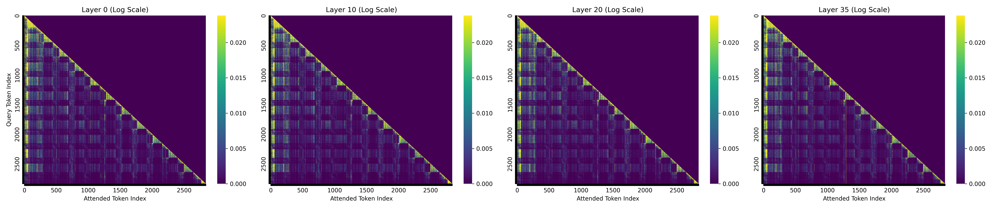
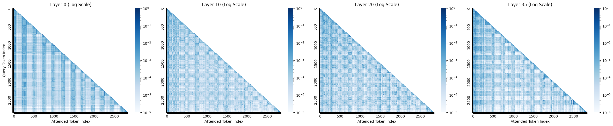
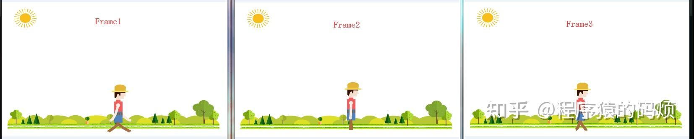
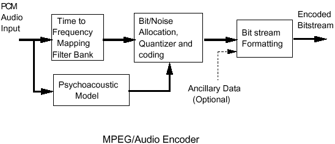
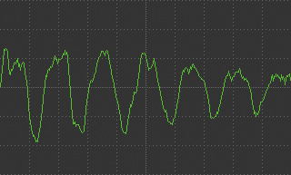
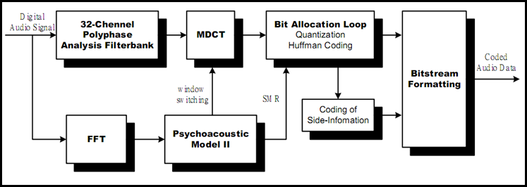
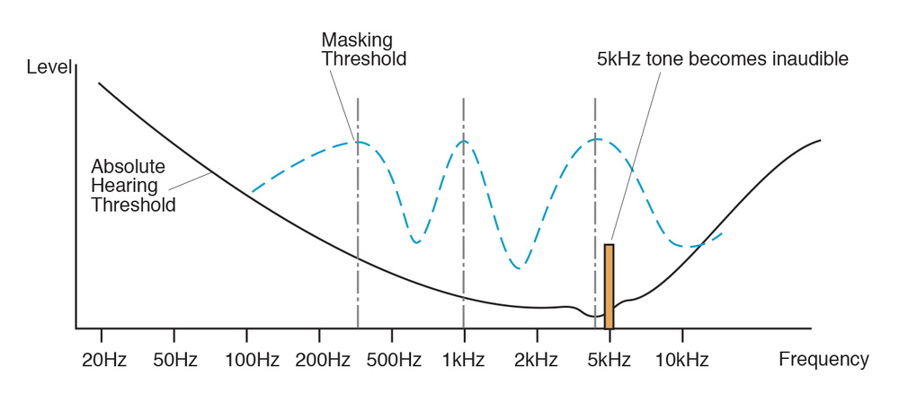
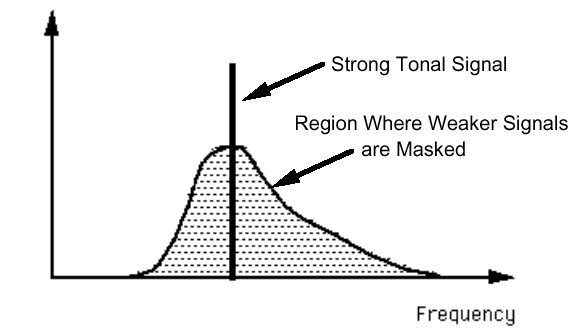
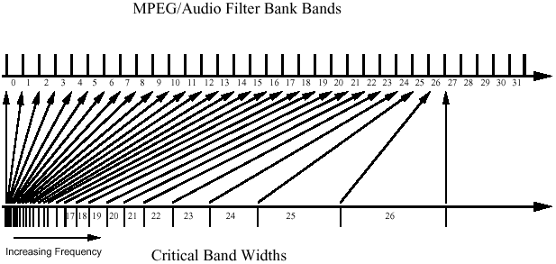

## Record

## TODO


- [ ] 不同 fps 下测试
- [ ] 可视化 llm 注意力
- [ ] 音频压缩原理
- [ ] 视频压缩原理


### 不同 fps 下效果的影响

```py
VIDEO_MIN_PIXELS = 128 * 28 * 28
VIDEO_MAX_PIXELS = 768 * 28 * 28 # <- 1 (We use 128*28*28 in the paper.)
FRAME_FACTOR = 2
FPS = 2.0
FPS_MIN_FRAMES = 4
FPS_MAX_FRAMES = 768 # <- 2 ( WorldSense benchmark 128)
```

| Model | fps | overall_accuracy | Music | Culture & Politics | Tech & Science | Daily Life | Film & TV | Sports | Performance | Games |
| :---: | :---: | :---: | :---: | :---: | :---: | :---: | :---: | :---: | :---: | :---: |
| Qwen2.5-omni-3B(bf16) | 2 | 46.3 | 46.3 | 51.8 | 51.2 | 44.2 | 45.4 | 44.9 | 43.1 | 42.1 |
| Qwen2.5-omni-3B(bf16) | 1 | 46.0 | 44.6 | 52.1 | 51.4 | 46.0 | 43.0 | 42.6 | 43.8 | 42.5 |
| Qwen2.5-omni-3B(bf16) | 0.5 | 45.5 | 43.8 | 51.5 | 50.8 | 43.8 | 43.8 | 43.0 | 45.3 | 42.1 |

0.5 fps 的效果不太公正可能，token 分布不均，在 2s 的窗口内

**TODO：设置为 4s 时间窗口的测试**

### 注意力可视化





可以看到有明显的垂直亮线


### h264 视频压缩原理

1、分组：把几帧图像分为一组（GOP，也就是一个序列，第一帧-IDR 帧，一定是 I 帧），为防止运动变化，帧数不宜取多
2、定义帧：将每组内各帧图像定义为三种类型，即 I 帧、B 帧和 P 帧
3、预测帧：以 I 帧作为基础帧，以 I 帧预测 P 帧，再由 I 帧和 P 帧预测 B 帧
4、数据传输：最后将 I 帧数据与预测的差值信息进行存储和传输



I帧、B帧、P帧：

> 保留的是块级别的信息，而不是像素级别的信息

I帧：
- 全帧编码：I 帧是关键帧，包含完整的图像信息，不依赖于其他帧。
- 帧内压缩：I 帧通过帧内压缩技术（图像 jpeg 压缩）

P帧：
- 单向预测：P 帧只依赖于前一个参考帧(I 或 P，因为 P 也是参考帧，和 I 帧一样会造成解码错误的扩散)进行预测。
- 压缩效率中等：差别帧，只包含和前一帧的画面的差别，解码时需要之前缓存的画面叠加上本帧定义的差别，生成最终画面

B帧：
- 双向预测：B 帧依赖于前一帧和后一帧进行预测（不是参考帧），I-B-B-B-P-B-B-B-P-B-B-B-I-
- 压缩效率高：前后参考帧差异以外的变化部分，或者说前后两帧中没有变化的部分作为参考帧的一个 P 帧


就是先在图像上压缩一下（帧内），然后在时间维度上压缩一次（帧间）


### MP3 音频压缩原理

整体流程图如下：



首先是输入的是音频 PCM 波形（采样率 44.1 kHz，（振幅）位深 16 bit）



然后是对 PCM 波形进行分帧，划分为小的时间片段，每帧 1152 个采样点（也就是 26 ms 左右）

音频帧流入两条线路，先看下面的心理声学模型

#### 心理声学模型

这里会先进行 FFT 变换的，将时域信号转换为频域信号。



因为人类感知上存在下面的频率掩蔽效应



如图，横轴是频率，纵轴是强度（响度），黑线之下是无法被人感知的声音范围，而黑线以上是可以被人感知的声音范围，并且，在一个强音（响度/幅度）的前后存在一定的较弱信号遮蔽区域



虚线显示了在存在 250Hz、1kHz 和 4kHz 三个响亮音调的情况下遮蔽阀值（蓝色虚线下部分）的变化。

这一步就是将一帧 PCM 波形通过 FFT 得到的频谱图, 通过心理声学模型, 计算该帧的遮蔽阈值曲线

#### 多相滤波器组 + MDCT

> 实验证据表明，人耳的分辨率有限，可以用小于 100Hz 和大于 4kHz 的临界带宽来表示。在临界带宽内，人耳会模糊频率；一个物理上的等宽子带，在低频对应多个临界带宽，在高频则只对应一个临界带宽

先使用 32 个子带滤波器，把音频分成 32 个等宽度的频率子带（非线性映射）。把声音按高低音分成 32 份，每份独立处理和压缩



这是得到的是 32 个并行的时域信号，类似 RGB -> R + G + B 三个通道，

然后通过 MDCT 进行时频域变换，对于一个子带，在频域上进一步划分，长块 18，短块 6 （取决于子带音频信号是否稳定，看频谱图是否有尖锐的峰值，有的话是稳态信号，稳定振动集中于部分频率区间）

#### 二者结合确定编码位数

从这个例子看：

假设有一个 MDCT 子带的一条谱线覆盖 1000Hz 到 1100Hz。心理声学模型的FFT分析在此区间内给出了如下掩蔽阈值：

```py
1000Hz: 30 dB
...
1020Hz: 25 dB （最小值）
...
1050Hz: 40 dB
...
1080Hz: 35 dB
...
1100Hz: 50 dB
```

取其中最小值作为允许的遮蔽噪声；通常是一整个 MDCT 子带共用一个遮蔽噪声

定义遮蔽噪声比（信号功率 - 掩蔽阈值） = 信噪比（信号功率 - 量化噪声功率） - 信遮蔽比（掩蔽阈值 - 量化噪声功率）

所有 MDCT 子带按照遮蔽噪声比从低到高，根据音频帧可用总位数，最低的子带分配最少的码位数，循环分配，直到码位用完。


